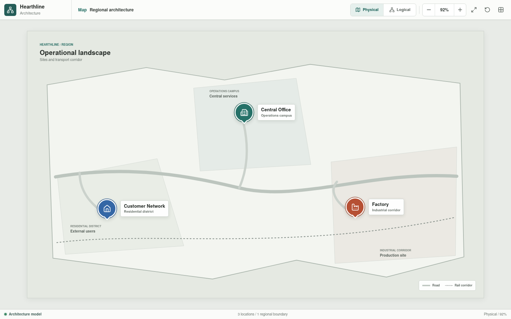
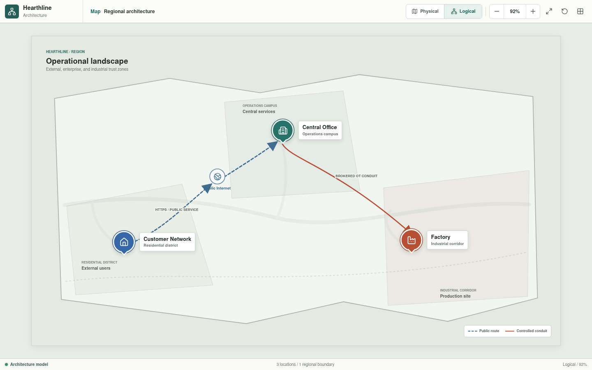

# Hearthline

**Current development release:** `0.2.0`

See the [changelog](CHANGELOG.md) and
[versioning policy](docs/versioning.md).

Hearthline is an industrial architecture and simulation project intended to
connect a public customer journey, enterprise services, governed IT/OT
exchange, and a segmented ceramics process. Its current implementation is a
navigable Svelte architecture application plus an initial deterministic Rust
component engine. Typed appliance and connection YAML pipelines now validate
the rendered inventory and its physical and logical attachment records,
generate frontend configuration data, and support validated local editing.
Complete topology execution, IEC 61131-3 control execution, and plant
simulation remain planned engineering layers.





## Project Goals

Hearthline is designed to:

- Progressively model the architecture through corresponding physical and
  logical views.
- Keep network inventory, addressing, interfaces, policy, and scenarios in
  reviewable YAML.
- Validate topology, routing, NAT, segmentation, and permitted conduits in
  Rust.
- Associate controllers with Structured Text or Ladder Diagram programs,
  tasks, tags, and simulated I/O.
- Run virtual PLC logic against a Rust process model.
- Explain successful and denied communication paths in the Svelte interface.
- Model safe local factory operation without depending on Central Office
  availability.

## Why a Custom Codebase

The project began with existing network and industrial simulation tools, but
the initial evaluation did not identify one simulator that covered the combined
requirements: hierarchical physical and logical navigation, vendor-neutral
configuration, explainable network and security decisions, virtual PLC
execution, IEC 61131-3 source integration, process simulation, fault scenarios,
and generated documentation.

Hearthline is therefore being developed as a purpose-specific codebase instead
of treating several disconnected tools as one authoritative model. This is a
scope decision, not a claim that the project already replaces network
emulators, vendor engineering environments, virtual PLC products, or hardware
integration laboratories. Those tools remain necessary for implementation and
acceptance testing.

Building the missing integration also creates substantial engineering
obligations. Parser correctness, timing behavior, protocol fidelity, failure
modes, safety boundaries, and generated results must be tested before they can
be trusted. Hearthline only claims behavior that has an implemented and
repeatable validation path.

## Current State

The following capabilities are implemented in the Svelte application:

- A regional map containing the Customer Network, Central Office, and Factory.
- Physical and logical representations at every documented level.
- Drill-down navigation from sites to environments and from the Factory process
  to ten individual production areas.
- Selectable architecture nodes, device inspectors, zoom, pan, fit, reset,
  grid, and minimap controls.
- Customer LAN, customer edge, public-service, enterprise, DMZ, operations,
  analytics, and factory security views.
- A ten-stage ceramics process with individual controllers, HMIs, sensors,
  distributed I/O, actuators, and safety or permissive interfaces.
- A bootstrap process view model loaded from
  [`process-view.json`](web/src/generated/process-view.json).
- Rust-generated appliance and connection metadata, full YAML inspection, and
  validated editing through a localhost-only Rust API.
- A Rust workspace with shared model contracts, typed YAML configuration,
  deterministic appliance primitives, process-component primitives, trace
  output, and command-line validation and generation.

Current maturity is:

| Layer | Status |
| --- | --- |
| Application release | `0.2.0`, initial development |
| Svelte architecture application | Implemented and buildable; rendered architecture remains provisional |
| Physical and logical documentation captures | Implemented for every documented route |
| Process view-model contract | Bootstrap JSON, schema `0.2.0` |
| Canonical appliance YAML | Provisional baseline; 160 schema `0.3.0` files, one per appliance |
| Canonical connection YAML | Provisional baseline; 205 schema `0.2.0` files, one per modeled connection |
| Rust component simulation | Initial implementation; reusable primitives and unit tests exist, but the project topology is not instantiated |
| Rust YAML validation and frontend projection | Implemented for appliance behavior, port hardware and state, connection media, endpoint compatibility, capacity, exclusive point-to-point ports, file identity, and render bindings |
| Local YAML editing | Implemented with revision checks, whole-project validation, atomic writes, and catalog regeneration |
| Configured topology and end-to-end scenarios | Planned; validated connection records are not yet assembled into an executable project graph |
| IEC 61131-3 sources and vPLC execution | Planned; no control sources or runtime integration exist yet |
| Deployment or standards conformance | Not claimed |

The generated catalog proves that the current YAML files parse, every
connection resolves to declared appliance ports, each port supports its
connection medium, link capacity does not exceed configured port or medium
limits, and point-to-point physical ports are not reused. It does not prove
address uniqueness, VLAN or route consistency, policy correctness, HA
behavior, or end-to-end reachability. Remaining bootstrap frontend datasets
still describe architecture and presentation intent rather than simulated
behavior.

The current YAML values and rendered architecture are intentionally
provisional placeholders. They provide stable identifiers, parser coverage,
navigation, and representative engineering structure while development
focuses on communication, simulation, and control behavior. They are not
finished device configurations or a final deployment architecture. Addressing,
policy, equipment selection, topology details, availability design, and
physical placement will be revised as executable scenarios and engineering
requirements mature.

## Target Architecture

| Layer | Responsibility |
| --- | --- |
| YAML | Canonical inventory, port state and settings, connection instances, addressing, routes, services, policies, I/O assignments, and scenarios |
| IEC 61131-3 | Structured Text and machine-readable Ladder Diagram control sources |
| Rust | Schema validation, graph construction, connectivity and policy evaluation, process behavior, fault injection, and generated view data |
| Virtual PLC runtime | PLC scan cycles, task scheduling, timers, function blocks, and execution of the selected control dialect |
| Svelte | Static architecture presentation, navigation, inspection, filtering, and visualization of validated results |

```text
YAML configuration --------+
                           |
Structured Text -----------+--> Rust models and validation
                           |          |
Ladder / PLCopen XML ------+          +--> connectivity and policy results
                                      +--> control and I/O cross-references
                                      +--> process and fault scenarios
                                                |
                                                v
                                         Generated JSON
                                                |
                                                v
                                      Svelte application

Control sources --> virtual PLC runtime --> simulated I/O --> Rust plant model
```

Svelte owns presentation and interaction. It does not make routing, policy,
identity, control, or process decisions.

## Sites

| Site | Scope | Documentation |
| --- | --- | --- |
| Customer Network | Residential LAN, customer edge, and end-to-end public web access | [Customer Network](docs/customer-network/README.md) |
| Central Office | Public IT DMZ, Business IT, governance, monitoring, analytics, and approved change workflows | [Central Office](docs/central-office/README.md) |
| Factory | Factory-local OT DMZ, Level 3 handoff, and segmented ceramics process | [Factory](docs/factory/README.md) |

The Central Office is the principal governance and analysis site. The Factory
retains local execution, enforcement, engineering authority, and safe process
operation. Central services do not receive direct routes to controllers.

## Target Security Model

Hearthline applies the following architecture rules:

- Default-deny communication between security zones.
- Explicit conduits defined by source, destination, protocol, direction,
  purpose, owner, and availability requirement.
- Separate IT-side and OT-side enforcement at the factory OT DMZ.
- Controlled administrative access through jump services.
- Brokered or replicated production data for enterprise analytics.
- Passive monitoring paths that are not required for process forwarding.
- Identity, device assurance, session authorization, and least privilege in
  addition to network segmentation.
- Independent local process operation when inter-site services are unavailable.
- Explicit safety and burner-management boundaries that are not replaced by
  general-purpose control logic.

## Ceramics Process

```text
Body Preparation
  -> Forming
  -> Controlled Drying
  -> Industrial Dryer
  -> Color and Glaze
  -> Kiln 1
  -> Intermediate Inspection
  -> Kiln 2
  -> Final Inspection
  -> Logistics
```

Each process area is independently enterable and contains a representative cell
network, logical vPLC workload, local HMI, distributed I/O, sensors, actuators,
and safety or permissive interface. The target deployment assigns physical vPLC
execution to a factory-local redundant control-compute cluster; no runtime is
integrated yet. Detailed process documentation starts at the
[Ceramics Process](docs/factory/process/README.md).

## Repository Structure

```text
.
|-- config
|   |-- appliances
|   |   |-- customer
|   |   |-- internet
|   |   |-- central-office
|   |   |-- factory
|   |   `-- shared
|   |-- connections
|   |   |-- customer
|   |   |-- internet
|   |   |-- central-office
|   |   |-- factory
|   |   `-- shared
|   `-- ot
|       `-- process
|-- crates
|   |-- hearthline-model
|   |-- hearthline-engine
|   |-- hearthline-api
|   `-- hearthline-cli
|-- docs
|   |-- customer-network
|   |-- central-office
|   |-- factory
|   |-- project-direction.md
|   `-- versioning.md
|-- web
|   |-- src
|   |-- package.json
|   `-- README.md
|-- CHANGELOG.md
|-- LICENSE
|-- VERSION
`-- README.md
```

The documentation tree follows the Svelte navigation tree. Every documentation
folder contains its own README plus physical and logical screenshots of the
corresponding current view.

## Next Planned Step

The next engineering milestone is a formal device-to-device communication
model executed through the typed media layer added in release `0.2.0`. Rust
will instantiate configured ports and connections, carry typed network or
field messages across them, apply link state, direction, capacity, MTU,
serialization, propagation, and loss behavior, and emit an explained trace for
each hop.

The Customer LAN and Customer Edge will provide the first executable path.
This milestone will establish the communication contract used later by
switching, routing, NAT, firewall, service, OT, and controller scenarios.

## Roadmap

1. Implement formal device-to-device communication through configured ports
   and typed media, beginning with the Customer LAN and Customer Edge.
2. Extend cross-file validation to addresses, VLANs, routes, NAT, services,
   policy references, and HA relationships.
3. Move the remaining site and environment presentation data out of Svelte
   components.
4. Construct simulated component instances from validated appliance
   configuration.
5. Assemble complete topologies from the existing routing, NAT, firewall,
   switching, link, service, and OT behavior primitives.
6. Add positive and negative end-to-end scenarios with deterministic traces.
7. Emit versioned JSON view models and scenario results for Svelte.
8. Replace provisional configuration values and architecture placeholders with
   scenario-derived, cross-validated, and reviewed engineering definitions.
9. Select the supported IEC 61131-3 edition, Structured Text dialect, and
   Ladder interchange format.
10. Implement program, symbol, task, tag, and I/O cross-references.
11. Integrate virtual PLC execution with the Rust plant model.
12. Add process scenarios, accelerated time, material tracking, and fault
    injection.

## Running the Application

```bash
cd web
npm install
npm run dev
```

Validated editing requires the local Rust API from the repository root:

```bash
cargo run -p hearthline-api
```

Quality checks:

```bash
node scripts/check-version.mjs
cd web
npm run check
npm run build
cd ..
cargo fmt --all -- --check
cargo test --workspace
cargo clippy --workspace --all-targets -- -D warnings
cargo run -p hearthline-cli -- config-validate
cargo run -p hearthline-cli -- config-generate
```

## Documentation

- [Documentation index](docs/README.md)
- [Implementation direction](docs/project-direction.md)
- [Deployment conformance review](docs/deployment-conformance.md)
- [Rust simulation engine](docs/simulation-engine.md)
- [Svelte application](web/README.md)
- [Configuration model](config/README.md)
- [Changelog](CHANGELOG.md)
- [Versioning and releases](docs/versioning.md)

## License

Hearthline is licensed under the [MIT License](LICENSE).
