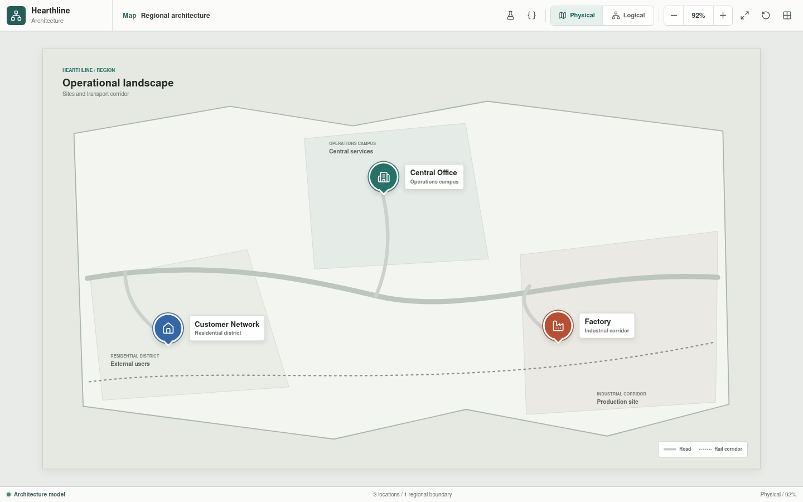
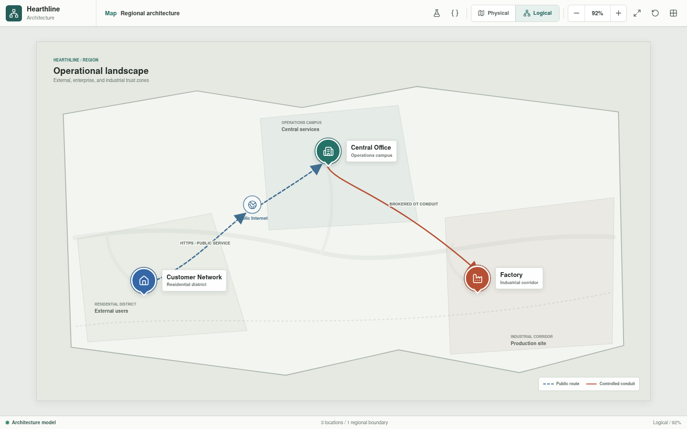

# Hearthline

**Current development release:** `0.3.1`

See the [changelog](CHANGELOG.md) and
[versioning policy](project/docs/reference/versioning.md).

Hearthline is an industrial architecture and simulation project intended to
connect a public customer journey, enterprise services, governed IT/OT
exchange, and a segmented ceramics process. Its current implementation is a
navigable Svelte architecture application plus a deterministic Rust component
engine. Typed appliance, connection, and scenario YAML pipelines validate the
rendered inventory and selected executable paths, generate frontend
configuration data, and support validated local editing. Thirty configured
scenarios cover independent Customer PC-01 and PC-02 public paths, independent
Business IT PC-01 through PC-04 internal DNS and HTTPS paths, approved or
denied factory operations-data flows, and three controlled public-web security
exercises: path traversal, a disallowed method, and a bounded SQL-injection
request body.
The Forming vPLC now emits a typed process sample through its virtual host and
Level 3 core to a bounded factory-local historian. A second executable path
replicates accepted records through the southbound OT firewall into the OT DMZ.
Forming SCADA shows both stores and their route evidence, and its publication
action sends only the latest replicated record through six modeled links to
Central Office analytics.
The first availability scenario applies a request-scoped customer access-link
outage, verifies the resulting media drop, and defines a separate recovery
state whose restored run must deliver the original DNS response.
A second availability scenario combines VRRP gateway transfer with
Rust-computed Rapid-PVST root, root-port, designated-port, and alternate-port
states so the unchanged Business IT DNS packet follows Core-01 at baseline and
Core-02 after the selected primary uplinks fail.
The northbound firewall pair now also executes a timed continuity scenario:
the active member serializes one TCP session and heartbeats over its dedicated
HA medium, the standby promotes after the configured hold timer, advertises
the shared first-hop identities, and permits the exact reverse ACK from
synchronized state. This is a deterministic Hearthline protocol abstraction,
not an implementation of a vendor HA protocol or a seamless-failover claim.
Two fault variants now distinguish retained state from unavailable state: one
drops the HA medium after synchronization and preserves the reverse flow,
while the other clears the standby session table and verifies default-deny
behavior after promotion.
A third fault case retains synchronized state through promotion, waits beyond
the modeled 300-second idle TCP timeout, and proves that FRW-03B expires the
stale entry before rejecting the delayed reverse ACK.
An HA-isolation case drops only the synchronization path while FRW-03A remains
healthy. FRW-03B reaches its hold timer but stays fenced because peer failure
is unconfirmed, preserving one active owner and the established flow.
A factory-autonomy case disables both factory-facing inter-site handoffs. The
operations-data transfer fails on both paths while an independently evaluated
Body Preparation control chain retains seven operational local links, resets
its healthy safety circuit, and starts the configured transfer pump through
HMI, vPLC, remote I/O, and actuator behavior. This is a bounded command-level
proof, not yet a changing plant-state or controller-program simulation.
Complete topology execution, general IEC 61131-3 control execution, and
broader plant simulation remain planned engineering layers. Forming is the
first bounded area-specific process model: a validated Structured Text subset
owns its sequence and output requests while Rust advances ceramic-slip
pressure casting, robotic demoulding, mould cleaning, vacuum drying, process
signals, alarms, and injected faults.





## Project Goals

Hearthline is designed to:

- Progressively model the architecture through corresponding physical and
  logical views.
- Keep network inventory, addressing, interfaces, policy, and scenarios in
  reviewable YAML.
- Validate topology, routing, NAT, segmentation, and permitted conduits in
  Rust.
- Associate controllers with Structured Text or Ladder Diagram programs,
  tasks, tags, and simulated I/O.
- Run virtual PLC logic against a Rust process model.
- Explain successful and denied communication paths in the Svelte interface.
- Model safe local factory operation without depending on Central Office
  availability.

## Why a Custom Codebase

The project began with existing network and industrial simulation tools, but
the initial evaluation did not identify one simulator that covered the combined
requirements: hierarchical physical and logical navigation, vendor-neutral
configuration, explainable network and security decisions, virtual PLC
execution, IEC 61131-3 source integration, process simulation, fault scenarios,
and generated documentation.

Hearthline is therefore being developed as a purpose-specific codebase instead
of treating several disconnected tools as one authoritative model. This is a
scope decision, not a claim that the project already replaces network
emulators, vendor engineering environments, virtual PLC products, or hardware
integration laboratories. Those tools remain necessary for implementation and
acceptance testing.

Building the missing integration also creates substantial engineering
obligations. Parser correctness, timing behavior, protocol fidelity, failure
modes, safety boundaries, and generated results must be tested before they can
be trusted. Hearthline only claims behavior that has an implemented and
repeatable validation path.

## Current State

The following capabilities are implemented in the Svelte application:

- A regional map containing the Customer Network, Central Office, and Factory.
- Physical and logical representations at every documented level.
- Drill-down navigation from sites to environments and from the Factory process
  to ten individual production areas.
- Selectable architecture nodes, device inspectors, zoom, pan, fit, reset,
  grid, and minimap controls.
- Customer LAN, customer edge, public-service, enterprise, DMZ, operations,
  analytics, and factory security views.
- A ten-stage ceramics process with individual controllers, HMIs, sensors,
  distributed I/O, actuators, and safety or permissive interfaces; Forming is
  the first detailed cell with 84 components, an embedded machine-PC SCADA,
  four equal mould stations, four mould-local HMIs, an independent robot
  pendant, 45 configured process values, four fence-crossing handoff stations,
  and guarded-cell safety. Its physical view is limited to the 21 machine-floor
  items visible from above; the logical view retains all 84 components.
- A bootstrap process view model loaded from
  [`process-view.json`](packages/web/src/generated/process-view.json), with the
  detailed Forming inventory derived from the generated YAML catalog.
- Rust-generated appliance and connection metadata, full YAML inspection, and
  validated editing through a localhost-only Rust API.
- A Rust workspace with shared model contracts, typed YAML configuration,
  deterministic appliance primitives, process-component primitives, physical
  media transit, trace output, and command-line validation and generation.
- An API-backed simulation workspace for packet overrides, deterministic
  execution, outcome metrics, trace filtering, and desktop or mobile scenario
  selection.
- Scenario-owned and request-time connection-state overrides with an editable
  link-state panel, canonical reset, YAML-declared recovery action, active
  baseline or recovery expectations, and explicit media-failure traces.
- YAML-configured VRRP identities with validated active/standby state, an
  editable first-hop role panel, split-brain rejection, and a Core-02 recovery
  trace after selected Core-01 uplink failure.
- Reciprocal firewall-HA configuration with validated heartbeat and hold
  timers, media-carried bounded session updates, active-member failure,
  standby promotion, gratuitous first-hop announcements, and reverse-flow
  continuity evidence in the simulation workspace.
- YAML-configured Rapid-PVST bridge identities and priorities with
  Rust-computed per-VLAN root selection, long path costs, port roles,
  forwarding or discarding state, and scenario-report projection.
- Enterable Customer PC-01 and PC-02 endpoints with responsive desktops,
  terminals, browsers, independent YAML-derived network identities, and
  Rust-backed DNS, repeated ICMP echo, HTTPS, and denied SSH actions. Each API
  session maintains an isolated 60-second DNS client cache with inspection and
  flush commands plus a persistent compatible baseline network that retains
  endpoint ARP, switch CAM, routed-neighbor, customer PAT, and traversed
  firewall-session state across actions.
- Enterable Business IT PC-01 through PC-04 endpoints with scenario-derived
  portal home pages and Rust-backed internal DNS, repeated ICMP echo, and HTTPS
  actions across trunked VLANs 20, 30, and 80 through routed Core-01 SVIs;
  browser, `curl`, `ping`, and SSH share that workstation's DNS cache while
  `nslookup` always queries the configured server. Browser details and
  terminal `arp -a` expose current session state.
- A responsive Network State application on each enterable workstation,
  showing capability-scoped CAM, neighbor, PAT, and firewall-session tables
  from the active Rust runtime plus a bounded read-only simulator console for
  `show` commands. This is per-workstation session instrumentation, not a
  global management plane or vendor CLI implementation.
- Enterable operator interfaces for all ten process areas, including the
  Forming machine PC, four mould-local HMIs, and independent robot joystick, with YAML-derived
  instruments, safety permissives, alarm acknowledgement, operator audit,
  equipment-specific actuator states, and commands executed through Rust HMI,
  vPLC, remote-I/O, and field-actuator primitives.
- One shared Forming cell session across the embedded SCADA and local stations,
  with four independent mould sequence runtimes, mould-local Start/Stop/End,
  continuous production, keyed manual/auto/setup selectors, retained manual
  commands, object-scoped PC views, live equipment displays, and five
  injectable disturbances.
- A separate six-axis robot controller, manipulator, pendant, and safety
  boundary with bounded FIFO arbitration across four taught mould pickup and
  operator-handoff definitions, frames, tool, payload, and live execution
  state.
- Four external mould-control cabinets and four mould-embedded utility
  sections, seven runtime-bound setpoints per mould, and an object-based
  supervisory model with quality-aware history, events, roles, revision state,
  and active/standby deployment nodes.
- Automatic one-second Forming telemetry collection with bounded local and OT
  DMZ stores, pending-record and loss accounting, 250-millisecond replication
  retry, and an authorized replica-backed analytics publication with all three
  media traces beside the live process.
- Composite factory-autonomy evidence in the simulation workspace, including
  redundant conduit loss, local-path health, safety reset, command result,
  final actuator state, and the six recorded control stages.
- Controlled customer-workstation path-traversal, disallowed-method, and
  request-body SQL-injection exercises that are prevented by the DMZ
  reverse-proxy WAF and projected into an enterable Central SOC session with
  evidence, filtering, acknowledgement, and bounded event retention.

Current maturity is:

| Layer | Status |
| --- | --- |
| Application release | `0.3.1`, initial development |
| Svelte architecture application | Implemented and buildable; rendered architecture remains provisional |
| Physical and logical documentation captures | Implemented for every documented route |
| Process view-model contract | Bootstrap JSON, schema `0.2.0` |
| Canonical appliance YAML | Provisional baseline; 237 schema `0.10.0` files, one per appliance |
| Canonical connection YAML | Provisional baseline; 286 schema `0.2.0` files, one per modeled connection |
| Rust component simulation | Allocator-free appliance runtime with Ethernet, ARP, switching, LACP aggregation, bounded multi-chassis split horizon, routing, NAT, active/standby stateful firewalls, service, media, and process primitives |
| Rust YAML validation and frontend projection | Implemented for appliance behavior, port hardware and state, VRRP member consistency, Rapid-PVST bridge identities, LACP, multi-chassis and firewall-HA relationships, synchronized firewall policy, connection media, endpoint compatibility, capacity, exclusive point-to-point ports, file identity, and render bindings |
| Local YAML editing | Implemented with revision checks, whole-project validation, atomic writes, and catalog regeneration |
| Configured topology and end-to-end scenarios | Initial implementation; 30 versioned scenarios cover independent customer public paths, Business IT PC-01 through PC-04 internal DNS and HTTPS, deterministic Business IT core recovery, converged and protocol-timed northbound-firewall recovery, HA-sync, standby-state, stale-session, and fenced-isolation cases, Forming-to-Level-3 collection, Level-3-to-DMZ replication, a brokered OT-DMZ-to-analytics path with explicit HTTPS delivery and SSH default denial, a composite local-control/inter-site-outage case, three WAF-prevented security exercises, and one customer access-circuit outage with an explicit restoration expectation |
| Offensive and defensive interaction | First controlled slice implemented through Customer PC-01 method- and body-aware `curl`, configuration-owned DMZ WAF policy, and a filterable session-local Central SOC queue; broader attack techniques, telemetry transport, correlation, and response automation remain planned |
| HMI and process interaction | Fifteen operator sessions are configured across all ten process areas; Forming adds four independent mould runtimes with bound timings and pressure, external control cabinets, mould-embedded utility sections, local production authority, four transfer stations, a guarded-cell interlock, live views, bounded shared-robot arbitration, and a workspace-limited pendant with jog/teach and four authoritative `.g` routines. Automatic pickup and handoff poses are checked against YAML geometry and fault on mismatch. Object-based supervisory state, historian collection and replication, and operator-triggered publication are also implemented. Production kinematics, recipe-to-setpoint deployment, durable persistence, and broader plant dynamics remain planned. |
| Control sources and vPLC execution | Initial Forming slice implemented with versioned Structured Text, explicit YAML I/O binding, 20 ms scan execution, and Rust plant dynamics; broader language and area coverage remain planned |
| Deployment or standards conformance | Not claimed |

The generated catalog proves that the current YAML files parse, every
connection resolves to declared appliance ports, configured spanning-tree
bridges have valid and unique identities, each port supports its
connection medium, link capacity does not exceed configured port or medium
limits, and point-to-point physical ports are not reused. It does not prove
project-wide address uniqueness, VLAN or route consistency, policy
correctness, complete HA behavior, or arbitrary end-to-end reachability. The
30 configured scenarios prove only their selected participant paths and
expected outcomes. Remaining bootstrap frontend datasets still describe architecture
and presentation intent rather than simulated behavior.

The current YAML values and rendered architecture are intentionally
provisional placeholders. They provide stable identifiers, parser coverage,
navigation, and representative engineering structure while development
focuses on communication, simulation, and control behavior. They are not
finished device configurations or a final deployment architecture. Addressing,
policy, equipment selection, topology details, availability design, and
physical placement will be revised as executable scenarios and engineering
requirements mature.

## Target Architecture

| Layer | Responsibility |
| --- | --- |
| YAML | Canonical inventory, port state and settings, connection instances, addressing, routes, services, policies, I/O assignments, and scenarios |
| IEC 61131-3 | Structured Text and machine-readable Ladder Diagram control sources |
| Rust | Schema validation, graph construction, connectivity and policy evaluation, process behavior, fault injection, and generated view data |
| Virtual PLC runtime | PLC scan cycles, task scheduling, timers, function blocks, and execution of the selected control dialect |
| Svelte | Static architecture presentation, navigation, inspection, filtering, and visualization of validated results |

```text
YAML configuration --------+
                           |
Structured Text -----------+--> Rust models and validation
                           |          |
Ladder / PLCopen XML ------+          +--> connectivity and policy results
                                      +--> control and I/O cross-references
                                      +--> process and fault scenarios
                                                |
                                                v
                                         Generated JSON
                                                |
                                                v
                                      Svelte application

Control sources --> virtual PLC runtime --> simulated I/O --> Rust plant model
```

Svelte owns presentation and interaction. It does not make routing, policy,
identity, control, or process decisions.

## Sites

| Site | Scope | Documentation |
| --- | --- | --- |
| Customer Network | Residential LAN, customer edge, and end-to-end public web access | [Customer Network](project/docs/customer-network/README.md) |
| Central Office | Public IT DMZ, Business IT, governance, monitoring, analytics, and approved change workflows | [Central Office](project/docs/central-office/README.md) |
| Factory | Factory-local OT DMZ, Level 3 handoff, and segmented ceramics process | [Factory](project/docs/factory/README.md) |

The Central Office is the principal governance and analysis site. The Factory
retains local execution, enforcement, engineering authority, and safe process
operation. Central services do not receive direct routes to controllers.

## Target Security Model

Hearthline applies the following architecture rules:

- Default-deny communication between security zones.
- Explicit conduits defined by source, destination, protocol, direction,
  purpose, owner, and availability requirement.
- Separate IT-side and OT-side enforcement at the factory OT DMZ.
- Controlled administrative access through jump services.
- Brokered or replicated production data for enterprise analytics.
- Passive monitoring paths that are not required for process forwarding.
- Identity, device assurance, session authorization, and least privilege in
  addition to network segmentation.
- Independent local process operation when inter-site services are unavailable.
- Explicit safety and burner-management boundaries that are not replaced by
  general-purpose control logic.

## Ceramics Process

```text
Body Preparation
  -> Forming
  -> Controlled Drying
  -> Industrial Dryer
  -> Color and Glaze
  -> Kiln 1
  -> Intermediate Inspection
  -> Kiln 2
  -> Final Inspection
  -> Logistics
```

Each process area is independently enterable and contains a cell network,
logical vPLC workload, local operator interface, distributed I/O, sensors,
actuators, and a safety or permissive interface. Forming currently carries the
only expanded module-level inventory; the other areas remain representative.
The target deployment assigns physical vPLC
execution to a factory-local redundant control-compute cluster. Only the
bounded Forming Structured Text subset is integrated; this is not a general
IEC 61131-3 runtime. Detailed process documentation starts at the
[Ceramics Process](project/docs/factory/process/README.md).

## Repository Structure

```text
.
|-- .github
|   `-- workflows
|-- packages
|   |-- crates
|   |   |-- hearthline-model
|   |   |-- hearthline-engine
|   |   |-- hearthline-config
|   |   |-- hearthline-api
|   |   `-- hearthline-cli
|   |-- fuzz
|   |-- web
|   |-- Cargo.toml
|   `-- Cargo.lock
|-- project
|   |-- control
|   |-- config
|   |-- docs
|   |-- scripts
|   |-- standards
|   `-- VERSION
|-- CHANGELOG.md
|-- LICENSE
`-- README.md
```

The documentation tree follows the Svelte navigation tree. Every documentation
folder contains its own README plus physical and logical screenshots of the
corresponding current view.

## Next Planned Step

The three Forming fidelity tracks are implemented as bounded development
models. The next milestone will connect Body Preparation to the approximately
40 C Forming slip tank with explicit material balance, replenishment requests,
availability and quality conditions, and deterministic cross-area tests. It
will also add robot recovery/fault paths, recipe-to-setpoint deployment, and
reviewed process-condition transitions without claiming production controller,
robot, supervisory-platform, or process-physics equivalence.

## Roadmap

1. Implement and test material balance between Body Preparation and the
   Forming slip tank, then deepen robot recovery, recipe deployment, and
   process-condition handling around the completed fidelity tracks.
2. Extend cross-file validation to addresses, VLANs, routes, NAT, services,
   policy references, and HA relationships.
3. Extend configured component construction beyond the currently executable
   network, service, link, and industrial process families.
4. Add further positive, negative, outage, and isolation set simulations with
   deterministic traces and explicit policy expectations.
5. Add further factory-local outage and recovery scenarios as plant behavior
   becomes executable.
6. Move the remaining site and environment presentation data out of Svelte
   components.
7. Replace provisional configuration values and architecture placeholders with
   scenario-derived, cross-validated, and reviewed engineering definitions.
8. Select formal IEC 61131-3 compatibility targets and a Ladder interchange
   format before broadening the implemented Forming subset.
9. Extend program, symbol, task, tag, and I/O cross-references to additional
   selected constructs and process areas.
10. Extend source-driven virtual PLC execution beyond Forming.
11. Extend deterministic process scenarios, accelerated time, cross-area
    material tracking, and fault injection beyond the first Forming model.
12. Extend the controlled Phase 3 WAF baseline with additional attack,
    detection, triage, and response paths backed by deterministic policy
    behavior.

## Running the Application

```bash
cd packages/web
npm install
npm run dev
```

Scenario execution and validated editing require the local Rust API from the
repository root:

```bash
cargo run --manifest-path packages/Cargo.toml -p hearthline-api
```

Quality checks:

```bash
node project/scripts/repository-policy.mjs
node project/scripts/check-version.mjs
cd packages/web
npm run check
npm run build
cd ../..
cargo fmt --manifest-path packages/Cargo.toml --all --check
cargo clippy --manifest-path packages/Cargo.toml --workspace --all-targets --all-features -- -D warnings
cargo test --manifest-path packages/Cargo.toml --workspace --all-features
cargo run --manifest-path packages/Cargo.toml -p hearthline-cli -- config-validate
cargo run --manifest-path packages/Cargo.toml -p hearthline-cli -- config-generate
cargo run --manifest-path packages/Cargo.toml -p hearthline-cli -- config-demo
cargo run --manifest-path packages/Cargo.toml -p hearthline-cli -- scenario-run customer-dns-lookup
cargo bench --manifest-path packages/Cargo.toml --workspace --all-features
```

CI additionally runs the two bounded `cargo-fuzz` targets with nightly Rust.
The enforced repository constraints are documented in
[CI policy](project/standards/CI_POLICY.md).

## Documentation

- [Documentation index](project/docs/README.md)
- [Implementation direction](project/docs/reference/project-direction.md)
- [Deployment conformance review](project/docs/reference/deployment-conformance.md)
- [Rust simulation engine](project/docs/reference/simulation-engine.md)
- [Svelte application](project/docs/reference/svelte-application.md)
- [Configuration model](project/config/README.md)
- [Continuous integration policy](project/standards/CI_POLICY.md)
- [Changelog](CHANGELOG.md)
- [Versioning and releases](project/docs/reference/versioning.md)

## License

Hearthline is licensed under the [MIT License](LICENSE).
