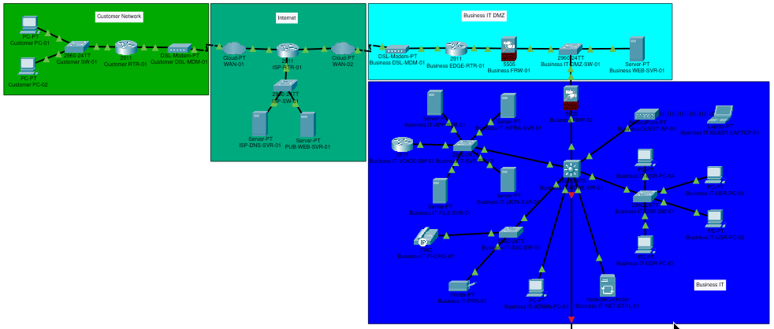

# Hearthline Industrial Network

Hearthline is a Cisco Packet Tracer project that models the network path from an external customer, through a simulated Internet service provider, into a public business DMZ and a segmented internal IT environment. The long-term design will extend through an OT DMZ into an industrial control environment.

The project is both a working network simulation and an as-built documentation exercise. It emphasizes understandable traffic paths, explicit trust boundaries, realistic service placement, repeatable validation, and honest treatment of Packet Tracer limitations.

> **Project status:** Active development. The customer, ISP, and public IT DMZ segments are operational. The Business IT functional baseline is operational, but Internet egress, internal security policy, management hardening, and final validation remain in progress. The OT environment is intentionally deferred.

## Project Proposal

Hearthline represents a fictional industrial business with an e-commerce presence and a future operational technology environment. Customers must be able to resolve and reach the public business website without receiving direct access to internal business or industrial systems. Internal users require business applications, file transfer, printing, voice, guest wireless, infrastructure services, and managed network access. Future OT communications must cross dedicated security boundaries rather than connect directly to the corporate LAN.

The project is intended to demonstrate how these requirements translate into:

- Separate customer, provider, public DMZ, Business IT, OT DMZ, and OT trust zones.
- Layer 2 segmentation with dedicated VLANs and explicit trunk allowlists.
- Layer 3 routing through documented gateways and transit networks.
- Stateful firewall boundaries between external, DMZ, IT, and future OT environments.
- Static NAT for the public web service and PAT for client-originated traffic.
- Central DNS, DHCP, NTP, logging, management, and call-control services.
- Least-privilege access policies with both allowed-path and denied-path testing.
- Professional documentation that distinguishes completed work from planned work.

Hearthline is an educational simulation, not a production deployment template. Real equipment selection, cryptography, identity integration, redundancy, availability requirements, change control, and industrial safety obligations would require separate engineering and risk assessment.

## Design Principles

- **Segment by role and trust:** Public services, users, servers, voice, printers, guests, management, and future OT assets do not share a single broadcast domain.
- **Cross boundaries deliberately:** Firewalls and Layer 3 policy points own communication between zones.
- **Publish only required services:** The public web server is placed in a DMZ and exposed only through explicit NAT and firewall rules.
- **Keep management separate:** Network administration uses a dedicated management VLAN and will be restricted to approved systems.
- **Deny unnecessary access:** Guest, voice, printer, and public-DMZ traffic will receive only the access required for their roles.
- **Validate behavior:** Successful pings alone are not sufficient; DNS, DHCP, applications, NAT, registration, logging, and denied flows are tested separately.
- **Document simulator gaps:** Unsupported or unreliable Packet Tracer behavior is recorded instead of being presented as production-equivalent functionality.

## High-Level Architecture



The overall topology image shows the implemented customer, Internet, public Business IT DMZ, and Business IT segments. The OT-facing connection continues below the current Business IT view and remains disabled pending the future OT DMZ phase.

```text
Customer LAN
192.168.0.0/24
      |
Customer router with PAT
      |
WAN-01 / ISP-RTR-01 / WAN-02
      |
Business EDGE-RTR-01
      |
Business FRW-01
      |
Public Business IT DMZ
172.16.10.0/24
      |-- Public web server
      `-- Business FRW-02
               |
         Business IT core
               |-- VLAN 20: Servers
               |-- VLAN 30: Users
               |-- VLAN 40: Voice
               |-- VLAN 50: Printers
               |-- VLAN 60: Guest wireless
               |-- VLAN 70: Management
               `-- Business FRW-03 [disabled]
                          |
                    Future OT DMZ
                          |
                    Future OT zones
```

The active end-to-end public path is:

```text
Customer PC
  -> Customer RTR-01 PAT
  -> ISP-RTR-01
  -> Business EDGE-RTR-01 static NAT
  -> Business FRW-01 policy
  -> Business WEB-SVR-01
```

The Business IT-to-OT path is not active. `Business FRW-03` remains physically connected but administratively disabled until the OT DMZ design and its allowed communication flows are approved.

## Segment Status

| Segment | Status | Current result | Detailed documentation |
| --- | --- | --- | --- |
| Customer network | Complete | Two clients use PAT, public DNS, and public web services successfully | [Customer network](docs/customer-network/README.md) |
| Internet segment | Complete | ISP routing and public DNS/web services connect the customer and business edges | [Internet segment](docs/internet/README.md) |
| Public Business IT DMZ | Complete | Public web service is published through static NAT and restricted firewall rules | [Business IT DMZ](docs/business-it-dmz/README.md) |
| Business IT | In progress | Local routing and services work; egress, ACLs, and management hardening remain | [Business IT](docs/business-it/README.md) |
| OT DMZ | Planned | Boundary concept exists, but no active configuration or segment documentation exists | Not yet created |
| OT environment | Deferred | Architecture and implementation are scheduled for a later project phase | Not yet created |

## Implemented Capabilities

### Customer and ISP

- Customer LAN addressing on `192.168.0.0/24`.
- PAT overload on `Customer RTR-01` using `203.0.113.2`.
- Default routing from the customer edge to `ISP-RTR-01`.
- ISP routing between customer-facing, service-hosting, and business-facing networks.
- Public DNS at `198.51.100.50` and a public ISP website at `198.51.100.51`.
- Successful customer access to both ISP and business public websites by DNS name.

### Public Business IT DMZ

- Business edge routing toward the ISP and perimeter firewall.
- One-to-one static NAT from `203.0.114.10` to the DMZ web server at `172.16.10.2`.
- Perimeter firewall rules permitting ICMP, HTTP, and HTTPS to the public web server.
- Default denial of other unsolicited inbound traffic through `Business FRW-01`.
- A second firewall boundary, `Business FRW-02`, between the public DMZ and Business IT.

### Business IT

- Collapsed-core routing on `Business IT-CORE-SW-01`.
- Dedicated VLANs for servers, users, voice, printers, guests, and management.
- VLAN 999 as the native trunk and parking-lot VLAN.
- Explicit trunk allowlists and endpoint PortFast/BPDU Guard protection.
- Routed `/30` transit between the core and `Business FRW-02`.
- Static server, printer, management, and voice-gateway addressing.
- Relayed DHCP for user, voice, and guest VLANs.
- Internal DNS records for infrastructure, applications, monitoring, printing, voice, and public services.
- Internal HTTPS application service.
- FTP-based file-transfer simulation with credentials omitted from documentation.
- WPA2-PSK guest wireless association and DHCP validation.
- CallManager Express with one registered phone at extension `2001`.
- Central syslog delivery from the core, three access switches, and voice gateway.
- NTP configuration present but not operational; device clocks remain at the default 1 March 1993 epoch.

## Addressing Summary

| Zone or link | IPv4 network | Purpose |
| --- | --- | --- |
| Customer LAN | `192.168.0.0/24` | Private customer endpoints |
| Customer-facing ISP network | `203.0.113.0/24` | Customer edge to ISP |
| ISP services | `198.51.100.0/24` | Public DNS and ISP web service |
| Business-facing ISP network | `203.0.114.0/24` | ISP to business edge and public NAT address |
| Edge-to-FRW-01 transit | `10.255.0.0/30` | Business edge to perimeter firewall |
| Public Business IT DMZ | `172.16.10.0/24` | Public web server and downstream firewall |
| FRW-02-to-core transit | `10.255.0.4/30` | Business IT firewall to multilayer core |
| IT servers | `10.10.20.0/24` | Infrastructure and application services |
| IT users | `10.10.30.0/24` | Employee workstations |
| IT voice | `10.10.40.0/24` | IP telephony endpoints |
| IT printers | `10.10.50.0/24` | Shared printing |
| IT guest | `10.10.60.0/24` | Guest wireless clients |
| IT management | `10.10.70.0/24` | Administration and network management |

`198.51.100.0/24` and `203.0.113.0/24` are reserved documentation networks. `203.0.114.0/24` is not reserved for documentation and is used only within this isolated simulation. It must not be reused as an example allocation in a production or Internet-connected environment.

## Current Security Posture

The implemented topology provides meaningful segmentation, but the Business IT security policy is not complete.

| Control | Current state |
| --- | --- |
| Customer inbound exposure | No static inbound translations are configured |
| Public web exposure | Restricted to the published DMZ host and explicitly permitted protocols |
| Public DMZ to Business IT | Unsolicited outside-to-inside access denied by `Business FRW-02` defaults |
| Internal VLAN separation | Separate Layer 2 domains exist, but the core currently routes freely between them |
| Guest isolation | Not yet enforced; guest clients can currently reach internal addresses |
| Management access | Dedicated VLAN exists, but SSH/AAA and source restrictions remain pending |
| Business IT Internet egress | Not yet operational; upstream return routes and PAT remain pending |
| Unused switch ports | VLAN 999 exists, but the full shutdown and parking pass remains pending |
| OT connectivity | Disabled at `Business FRW-03` |

Credentials and pre-shared keys are intentionally excluded from the repository documentation. Values used in the simulation must not be reused in a real environment.

## Validated Outcomes

| Test path | Result |
| --- | --- |
| Customer clients to customer gateway | Passed |
| Customer clients through PAT to ISP services | Passed |
| Public DNS resolution for ISP and business websites | Passed |
| Customer access to the statically published business web server | Passed |
| Business IT VLAN gateway and inter-VLAN reachability | Passed before policy enforcement |
| DHCP relay and leases for users, voice, and guests | Passed |
| Internal DNS resolution | Passed |
| Internal application HTTPS access from the user VLAN | Passed |
| File upload to the simulated internal FTP service | Passed |
| Guest wireless association and DHCP | Passed |
| IP phone registration with CME | Passed |
| Syslog delivery from core, access switches, and voice gateway | Passed |
| NTP synchronization | Not passed; clocks remain at the IOS default epoch |
| Business IT and guest Internet access | Not tested because routing and PAT are incomplete |
| Inter-VLAN denied-path tests | Not tested because ACLs are not yet applied |

## Roadmap

### Immediate Business IT Work

1. Resolve NTP synchronization or document a stable Packet Tracer-compatible workaround.
2. Complete centralized logging for the firewalls where supported.
3. Add upstream return routes for `10.10.0.0/16` through the DMZ and perimeter path.
4. Configure edge PAT for approved Business IT and guest outbound traffic.
5. Define firewall egress policy while retaining default denial of public-DMZ-initiated IT sessions.
6. Apply inter-VLAN ACLs for users, servers, voice, printers, guests, and management.
7. Restrict device administration to SSH from the administrator workstation and approved management systems.
8. Park and shut down every unused switch port.
9. Decide whether `Business IT-NET-CTRL-01` will actively manage supported devices or remain a documented placeholder.
10. Run an allowed-flow and denied-flow validation matrix, save all device configurations, and refresh the Business IT topology image.

The detailed acceptance criteria and target policy outcomes are maintained in the [Business IT README](docs/business-it/README.md#remaining-work).

### Future OT DMZ

The OT DMZ will be designed as the only permitted exchange point between Business IT and OT. Candidate roles will be evaluated from actual requirements rather than added by default. These may include a jump host, controlled file-transfer service, patch or update staging, a historian replica, remote-access termination, and security monitoring.

No OT DMZ service will receive unrestricted access in both directions. Each required flow will be documented by source, destination, protocol, owner, and operational purpose before firewall policy is created.

### Future OT Environment

The OT architecture will be developed in a later project phase. Planned work includes:

- Defining industrial zones and conduits from documented functional and security requirements.
- Separating supervisory, control, safety-related, engineering, and field-device functions where applicable.
- Documenting required communications before selecting VLANs, routes, or firewall rules.
- Keeping Internet and guest access out of OT networks.
- Evaluating remote maintenance, vendor access, monitoring, backup, and recovery paths.
- Testing that loss of business services does not create an unsafe or uncontrolled OT dependency.

### Later Enhancements

- Redundant routing, switching, and firewall concepts where Packet Tracer can represent them meaningfully.
- Central AAA with tested local fallback.
- More complete certificate, identity, and role-based access design.
- Expanded monitoring, alerting, configuration backup, and incident-response scenarios.
- Failure testing for links, services, routes, and security devices.
- Migration of generic `Business-*` names and `business.example` records to Hearthline branding after the current stable configuration is finalized.

## Documentation

Each segment README is the authoritative source for device roles, addressing, ports, routing, NAT, services, policy, and validation within that segment.

| Document | Scope |
| --- | --- |
| [Overall Topology](Hearthline.png) | Consolidated view of the currently implemented Hearthline segments |
| [Customer Network README](docs/customer-network/README.md) | Customer LAN, DSL edge, routing, and PAT |
| [Internet Segment README](docs/internet/README.md) | Simulated WANs, ISP routing, DNS, and public ISP services |
| [Business IT DMZ README](docs/business-it-dmz/README.md) | Business edge, static NAT, perimeter firewall, public DMZ, and IT handoff |
| [Business IT README](docs/business-it/README.md) | Internal VLANs, services, voice, wireless, management, validation, and remaining work |

The text and tables are authoritative when a topology image has not yet been refreshed after a configuration change.

## Repository Layout

```text
.
|-- Hearthline.pkt
|-- Hearthline.png
|-- README.md
|-- LICENSE
`-- docs
    |-- business-it
    |   |-- README.md
    |   `-- business-it.png
    |-- business-it-dmz
    |   |-- README.md
    |   `-- business-it-dmz.png
    |-- customer-network
    |   |-- README.md
    |   `-- customer-network.png
    `-- internet
        |-- README.md
        `-- internet.png
```

## Using the Simulation

1. Open `Hearthline.pkt` in Cisco Packet Tracer.
2. Read this README for project scope and current status.
3. Use the relevant segment README before changing addressing, ports, routes, NAT, or policy.
4. Preserve the current disabled state of the OT-facing firewall connection.
5. Validate both expected success and expected denial after every security-policy change.
6. Save device configurations and update the relevant documentation after each completed checkpoint.

Packet Tracer is the executable source of the simulated configuration. The documentation is the human-readable as-built record. Any discrepancy must be investigated and corrected rather than silently assuming either source is current.

## Known Simulation Limitations

- Device CLI support varies by Packet Tracer model and does not always match full Cisco IOS or ASA software.
- NTP statements are accepted in the current file, but clients remain at 1 March 1993 and are not synchronized.
- The simulated 3560 does not accept explicit syslog severity or source-interface options used by full IOS platforms.
- Packet Tracer DNS does not model complete recursive forwarding, so selected public records are duplicated internally.
- The generic access point cannot separate client traffic from access-point management on different VLANs.
- FTP is used as a file-service substitute even though it is unsuitable for production credentials or data.
- One registered IP phone validates CME registration but not phone-to-phone calling.
- High availability, modern identity services, advanced threat inspection, and realistic industrial protocols require tools or equipment beyond this baseline simulation.

## License

Hearthline is available under the [MIT License](LICENSE).
