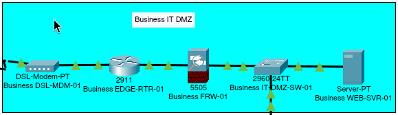

# Business IT DMZ

## Overview

The Business IT DMZ hosts the public-facing business web server and provides controlled handoffs to both the Internet and the internal Business IT segment. Its external service path contains a DSL modem, an edge router, a perimeter firewall, a DMZ access switch, and a web server. `Business FRW-02` forms the downstream boundary toward Business IT.

The edge router connects to the ISP-facing `203.0.114.0/24` network. A dedicated `10.255.0.0/30` transit network links the edge router to `Business FRW-01`, while the protected DMZ uses `172.16.10.0/24`. The private web server is published as `203.0.114.10` through static NAT on the edge router.

## Topology



The image captures the configured external service chain. `Business FRW-02` was added after this segment image was captured, so the topology flow and connectivity tables below are authoritative for the downstream Business IT handoff.

The complete physical traffic path is:

```text
Internet
   |
Business DSL-MDM-01
   |
Business EDGE-RTR-01
   |
Business FRW-01
   |
Business IT-DMZ-SW-01
   |-- Business WEB-SVR-01
   `-- Business FRW-02 -> Business IT
```

`Business IT-DMZ-SW-01` uses `GigabitEthernet0/2` for the downstream firewall handoff to `Business FRW-02 Ethernet0/1`. The firewall's DMZ-facing outside interface is configured in this segment, while its IT-facing inside interface and policy belong to the Business IT configuration.

## Device Inventory

| Device | Packet Tracer model | Role |
| --- | --- | --- |
| Business DSL-MDM-01 | DSL-Modem-PT | Business premises connection to the ISP network |
| Business EDGE-RTR-01 | Cisco 2911 | Internet edge routing and static NAT |
| Business FRW-01 | Cisco ASA 5505 | Security boundary between the edge transit network and public DMZ |
| Business IT-DMZ-SW-01 | Cisco 2960-24TT | Layer 2 access switch for the public DMZ |
| Business WEB-SVR-01 | Server-PT | Public-facing business HTTP and HTTPS server |
| Business FRW-02 | Cisco ASA 5505 | Downstream security boundary toward Business IT |

## IPv4 Addressing

### ISP-Facing Network

| Device or service | Interface or role | IPv4 address | Subnet mask |
| --- | --- | --- | --- |
| Business EDGE-RTR-01 | GigabitEthernet0/1 | `203.0.114.2` | `255.255.255.0` |
| Business WEB-SVR-01 | Public static NAT address | `203.0.114.10` | Not applicable |

### Router-to-Firewall Transit Network

| Device | Interface or role | IPv4 address | Subnet mask |
| --- | --- | --- | --- |
| Business EDGE-RTR-01 | GigabitEthernet0/0 | `10.255.0.1` | `255.255.255.252` |
| Business FRW-01 | Vlan2 (`outside`) | `10.255.0.2` | `255.255.255.252` |

### Public DMZ Network

| Device | Interface or role | IPv4 address | Subnet mask | Default gateway | DNS server |
| --- | --- | --- | --- | --- | --- |
| Business FRW-01 | Vlan1 (`dmz`) | `172.16.10.1` | `255.255.255.0` | Not applicable | Not applicable |
| Business WEB-SVR-01 | FastEthernet0 | `172.16.10.2` | `255.255.255.0` | `172.16.10.1` | `198.51.100.50` |
| Business FRW-02 | Vlan2 (`outside`) | `172.16.10.3` | `255.255.255.0` | `172.16.10.1` | Not applicable |

## Edge Routing and NAT

### Interface Roles

| Router interface | Connected network | IPv4 configuration | NAT role | State |
| --- | --- | --- | --- | --- |
| GigabitEthernet0/0 | Firewall transit network | `10.255.0.1/30` | Inside | Enabled |
| GigabitEthernet0/1 | ISP-facing network | `203.0.114.2/24` | Outside | Enabled |

### Routing Table

| Route type | Destination | Next hop or interface | Purpose |
| --- | --- | --- | --- |
| Connected | `10.255.0.0/30` | GigabitEthernet0/0 | Firewall transit reachability |
| Connected | `203.0.114.0/24` | GigabitEthernet0/1 | ISP-facing reachability |
| Static | `172.16.10.0/24` | `10.255.0.2` | Public DMZ reachability through `Business FRW-01` |
| Static default | `0.0.0.0/0` | `203.0.114.1` | Forwards non-local traffic to `ISP-RTR-01` |

### Static NAT Policy

| Inside-local address | Inside-global address | Translation type | Published system |
| --- | --- | --- | --- |
| `172.16.10.2` | `203.0.114.10` | One-to-one static NAT | Business WEB-SVR-01 |

The static translation makes the web server reachable through a public address on the ISP-facing network. It does not independently authorize inbound traffic; `Business FRW-01` enforces the permitted protocol policy.

## Perimeter Firewall Policy

The ASA 5505 assigns IPv4 addresses and security settings to logical VLAN interfaces. Its Ethernet interfaces operate as Layer 2 access ports assigned to those VLANs. NAT is not configured on this firewall because address translation occurs on the edge router.

### Security Zones

| VLAN interface | Interface name | Security level | Access port | Connected network |
| --- | --- | --- | --- | --- |
| Vlan1 | `dmz` | 50 | Ethernet0/0 | Public DMZ (`172.16.10.0/24`) |
| Vlan2 | `outside` | 0 | Ethernet0/1 | Router transit network (`10.255.0.0/30`) |

The firewall default route uses `10.255.0.1` on the `outside` interface.

### Inbound Access Policy

| Source | Destination | Protocol | Purpose |
| --- | --- | --- | --- |
| Any | `172.16.10.2` | ICMP | External reachability testing |
| Any | `172.16.10.2` | TCP/80 | Public HTTP service |
| Any | `172.16.10.2` | TCP/443 | Public HTTPS service |

Inbound traffic that does not match these entries is denied by the firewall's implicit rule. Traffic addressed to the ASA itself is controlled separately from traffic forwarded through it.

## Switch Configuration

`Business IT-DMZ-SW-01` uses VLAN 10 (`PUBLIC_DMZ`) for all currently connected DMZ systems and boundary devices.

| Switch interface | Connected device | VLAN | Port mode | PortFast |
| --- | --- | --- | --- | --- |
| GigabitEthernet0/1 | Business FRW-01 | 10 | Access | Disabled |
| FastEthernet0/1 | Business WEB-SVR-01 | 10 | Access | Enabled |
| GigabitEthernet0/2 | Business FRW-02 | 10 | Access | Disabled |

## Network Services

| Server | IPv4 configuration | Default gateway | DNS server | Enabled services |
| --- | --- | --- | --- | --- |
| Business WEB-SVR-01 | `172.16.10.2/24` | `172.16.10.1` | `198.51.100.50` | HTTP and HTTPS |

The ISP DNS server contains an A record mapping `www.business.example` to the public static NAT address `203.0.114.10`. Unrelated services on the business web server remain disabled.

## Physical Connectivity

| Source device | Source port | Destination device | Destination port | Connection type |
| --- | --- | --- | --- | --- |
| WAN-02 | Modem4 | Business DSL-MDM-01 | Port 0 | Telephone/DSL cable |
| Business DSL-MDM-01 | Port 1 | Business EDGE-RTR-01 | GigabitEthernet0/1 | Copper Ethernet |
| Business EDGE-RTR-01 | GigabitEthernet0/0 | Business FRW-01 | Ethernet0/1 | Copper Ethernet |
| Business FRW-01 | Ethernet0/0 | Business IT-DMZ-SW-01 | GigabitEthernet0/1 | Copper Ethernet |
| Business IT-DMZ-SW-01 | FastEthernet0/1 | Business WEB-SVR-01 | FastEthernet0 | Copper Ethernet |
| Business IT-DMZ-SW-01 | GigabitEthernet0/2 | Business FRW-02 | Ethernet0/1 | Copper Ethernet |

## Validated Connectivity

| Source | Destination or service | Result |
| --- | --- | --- |
| Business WEB-SVR-01 | DMZ gateway at `172.16.10.1` | Reachable |
| Business WEB-SVR-01 | ISP DNS server at `198.51.100.50` | Reachable |
| Business FRW-02 | Upstream firewall at `172.16.10.1` | Reachable |
| Business FRW-02 | Business web server at `172.16.10.2` | Reachable |
| Customer network | Business public address at `203.0.114.10` | Reachable through static NAT and the firewall |
| Customer network | DNS resolution for `www.business.example` | Operational |
| Customer network | HTTP access to `www.business.example` | Operational |
| Business EDGE-RTR-01 | Static mapping between `203.0.114.10` and `172.16.10.2` | Present |

## Network Boundaries

- `Business EDGE-RTR-01` connects the business environment to the ISP-facing `203.0.114.0/24` network.
- Static NAT publishes only the address identity of the private web server; the perimeter firewall controls permitted inbound protocols.
- The `10.255.0.0/30` network is dedicated to transit between the edge router and `Business FRW-01`.
- `Business FRW-01` separates the untrusted router transit network from the public DMZ.
- The public DMZ is contained within VLAN 10 and `172.16.10.0/24`.
- `Business FRW-02` is the only physical handoff from the public DMZ toward Business IT.
- `Business FRW-02 Ethernet0/1` is assigned to its `outside` VLAN at security level 0 and uses `172.16.10.1` as its default-route next hop.
- The downstream firewall's inside interface and Business IT addressing are documented in the [Business IT README](../business-it/README.md).
