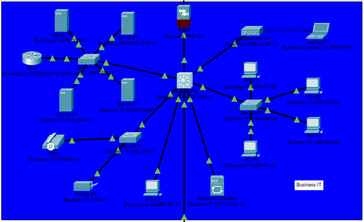

# Business IT

## Overview

The Business IT segment contains the organization's internal users, servers, shared services, guest wireless access, and network-management systems. `Business-FRW-02` separates this segment from the public Business IT DMZ, while `Business-IT-CORE-SW-01` provides Layer 3 routing between the internal VLANs.

The physical design uses a collapsed-core architecture with one Cisco 3560-24PS multilayer switch and three Cisco 2960-24TT access switches. The access switches separate server, user, and office-service connections. The disabled connection to `Business-FRW-03` will provide the controlled handoff toward the future OT DMZ.

This document records the as-built checkpoint reached on 2026-07-21. `Complete` means the configuration was applied and its principal traffic path was tested. `Partial` means useful configuration exists but validation or hardening remains. `Pending` means the work has not been implemented. `Deferred` identifies work intentionally reserved for a later project phase.

## Topology



```text
Public Business IT DMZ
          |
Business-FRW-02
 outside: 172.16.10.3/24
 inside:  10.255.0.6/30
          |
Business-IT-CORE-SW-01
          |-- Business-IT-SRV-SW-01 -> Internal servers and voice gateway
          |-- Business-IT-USR-SW-01 -> Employee PCs
          |-- Business-IT-SVC-SW-01 -> IP phone and printer
          |-- Business-IT-GUEST-AP-01
          |-- Business-IT-ADMIN-PC-01
          |-- Business-IT-NET-CTRL-01
          `-- Business-FRW-03 -> Future OT DMZ
```

## Current Checkpoint

| Area | Status | Evidence or remaining condition |
| --- | --- | --- |
| Device inventory and naming | Complete | Business IT devices use standardized role-based names |
| Physical Business IT connectivity | Complete | Core, access switches, endpoints, FRW-02, and the voice gateway are connected |
| VLANs, trunks, and access ports | Complete | VLANs 20-70 and 999 are active on their required links |
| Core SVIs and inter-VLAN routing | Complete | All six functional VLAN gateways are connected and reachable |
| FRW-02-to-core transit | Complete | `10.255.0.4/30` is routed in both directions |
| Switch management addressing | Complete | Core and access-switch management addresses are reachable |
| Server and fixed-endpoint addressing | Complete | Four servers, printer, administrator PC, controller, and voice gateway use static addresses |
| DHCP and relay | Complete | User, voice, and guest clients received leases from their respective scopes |
| Internal DNS | Complete | Internal and duplicated public records resolve from managed clients |
| NTP | Partial | Server and client configuration exists, but device clocks remain at the default 1 March 1993 epoch; synchronization is not validated |
| Internal application | Complete | HTTPS service reached by DNS name from the user VLAN |
| Internal file transfer | Complete | FTP authentication and upload validated from the user VLAN |
| Guest wireless | Partial | WPA2-PSK association and DHCP work; guest isolation ACL is still pending |
| IP telephony | Complete | The phone registers with CME as extension `2001` |
| Centralized syslog | Partial | Core, access-switch, and voice-gateway messages are validated; firewall logging is pending |
| Network controller | Partial | Statically addressed and reachable; managed-device integration is pending |
| Business IT Internet access | Pending | Upstream return routes, outbound policy, and edge PAT are not configured |
| Inter-VLAN security policy | Pending | The core currently permits unrestricted routing between internal VLANs |
| Management-plane hardening | Pending | SSH, AAA/local administration, VTY restrictions, and Telnet removal remain |
| Unused-port hardening | Pending | Unused ports still require parking in VLAN 999 and administrative shutdown |
| OT DMZ handoff | Deferred | `Business-FRW-03` remains physically connected but disabled |

## Device Inventory

| Device | Packet Tracer model | Role |
| --- | --- | --- |
| Business-FRW-02 | Cisco ASA 5505 | Security boundary between the public DMZ and Business IT |
| Business-IT-CORE-SW-01 | Cisco 3560-24PS | Layer 3 collapsed-core switch and VLAN gateway |
| Business-IT-SRV-SW-01 | Cisco 2960-24TT | Server access switch |
| Business-IT-USR-SW-01 | Cisco 2960-24TT | Employee access switch |
| Business-IT-SVC-SW-01 | Cisco 2960-24TT | Voice and printer access switch |
| Business-IT-INFRA-SVR-01 | Server-PT | Internal DNS, DHCP, and NTP server |
| Business-IT-APP-SVR-01 | Server-PT | Internal HTTPS application server |
| Business-IT-FILE-SVR-01 | Server-PT | Internal FTP-based lab file-transfer server |
| Business-IT-MON-SVR-01 | Server-PT | Centralized syslog and monitoring server |
| Business-IT-VOICE-GW-01 | Cisco 2811 | Internal CallManager Express and IP phone configuration service |
| Business-IT-USR-PC-01 through 04 | PC-PT | Employee workstations |
| Business-IT-ADMIN-PC-01 | PC-PT | Restricted administrator workstation |
| Business-IT-NET-CTRL-01 | NetworkController | Centralized network-management controller |
| Business-IT-GUEST-AP-01 | AccessPoint-PT | Guest wireless access point |
| Business-IT-GUEST-LAPTOP-01 | Laptop-PT with WPC300N | Representative guest wireless client |
| Business-IT-PHONE-01 | Cisco 7960 | Voice endpoint |
| Business-IT-PRN-01 | Printer-PT | Shared office printer |
| Business-FRW-03 | Firewall | Future Business IT-to-OT DMZ boundary |

## VLAN and IPv4 Plan

| VLAN | Name | IPv4 subnet | Core gateway | Purpose |
| --- | --- | --- | --- | --- |
| 20 | `IT_SERVERS` | `10.10.20.0/24` | `10.10.20.1` | Internal servers |
| 30 | `IT_USERS` | `10.10.30.0/24` | `10.10.30.1` | Employee workstations |
| 40 | `IT_VOICE` | `10.10.40.0/24` | `10.10.40.1` | IP telephony |
| 50 | `IT_PRINTERS` | `10.10.50.0/24` | `10.10.50.1` | Shared printers |
| 60 | `IT_GUEST` | `10.10.60.0/24` | `10.10.60.1` | Guest wireless clients |
| 70 | `IT_MANAGEMENT` | `10.10.70.0/24` | `10.10.70.1` | Network management and administration |
| 999 | `PARKING_LOT` | None | None | Native trunk VLAN and unused ports |

All functional VLAN gateways are switched virtual interfaces on `Business-IT-CORE-SW-01`. IP routing is enabled on the core.

## Firewall Boundary

### Interface Configuration

| Logical interface | Name | Security level | IPv4 configuration | Physical port | Connected network |
| --- | --- | --- | --- | --- | --- |
| Vlan2 | `outside` | 0 | `172.16.10.3/24` | Ethernet0/1 | Public Business IT DMZ |
| Vlan1 | `inside` | 100 | `10.255.0.6/30` | Ethernet0/0 | Business IT core transit |

### Routing

| Route type | Destination | Next hop | Interface |
| --- | --- | --- | --- |
| Connected | `172.16.10.0/24` | Directly connected | `outside` |
| Connected | `10.255.0.4/30` | Directly connected | `inside` |
| Static | `10.10.0.0/16` | `10.255.0.5` | `inside` |
| Static default | `0.0.0.0/0` | `172.16.10.1` | `outside` |

`Business-FRW-02` does not currently perform NAT. Unsolicited traffic arriving from the security-level-0 `outside` interface cannot enter Business IT unless explicitly permitted by a future firewall policy. Return traffic for statefully tracked inside-originated sessions is handled separately by the firewall.

## Core Routing

The core-to-firewall link is a routed point-to-point connection rather than a Layer 2 trunk.

| Core interface | IPv4 configuration | Connected device |
| --- | --- | --- |
| GigabitEthernet0/1 | `10.255.0.5/30` | Business-FRW-02 Ethernet0/0 |

The core contains a static default route through `10.255.0.6`. Its routing table also contains the six directly connected Business IT `/24` networks and the `10.255.0.4/30` firewall transit network.

### DHCP Relay

| Client VLAN | Relay destination | Status |
| --- | --- | --- |
| VLAN 30 - IT_USERS | `10.10.20.10` | Configured and validated from employee PCs |
| VLAN 40 - IT_VOICE | `10.10.20.10` | Configured and validated from the IP phone |
| VLAN 60 - IT_GUEST | `10.10.20.10` | Configured and validated from the guest wireless client |

`10.10.20.10` is the static address of `Business-IT-INFRA-SVR-01`.

## Server Addressing

| Server | IPv4 address | Subnet mask | Default gateway | DNS server |
| --- | --- | --- | --- | --- |
| Business-IT-INFRA-SVR-01 | `10.10.20.10` | `255.255.255.0` | `10.10.20.1` | `10.10.20.10` |
| Business-IT-APP-SVR-01 | `10.10.20.20` | `255.255.255.0` | `10.10.20.1` | `10.10.20.10` |
| Business-IT-FILE-SVR-01 | `10.10.20.30` | `255.255.255.0` | `10.10.20.1` | `10.10.20.10` |
| Business-IT-MON-SVR-01 | `10.10.20.40` | `255.255.255.0` | `10.10.20.1` | `10.10.20.10` |

## Infrastructure Services

`Business-IT-INFRA-SVR-01` provides the internal DNS, DHCP, and NTP services. Its unrelated Packet Tracer services are disabled.

### Internal DNS Records

| Name | IPv4 address | Purpose |
| --- | --- | --- |
| `infra.business.example` | `10.10.20.10` | Infrastructure services |
| `app.business.example` | `10.10.20.20` | Internal application server |
| `files.business.example` | `10.10.20.30` | Internal file server |
| `monitor.business.example` | `10.10.20.40` | Internal monitoring server |
| `controller.business.example` | `10.10.70.20` | Network controller |
| `printer.business.example` | `10.10.50.10` | Shared office printer |
| `voice.business.example` | `10.10.20.50` | CallManager Express voice gateway |
| `www.isp.example` | `198.51.100.51` | Public ISP test website |
| `www.business.example` | `203.0.114.10` | Public business website |

The two public records are also present on the internal server because Packet Tracer does not model a complete recursive DNS forwarding design.

### DHCP Scopes

| Pool | Client subnet | Default gateway | DNS server | First lease | Maximum leases |
| --- | --- | --- | --- | --- | --- |
| `IT_USERS` | `10.10.30.0/24` | `10.10.30.1` | `10.10.20.10` | `10.10.30.100` | 100 |
| `IT_VOICE` | `10.10.40.0/24` | `10.10.40.1` | `10.10.20.10` | `10.10.40.100` | 50 |
| `IT_GUEST` | `10.10.60.0/24` | `10.10.60.1` | `198.51.100.50` | `10.10.60.100` | 100 |

All three pools use a `255.255.255.0` subnet mask. The `IT_VOICE` pool supplies `10.10.20.50` as its TFTP/option 150 destination; TFTP is not assigned to the user or guest pools. Guest clients receive the ISP DNS service rather than the internal DNS server to avoid granting them a dependency on an internal service.

The NTP service is enabled without authentication for this Packet Tracer implementation. Client devices have been pointed at `10.10.20.10`, but their clocks remain at the default 1 March 1993 IOS epoch. NTP must therefore be treated as configured but not operational until `show ntp associations`, `show ntp status`, and `show clock` prove synchronization or a Packet Tracer-compatible alternative is implemented.

### Internal Application Service

`Business-IT-APP-SVR-01` provides the simulated internal business application at `https://app.business.example`. HTTPS is enabled, cleartext HTTP is disabled, and unrelated Packet Tracer services are disabled. The static page represents application availability; Packet Tracer does not model the application's business logic, authentication, or database tier.

### Internal File-Transfer Service

`Business-IT-FILE-SVR-01` provides the lab's internal file-transfer service at `files.business.example`. The FTP service uses a dedicated account with read, write, and list permissions; its password is intentionally omitted from this document. Unrelated Packet Tracer services are disabled.

FTP transfers credentials and data in cleartext. It is used only because Packet Tracer does not adequately model a modern managed file service. A production implementation would normally use an authenticated SMB service or SFTP, combined with authorization, encryption, endpoint controls, and auditable storage.

### Centralized Logging

`Business-IT-MON-SVR-01` receives centralized syslog messages at `monitor.business.example`. The core, all three access switches, and the voice gateway forward informational and more serious events to `10.10.20.40` and add date-and-time information to locally generated messages. The access-switch logs originate from their VLAN 70 management addresses, while voice-gateway messages originate from `10.10.20.50`.

Packet Tracer's simulated 3560 accepts the abbreviated `logging trap` command and internally selects the informational level, but rejects explicit severity arguments. It also does not implement `logging source-interface`. Consequently, core messages arrive from `10.10.20.1`, the SVI used to reach the directly connected monitoring server, instead of the core's management address in VLAN 70.

## Trunk Configuration

All switch-to-switch trunks use IEEE 802.1Q, native VLAN 999, and explicit VLAN allowlists.

| Core port | Access-switch port | Connected switch | Allowed VLANs | Native VLAN |
| --- | --- | --- | --- | --- |
| FastEthernet0/2 | GigabitEthernet0/1 | Business-IT-SRV-SW-01 | 20, 70, 999 | 999 |
| FastEthernet0/3 | GigabitEthernet0/1 | Business-IT-USR-SW-01 | 30, 70, 999 | 999 |
| FastEthernet0/4 | GigabitEthernet0/1 | Business-IT-SVC-SW-01 | 40, 50, 70, 999 | 999 |

The allowlists prevent unrelated VLANs from being transported to access switches that do not serve them. VLAN 999 carries no user service and receives any untagged trunk traffic.

## Access-Port Configuration

| Switch | Port or range | Connected endpoint | VLAN assignment | Edge protection |
| --- | --- | --- | --- | --- |
| Business-IT-SRV-SW-01 | FastEthernet0/1-4 | Four internal servers | Access VLAN 20 | PortFast and BPDU Guard |
| Business-IT-SRV-SW-01 | FastEthernet0/5 | Business-IT-VOICE-GW-01 | Access VLAN 20 | PortFast and BPDU Guard |
| Business-IT-USR-SW-01 | FastEthernet0/1-4 | Four employee PCs | Access VLAN 30 | PortFast and BPDU Guard |
| Business-IT-SVC-SW-01 | FastEthernet0/1 | Business-IT-PHONE-01 | Data VLAN 999; voice VLAN 40 | PortFast and BPDU Guard |
| Business-IT-SVC-SW-01 | FastEthernet0/2 | Business-IT-PRN-01 | Access VLAN 50 | PortFast and BPDU Guard |
| Business-IT-CORE-SW-01 | FastEthernet0/5 | Business-IT-GUEST-AP-01 | Access VLAN 60 | PortFast and BPDU Guard |
| Business-IT-CORE-SW-01 | FastEthernet0/6 | Business-IT-ADMIN-PC-01 | Access VLAN 70 | PortFast and BPDU Guard |
| Business-IT-CORE-SW-01 | FastEthernet0/7 | Business-IT-NET-CTRL-01 | Access VLAN 70 | PortFast and BPDU Guard |

PortFast removes the normal Spanning Tree startup delay on endpoint connections. BPDU Guard disables an endpoint port if it begins receiving switch-control BPDUs.

## Management Addressing

| Device | Interface or role | IPv4 address | Subnet mask | Default gateway | DNS server |
| --- | --- | --- | --- | --- | --- |
| Business-IT-CORE-SW-01 | Vlan70 gateway | `10.10.70.1` | `255.255.255.0` | `10.255.0.6` through the core default route | `10.10.20.10` when name resolution is configured |
| Business-IT-SRV-SW-01 | Vlan70 | `10.10.70.11` | `255.255.255.0` | `10.10.70.1` | Not applicable |
| Business-IT-USR-SW-01 | Vlan70 | `10.10.70.12` | `255.255.255.0` | `10.10.70.1` | Not applicable |
| Business-IT-SVC-SW-01 | Vlan70 | `10.10.70.13` | `255.255.255.0` | `10.10.70.1` | Not applicable |
| Business-IT-NET-CTRL-01 | Network interface | `10.10.70.20` | `255.255.255.0` | `10.10.70.1` | `10.10.20.10` |
| Business-IT-ADMIN-PC-01 | FastEthernet0 | `10.10.70.30` | `255.255.255.0` | `10.10.70.1` | `10.10.20.10` |

## Endpoint Addressing

| Endpoint group or device | Addressing | Default gateway | DNS server |
| --- | --- | --- | --- |
| Business-IT-USR-PC-01 through 04 | DHCP from the `IT_USERS` pool, beginning at `10.10.30.100` | `10.10.30.1` | `10.10.20.10` |
| Business-IT-PHONE-01 | DHCP from the `IT_VOICE` pool, beginning at `10.10.40.100` | `10.10.40.1` | `10.10.20.10` |
| Business-IT-PRN-01 | Static `10.10.50.10/24` | `10.10.50.1` | `10.10.20.10` |
| Business-IT-GUEST-LAPTOP-01 | DHCP from the `IT_GUEST` pool, beginning at `10.10.60.100` | `10.10.60.1` | `198.51.100.50` |

## Guest Wireless

`Business-IT-GUEST-AP-01` operates as a Layer 2 access point on access VLAN 60. It does not provide routing, NAT, or DHCP; guest DHCP requests are relayed by the VLAN 60 SVI to `Business-IT-INFRA-SVR-01`.

| Setting | Configuration |
| --- | --- |
| SSID | `Business-Guest` |
| Radio channel | 6 |
| Authentication | WPA2-PSK |
| Encryption | AES |
| Pre-shared key | Configured; omitted from documentation |

The generic Packet Tracer access point does not model the separate management and client VLAN design normally used with enterprise wireless infrastructure. Guest-client isolation will therefore be enforced at the Layer 3 boundary where Packet Tracer permits it.

## Voice Service

`Business-IT-VOICE-GW-01` provides CallManager Express from FastEthernet0/0 at `10.10.20.50/24` in the server VLAN. It uses `10.10.20.1` as its default route, advertises its SCCP service on TCP port 2000, and supports up to five ephones and five directory numbers in the current lab configuration.

`Business-IT-PHONE-01` receives the CME address through DHCP option 150, downloads its configuration, and registers successfully as extension `2001`. Only one phone and directory number are currently provisioned, so registration is validated but phone-to-phone calling is outside the present topology.

## Physical Connectivity

| Source device | Source port | Destination device | Destination port | Link role |
| --- | --- | --- | --- | --- |
| Business IT-DMZ-SW-01 | GigabitEthernet0/2 | Business-FRW-02 | Ethernet0/1 | Public DMZ handoff |
| Business-FRW-02 | Ethernet0/0 | Business-IT-CORE-SW-01 | GigabitEthernet0/1 | Routed firewall transit |
| Business-IT-CORE-SW-01 | FastEthernet0/2 | Business-IT-SRV-SW-01 | GigabitEthernet0/1 | 802.1Q server trunk |
| Business-IT-SRV-SW-01 | FastEthernet0/5 | Business-IT-VOICE-GW-01 | FastEthernet0/0 | Voice call-control connection in VLAN 20 |
| Business-IT-CORE-SW-01 | FastEthernet0/3 | Business-IT-USR-SW-01 | GigabitEthernet0/1 | 802.1Q user trunk |
| Business-IT-CORE-SW-01 | FastEthernet0/4 | Business-IT-SVC-SW-01 | GigabitEthernet0/1 | 802.1Q voice/printer trunk |
| Business-IT-CORE-SW-01 | FastEthernet0/5 | Business-IT-GUEST-AP-01 | Ethernet uplink | Guest access link |
| Business-IT-CORE-SW-01 | FastEthernet0/6 | Business-IT-ADMIN-PC-01 | FastEthernet0 | Management access link |
| Business-IT-CORE-SW-01 | FastEthernet0/7 | Business-IT-NET-CTRL-01 | Network interface | Management access link |
| Business-IT-CORE-SW-01 | GigabitEthernet0/2 | Business-FRW-03 | Pending | Future OT DMZ handoff; shutdown in VLAN 999 |

## Validated Connectivity

| Source | Destination | Result |
| --- | --- | --- |
| Business-IT-CORE-SW-01 | Business-FRW-02 at `10.255.0.6` | Reachable |
| Business-IT-CORE-SW-01 | Business-IT-SRV-SW-01 at `10.10.70.11` | Reachable |
| Business-IT-CORE-SW-01 | Business-IT-USR-SW-01 at `10.10.70.12` | Reachable |
| Business-IT-CORE-SW-01 | Business-IT-SVC-SW-01 at `10.10.70.13` | Reachable |
| Business-IT-CORE-SW-01 | Business-IT-NET-CTRL-01 at `10.10.70.20` | Reachable |
| Business-IT-CORE-SW-01 | Business-IT-ADMIN-PC-01 at `10.10.70.30` | Reachable |
| Business-IT-CORE-SW-01 | Internal servers at `10.10.20.10`, `.20`, `.30`, and `.40` | Reachable |
| Internal servers | Other servers in VLAN 20 | Reachable |
| Employee PCs in VLAN 30 | `IT_USERS` DHCP scope through relay at `10.10.30.1` | Leases received successfully |
| Business-IT-USR-PC-01 | VLAN 30 gateway at `10.10.30.1` | Reachable |
| Business-IT-USR-PC-01 | Infrastructure server at `10.10.20.10` | Reachable |
| Business-IT-USR-PC-01 | `app.business.example` and `www.business.example` | Resolved successfully through internal DNS |
| Business-IT-ADMIN-PC-01 | VLAN 50 gateway and printer at `10.10.50.1` and `10.10.50.10` | Reachable |
| Employee PC in VLAN 30 | Printer at `10.10.50.10` | Reachable |
| Business-IT-ADMIN-PC-01 | `printer.business.example` | Resolved successfully through internal DNS |
| Business-IT-GUEST-LAPTOP-01 | `Business-Guest` SSID using WPA2-PSK/AES | Associated successfully |
| Business-IT-GUEST-LAPTOP-01 | `IT_GUEST` DHCP scope through relay at `10.10.60.1` | Lease received successfully |
| Business-IT-GUEST-LAPTOP-01 | VLAN 60 gateway at `10.10.60.1` | Reachable |
| Business-IT-GUEST-LAPTOP-01 | Infrastructure server at `10.10.20.10` before ACL enforcement | Reachable as expected in the current unrestricted state |
| Business-IT-PHONE-01 | `IT_VOICE` DHCP scope through relay at `10.10.40.1` | Lease received successfully |
| Business-IT-ADMIN-PC-01 | IP phone at `10.10.40.100` | Reachable |
| Business-IT-VOICE-GW-01 | Server VLAN gateway at `10.10.20.1` | Reachable |
| Business-IT-VOICE-GW-01 | IP phone at `10.10.40.100` | Reachable |
| Business-IT-ADMIN-PC-01 | Voice gateway at `10.10.20.50` | Reachable |
| Business-IT-PHONE-01 | CME service at `10.10.20.50` | Registered successfully as extension `2001` |
| Business-IT-USR-PC-01 | `app.business.example` at `10.10.20.20` | Resolved and reachable |
| Business-IT-USR-PC-01 | `https://app.business.example` | HTTPS page loaded successfully |
| Business-IT-USR-PC-01 | `files.business.example` at `10.10.20.30` | Resolved and reachable |
| Business-IT-USR-PC-01 | FTP service on `files.business.example` | Authenticated upload and directory listing completed successfully |
| Business-IT-CORE-SW-01 | Syslog service at `10.10.20.40` | Informational message received by the monitoring server from `10.10.20.1` |
| Business-IT-SRV-SW-01 | Syslog service at `10.10.20.40` | Message received from `10.10.70.11` |
| Business-IT-USR-SW-01 | Syslog service at `10.10.20.40` | Message received from `10.10.70.12` |
| Business-IT-SVC-SW-01 | Syslog service at `10.10.20.40` | Message received from `10.10.70.13` |
| Business-IT-VOICE-GW-01 | Syslog service at `10.10.20.40` | Message received from `10.10.20.50` |

The core routing table contains active connected routes for VLANs 20, 30, 40, 50, 60, and 70 after VLAN 50 was added to the service-switch trunk allowlist.

## Current Security Posture

- Unsolicited public DMZ traffic cannot enter Business IT through `Business-FRW-02` without an explicit future ACL entry.
- VLANs currently provide Layer 2 separation.
- The core currently routes freely between the internal VLANs because inter-VLAN ACLs have not yet been applied.
- Guest clients can currently reach internal IP addresses; this is a known temporary condition, not the target security policy.
- Endpoint ports use PortFast and BPDU Guard; switch trunks do not use these endpoint protections.
- The future OT-facing core port is assigned to VLAN 999 and administratively shut down.
- NAT and outbound Internet policy for Business IT have not yet been configured.
- Remote device administration has not yet been restricted to SSH or to approved management sources.
- FTP is present only as a Packet Tracer file-service substitute and is not suitable for production use.

## Remaining Work

The following work remains before the Business IT segment can be considered complete. The order reflects configuration dependencies and provides the intended restart sequence.

| Order | Work item | Scope | Completion criterion |
| --- | --- | --- | --- |
| 1 | Resolve or document NTP behavior | Infrastructure server, core, access switches, and voice gateway | Clocks show a useful synchronized date, or the Packet Tracer limitation and manual workaround are documented |
| 2 | Complete centralized device logging | Firewalls where supported | Monitoring server receives identifiable firewall events, or unsupported behavior is documented per device |
| 3 | Enable outbound Internet routing and PAT | Business edge router, `Business-FRW-01`, and `Business-FRW-02` path | Internal and guest clients receive return traffic from the ISP services using translated addresses |
| 4 | Define firewall egress and boundary policy | `Business-FRW-02` and upstream firewall path | Approved outbound sessions work while public-DMZ-initiated sessions into Business IT remain denied |
| 5 | Apply inter-VLAN ACLs | Core SVIs for VLANs 20-70 | Only the approved service flows in the policy matrix are permitted |
| 6 | Harden the management plane | Core, access switches, voice gateway, and firewalls | SSH replaces Telnet; management is accepted only from the administrator PC and approved controller; local or AAA fallback is tested |
| 7 | Harden unused switch ports | Core and three access switches | Every unused port is assigned to VLAN 999, forced to access mode, described as unused, and shut down |
| 8 | Complete the network-controller role | `Business-IT-NET-CTRL-01` and supported managed devices | Devices are enrolled and reachable through their management interfaces, or the controller is documented as a topology placeholder |
| 9 | Execute final validation | All Business IT VLANs and upstream boundaries | Allowed flows succeed, denied flows fail, DHCP/DNS remain operational, configurations survive a save/reload, and results are recorded |
| 10 | Finalize documentation | Business IT README and topology image | Final device names, ports, policies, limitations, and test results match the saved Packet Tracer file |

### Target Security Outcomes

| Source zone | Required access | Required denial |
| --- | --- | --- |
| IT users | Internal DNS, HTTPS application, approved file transfer, printer, and Internet | Guest, voice-control, and network-management interfaces except where explicitly required |
| IT voice | DHCP, DNS, NTP when operational, and CME at `10.10.20.50` | User, guest, printer, management, and unrelated server services |
| IT printers | Responses to approved clients and required management/monitoring | New sessions toward user, guest, voice, or unrelated server systems |
| IT guest | DHCP, public DNS, and Internet | All Business IT private networks, the public DMZ private subnet, and management services |
| IT management | Administration and monitoring of approved Business IT devices | Access from non-management endpoints into device-management services |
| Public DMZ | No unsolicited access into Business IT by default | Internal users, servers, printers, voice, guest, and management networks unless a documented exception is created |

### Deferred OT Work

`Business-FRW-03` and the OT DMZ handoff are intentionally outside the current Business IT completion scope. GigabitEthernet0/2 on the core must remain in VLAN 999 and administratively shut down until the OT DMZ design and policy are approved.

## Packet Tracer Limitations

- The current NTP configuration is not synchronizing device clocks; 1 March 1993 is the IOS default epoch, not a valid operational timestamp.
- The simulated 3560 accepts bare `logging trap` and defaults to informational severity, but rejects explicit severity and `logging source-interface` commands.
- Configured NTP clients remain at the IOS default epoch even though IP reachability to the NTP server works.
- The generic access point cannot model separate wireless-client and access-point-management VLANs.
- Packet Tracer DNS does not provide a complete recursive forwarding design, so required public records are duplicated internally.
- FTP is used only as a functional substitute for a managed file service because SMB and SFTP are not adequately modeled.
- A single registered phone validates CME registration but cannot validate phone-to-phone calling.

## Network Boundaries

- `Business-FRW-02` is the only configured upstream path from Business IT to the public DMZ and Internet.
- `Business-IT-CORE-SW-01` owns the internal VLAN gateways and performs inter-VLAN routing.
- The three access switches remain Layer 2 devices and use VLAN 70 solely for management.
- The guest, user, server, voice, printer, and management networks are separate Layer 2 domains.
- `Business-FRW-03` is physically connected but remains disabled, preventing an active Business IT-to-OT path.
