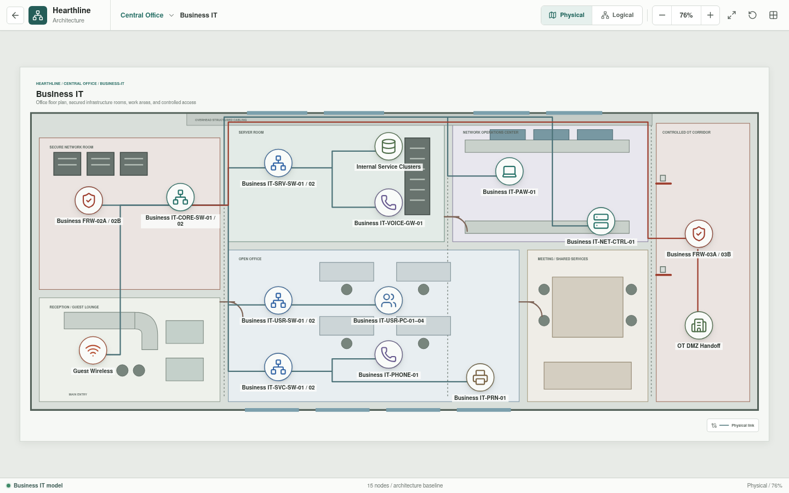
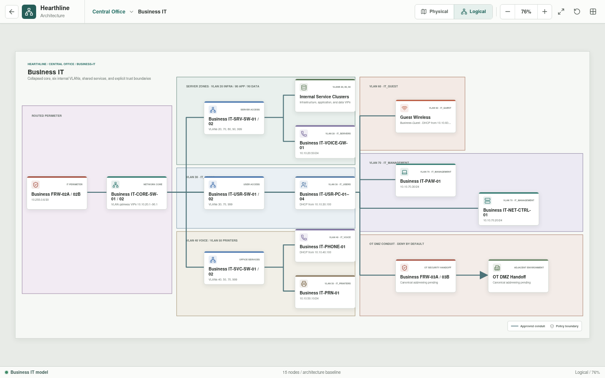

# Business IT

Business IT contains Hearthline's internal enterprise users, services,
management systems, voice, printers, and isolated guest access.

## Implementation Status

The enterprise zones, representative assets, and intended access relationships
are rendered in Svelte. Parsed appliance YAML now records VLAN baselines,
representative interfaces, services, voice, wireless, and default-deny
boundaries. These records are not yet assembled into the full topology, and
identity, detailed policy, monitoring, and HA behavior are not simulated.

## Architecture

`Business IT-CORE-SW-01/02` is the redundant Layer 3 core role. It provides
gateway VIPs and connects redundant server, user, and shared-service access
roles. `Business FRW-02A/02B` is the upstream boundary toward the public IT
DMZ. The governed factory path leaves through the Operations Intelligence
workflow and `Business FRW-03A/03B`; it does not provide a direct controller
route.

## VLANs

| VLAN | Name | Prefix | Purpose |
| --- | --- | --- | --- |
| 20 | Servers | `10.10.20.0/24` | Infrastructure and internal applications |
| 30 | Users | `10.10.30.0/24` | Managed employee endpoints |
| 40 | Voice | `10.10.40.0/24` | Enterprise voice |
| 50 | Printers | `10.10.50.0/24` | Shared printing |
| 60 | Guest | `10.10.60.0/24` | Isolated guest wireless |
| 70 | Management | `10.10.70.0/24` | Restricted administration |
| 80 | Applications | `10.10.80.0/24` | Internal application and API services |
| 90 | Data | `10.10.90.0/24` | Databases and protected application state |
| 999 | Native black hole | No routed prefix | Unused native VLAN |

The core gateway convention uses `.1` in each routed VLAN.

## Infrastructure

| Asset | Role |
| --- | --- |
| `Business FRW-02A/02B` | High-availability upstream security boundary |
| `Business IT-CORE-SW-01/02` | Redundant routed core and gateway role |
| `Business IT-SRV-SW-01/02` | Infrastructure, application, and data-zone access |
| `Internal Service Clusters` | DNS, DHCP, PKI, time, applications, data, transfer, monitoring, backup, and recovery |
| `Business IT-VOICE-GW-01` | Enterprise voice services |
| `Business IT-USR-SW-01/02` | Employee workstation access |
| `Business IT-SVC-SW-01/02` | Voice, printer, and wireless access |
| `Guest Wireless` | Isolated wireless clients |
| `Business IT-PAW-01` | Privileged access workstation |
| `Business IT-NET-CTRL-01` | Network-management controller |
| `Business FRW-03A/03B` | Governed northbound boundary for factory workflows |

## Policy Intent

- User devices receive only the internal and external services required for
  their role.
- Guest clients receive public access without routes to enterprise or factory
  networks.
- Printer access is limited to approved user and service sources.
- Management interfaces accept administration only from defined management
  identities and endpoints.
- Server-to-server traffic is declared by application dependency.
- Public DMZ traffic enters through `Business FRW-02A/02B`; it is not trusted
  because it crossed a perimeter.
- Public gateways reach only named application VIPs; application services reach
  only named data-service dependencies.
- Factory administration and data exchange follow the approved Operations
  Intelligence conduit.

## Service Intent

The internal service layer includes DNS, DHCP, time, identity dependencies,
application services, managed file transfer, monitoring, and voice. The current
YAML uses one logical internal service cluster. Later expansion must define each
service endpoint and consumer rather than granting broad VLAN-to-VLAN access.

## Planned Validation Scenarios

| Scenario | Expected result |
| --- | --- |
| Managed user to internal application | Allowed |
| Managed user to approved public service | Allowed |
| Guest client to internal VLANs | Denied |
| User endpoint to management interfaces | Denied |
| Admin workstation to approved management service | Allowed |
| Printer to unrelated user endpoints | Denied |
| Public DMZ to arbitrary internal server | Denied |
| Central analytics to an OT controller | Denied |

The planned evaluator will include the selected route, VLAN gateway, policy
boundary, service match, state, and denial explanation for every scenario.
