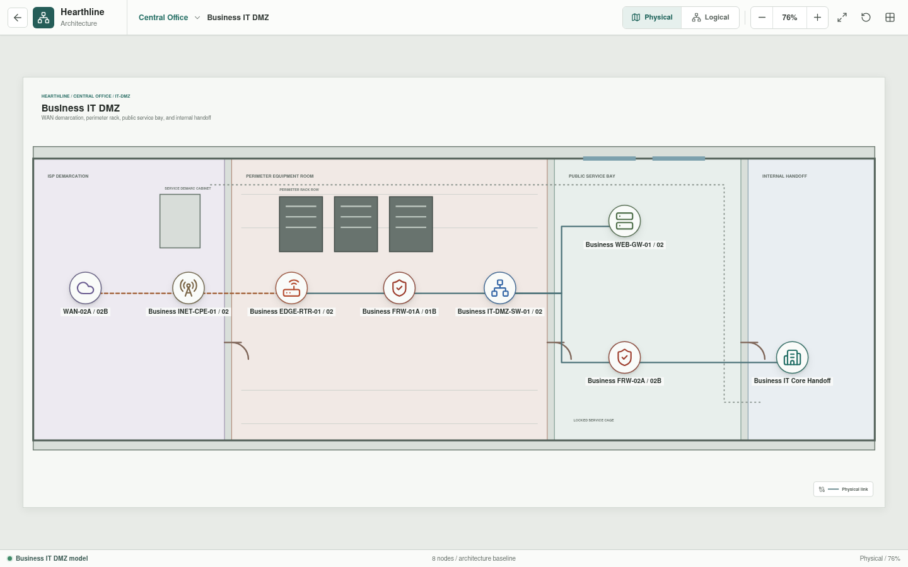

# Central Office IT DMZ

The IT DMZ publishes the business web service and provides controlled handoffs
to the provider and internal Business IT.




## Implementation Status

The DMZ architecture, addressing intent, and policy boundaries are represented
in Svelte. The paired assets indicate an availability target, not implemented
HA. Rust now contains initial NAT, firewall, service, and abstract web-gateway
primitives and parses each rendered appliance's YAML. The DMZ instances are not
yet connected into a complete simulation; TLS processing, synchronized HA
state, and failover are not implemented or tested.

## Architecture

```text
WAN-02A / WAN-02B
  -> Business INET-CPE-01/02
  -> Business EDGE-RTR-01/02
  -> Business FRW-01A/01B
  -> Business IT-DMZ-SW-01/02
       |-- Business WEB-GW-01/02
       `-- Business FRW-02A/02B
             `-- Business IT Core Handoff
```

## Inventory

| Asset | Role |
| --- | --- |
| `WAN-02A/02B` | Diverse business-facing provider circuits |
| `Business INET-CPE-01/02` | Provider-managed access CPE |
| `Business EDGE-RTR-01/02` | Redundant Internet edge and static NAT role |
| `Business FRW-01A/01B` | High-availability external perimeter policy boundary |
| `Business IT-DMZ-SW-01/02` | Redundant public DMZ switching |
| `Business WEB-GW-01/02` | Reverse proxy, TLS termination, and web application firewall |
| `Business FRW-02A/02B` | High-availability internal boundary toward Business IT |
| `Business IT Core Handoff` | Adjacent routed enterprise environment |

## Addressing

| Zone or link | Addressing | Purpose |
| --- | --- | --- |
| Provider-facing network | `192.0.2.0/24` | Business edge attachment |
| Edge-to-perimeter transit | `10.255.0.0/30` | Routed external firewall handoff |
| Public DMZ | `172.16.10.0/24` | Published services and internal boundary |
| DMZ-to-IT transit | `10.255.0.4/30` | Routed Business IT handoff |

The target design assigns `Business EDGE-RTR-01/02` a static translation from
`192.0.2.10` to the `Business WEB-GW-01/02` VIP at `172.16.10.2`.

## Policy Intent

- `Business FRW-01A/01B` allows HTTPS to the published gateway VIP. TCP/80 is
  redirect-only when enabled.
- Unmatched inbound traffic is denied.
- The public DMZ does not initiate unrestricted sessions into Business IT.
- `Business FRW-02A/02B` independently enforces named gateway-to-application
  dependencies across the DMZ-to-IT boundary.
- Device management uses dedicated management roles, not the public conduit.
- NAT and firewall policy remain separate concerns and are evaluated in order.

## Planned Validation Scenarios

| Flow | Expected result |
| --- | --- |
| Public DNS-resolved HTTPS to `192.0.2.10` | Allowed and translated to `172.16.10.2` |
| Public HTTP to the published service | Redirected to HTTPS when enabled |
| Unpublished public service | Denied |
| Public source to Business IT | Denied |
| Web server to an explicitly approved internal dependency | Allowed only by named rule |
| DMZ source to network-management interfaces | Denied |

The current appliance YAML defines baseline interfaces, services, translation,
and default-deny behavior. Planned schema expansion and topology construction
must replace generic policy placeholders with named references before the Rust
evaluator can report each route, NAT stage, policy boundary, and final result.
