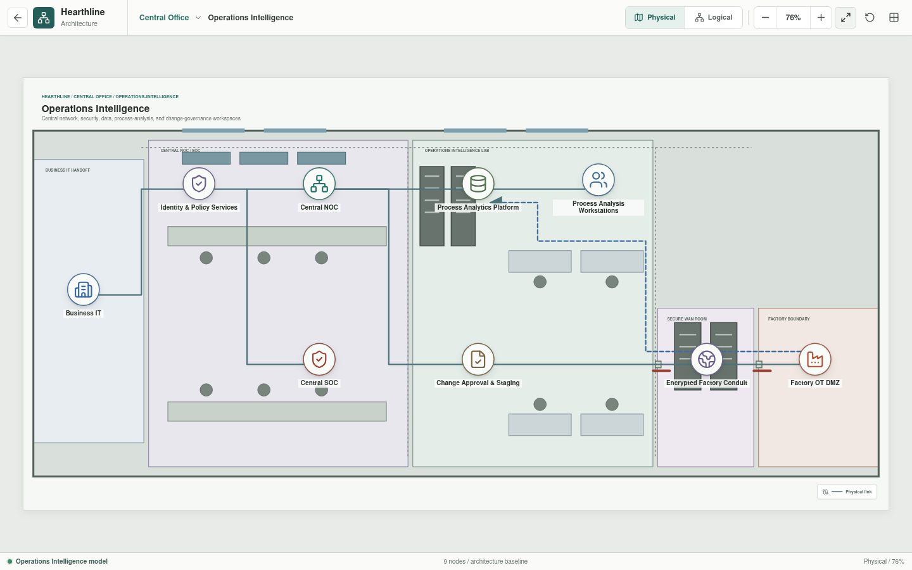
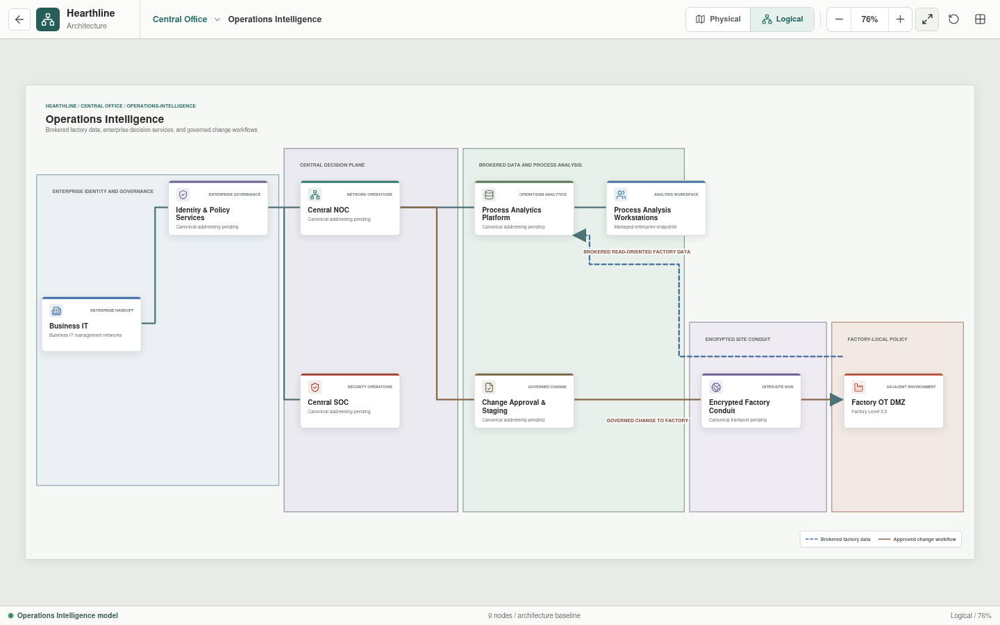

# Operations Intelligence

Operations Intelligence is the Central Office environment for architecture
governance, identity, monitoring, security operations, analytics, and approved
factory change workflows.

## Implementation Status

The governance, monitoring, analytics, identity, change, and conduit roles are
implemented as architecture views. Hearthline does not yet provide an identity
system, SOC or NOC tooling, analytics pipeline, package-signing workflow, or
inter-site transport.

## Responsibilities

| Capability | Responsibility |
| --- | --- |
| Identity and policy services | Authentication, authorization, device posture, and policy decisions |
| Central NOC | Architecture standards, availability, configuration governance, and change coordination |
| Central SOC | Security monitoring, investigation, and incident coordination |
| Process analytics platform | Analysis of approved production, quality, energy, and maintenance data |
| Process analysis workstations | Managed engineering and business analysis endpoints |
| Change approval and staging | Review, scanning, signing, approval, and controlled release |
| Encrypted Factory conduit | Authenticated inter-site transport to the factory perimeter |

## Authority Boundary

Central Office may define desired state, approve changes, and analyze selected
production data. Factory-local systems enforce OT policy and retain operational
authority. Analytics platforms consume brokered or replicated data and receive
no direct controller route.

The target workflow terminates administrative sessions at the Factory OT DMZ
jump service before a separately authorized southbound session is considered.
Change packages are intended to pass through managed transfer, inspection,
approval, and audit stages.

## Availability

Loss of Central Office or the inter-site conduit may interrupt analytics,
remote administration, and non-urgent changes. It must not stop local control,
safe shutdown, or essential factory operation.

## Planned Validation Scenarios

- Approved administrator reaches the OT DMZ jump service through the encrypted
  conduit.
- The same administrator cannot route directly to a controller.
- The analytics platform receives only approved replicated datasets.
- Unsigned or unapproved change packages are denied.
- SOC monitoring receives declared telemetry without becoming an inline process
  dependency.
- Factory operation continues when the inter-site conduit is unavailable.

These scenarios become executable only after the canonical data model, policy
engine, service models, and factory process state exist.
