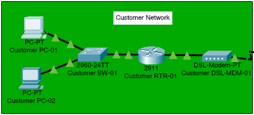

# Customer Network

## Overview

The customer network represents a small residential or remote-user environment that accesses the public Internet. It contains two end-user workstations, an access switch, an edge router, and a DSL modem.

The edge router provides the boundary between the private customer LAN (`192.168.0.0/24`) and the external ISP-facing network (`203.0.113.0/24`). The DSL modem connects the customer premises to the Internet segment.

## Topology



Traffic follows this path when either workstation communicates with an external service:

```text
Customer PC -> Customer SW-01 -> Customer RTR-01 -> Customer DSL-MDM-01 -> Internet
```

## Device Inventory

| Device | Packet Tracer model | Role |
| --- | --- | --- |
| Customer PC-01 | PC-PT | Customer workstation |
| Customer PC-02 | PC-PT | Customer workstation |
| Customer SW-01 | Cisco 2960-24TT | Layer 2 access switch |
| Customer RTR-01 | Cisco 2911 | LAN default gateway and Internet edge router |
| Customer DSL-MDM-01 | DSL-Modem-PT | Customer premises connection to the ISP network |

## IPv4 Addressing

### Customer LAN

| Device | Interface or role | IPv4 address | Subnet mask | Default gateway | DNS server |
| --- | --- | --- | --- | --- | --- |
| Customer PC-01 | Network interface | `192.168.0.2` | `255.255.255.0` | `192.168.0.1` | `198.51.100.50` |
| Customer PC-02 | Network interface | `192.168.0.3` | `255.255.255.0` | `192.168.0.1` | `198.51.100.50` |
| Customer RTR-01 | Internal interface | `192.168.0.1` | `255.255.255.0` | Not applicable | Not applicable |

### ISP-Facing Network

| Device | Interface or role | IPv4 address | Subnet mask |
| --- | --- | --- | --- |
| Customer RTR-01 | External interface | `203.0.113.2` | `255.255.255.0` |

## Routing and NAT

`Customer RTR-01` maintains a default route toward the ISP router at `203.0.113.1`. No route to the private customer LAN is required on the ISP router because customer traffic is translated before it enters the ISP-facing network.

Port Address Translation (PAT), also known as NAT overload, translates connections from both customer workstations to the router's external address, `203.0.113.2`. Source port numbers allow multiple simultaneous connections to share this address.

### Interface Roles

| Router interface | Description | IPv4 configuration | NAT role | State |
| --- | --- | --- | --- | --- |
| GigabitEthernet0/0 | Customer LAN connection to `Customer SW-01` | `192.168.0.1/24` | Inside | Enabled |
| GigabitEthernet0/1 | ISP uplink through `Customer DSL-MDM-01` | `203.0.113.2/24` | Outside | Enabled |

### Routing Table

| Route type | Destination | Next hop or interface | Purpose |
| --- | --- | --- | --- |
| Connected | `192.168.0.0/24` | GigabitEthernet0/0 | Customer LAN reachability |
| Connected | `203.0.113.0/24` | GigabitEthernet0/1 | ISP-facing network reachability |
| Static default | `0.0.0.0/0` | `203.0.113.1` | Forwards all non-local traffic to `ISP-RTR-01` |

### NAT Policy

| Setting | Configured value |
| --- | --- |
| Translation type | Port Address Translation (PAT/NAT overload) |
| Inside source network | `192.168.0.0/24` |
| Source selection | Standard access list 1 (`192.168.0.0 0.0.0.255`) |
| Inside interface | GigabitEthernet0/0 |
| Outside interface | GigabitEthernet0/1 |
| Translated source address | `203.0.113.2` |
| Inbound static translations | None |

The standard access list selects addresses for translation only. It does not operate as an interface traffic filter or provide a complete firewall policy.

## Switch Configuration

The customer switch provides one Layer 2 broadcast domain. Its workstation and router connections operate as access ports; no trunk is present or required in this segment.

| Switch interface | Connected device | VLAN | Port mode | PortFast |
| --- | --- | --- | --- | --- |
| FastEthernet0/1 | Customer PC-01 | 1 (default) | Access | Enabled |
| FastEthernet0/2 | Customer PC-02 | 1 (default) | Access | Enabled |
| GigabitEthernet0/1 | Customer RTR-01 | 1 (default) | Access | Disabled |

## DSL Operation

`Customer DSL-MDM-01` acts as a transparent media bridge between Ethernet and the simulated DSL link. It does not require an IPv4 address or participate in routing. The associated `WAN-01` Cloud-PT device maps its DSL modem port to the Ethernet port connected to `ISP-RTR-01`.

## Physical Connectivity

| Source device | Source port | Destination device | Destination port | Connection type |
| --- | --- | --- | --- | --- |
| Customer PC-01 | FastEthernet0 | Customer SW-01 | FastEthernet0/1 | Copper Ethernet |
| Customer PC-02 | FastEthernet0 | Customer SW-01 | FastEthernet0/2 | Copper Ethernet |
| Customer SW-01 | GigabitEthernet0/1 | Customer RTR-01 | GigabitEthernet0/0 | Copper Ethernet |
| Customer RTR-01 | GigabitEthernet0/1 | Customer DSL-MDM-01 | Port 1 | Copper Ethernet |
| Customer DSL-MDM-01 | Port 0 | Internet segment | DSL interface | Telephone/DSL cable |

## Validated Connectivity

| Source | Destination or service | Result |
| --- | --- | --- |
| Customer PC-01 | Customer gateway at `192.168.0.1` | Reachable |
| Customer PC-01 | ISP router at `203.0.113.1` | Reachable through PAT |
| Customer PC-01 | ISP DNS server at `198.51.100.50` | Reachable |
| Customer PC-02 | ISP public web server at `198.51.100.51` | Reachable |
| Customer workstations | DNS resolution through `198.51.100.50` | Operational |
| Customer workstations | ISP-hosted HTTP service | Operational |
| Customer workstations | Business public address at `203.0.114.10` | Reachable |
| Customer workstations | DNS resolution for `www.business.example` | Operational |
| Customer workstations | HTTP access to `www.business.example` | Operational |

Outbound sessions originating from `192.168.0.0/24` appear in the router's translation table with `203.0.113.2` as their inside-global address. Return traffic is associated with the corresponding PAT entries and forwarded to the originating workstation.

## Network Boundaries

- The customer LAN uses private address space and is contained within `192.168.0.0/24`.
- `Customer RTR-01` is the default gateway for all customer endpoints.
- The router's external interface connects to the ISP-facing `203.0.113.0/24` network through the DSL modem.
- PAT hides the customer workstation addresses behind the router's external `203.0.113.2` address.
- No inbound static NAT or port-forwarding rule is configured for the customer network.
- NAT provides address translation, not a complete firewall policy.
- Customer endpoints use `198.51.100.50` for DNS resolution.
