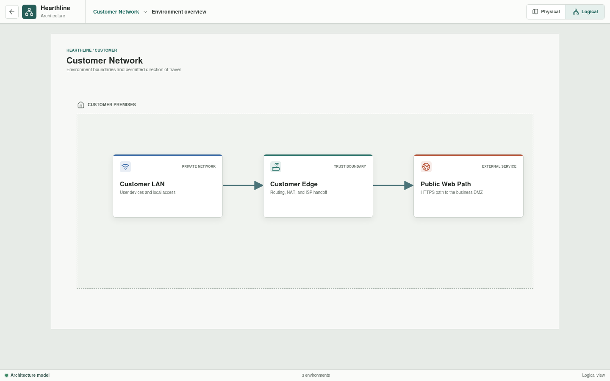

# Customer Network

The Customer Network represents an independently managed residential network
used to reach Hearthline's public services.

## Implementation Status

The location overview and its three environment routes are implemented in
Svelte. The assets, links, addresses, and policy descriptions remain
presentation data; they are not yet loaded from canonical YAML or evaluated by
Rust.

## Environments

| Environment | Responsibility |
| --- | --- |
| [Customer LAN](customer-lan/README.md) | Workstations, access switching, private addressing, and the router's LAN-facing boundary |
| [Customer Edge](customer-edge/README.md) | Default routing, PAT, media conversion, customer WAN access, and the provider next hop |
| [Public Web Path](public-web-path/README.md) | DNS, provider transit, business publication policy, and delivery to the public web service |

## Scope Boundaries

The Customer LAN ends at `Customer RTR-01`'s inside interface. Customer Edge
owns the router's boundary behavior and the access path to `ISP-RTR-01`. Public
Web Path is an end-to-end service view: it references customer, provider, and
business assets without becoming their configuration owner.

Planned work moves inventory and policy into YAML and adds Rust evaluation for
translation, route selection, permitted services, and declared denial
scenarios.
