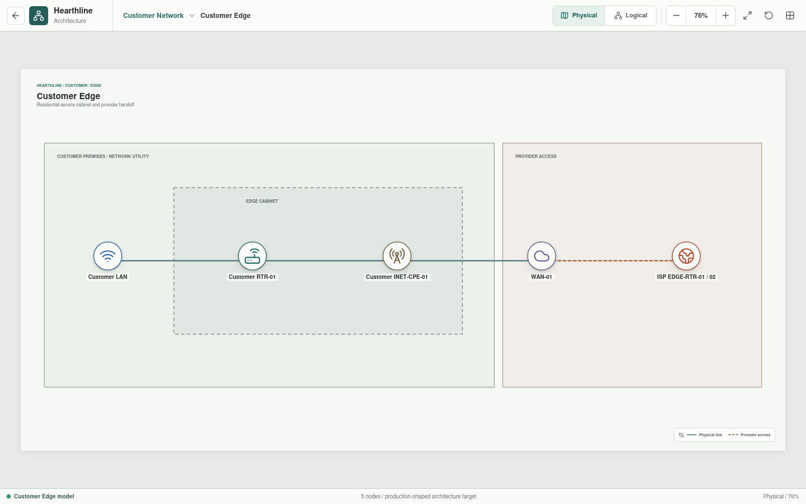
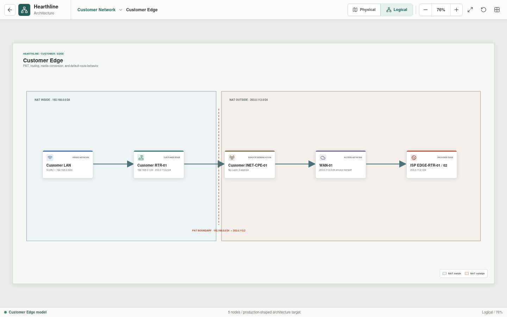

# Customer Edge

Customer Edge is the routing and translation boundary between the private
Customer LAN and the provider-facing access network.





## Implementation Status

The edge topology and boundary intent are rendered in Svelte. PAT, default
routing, reverse-flow state, and provider reachability are validation targets.
Rust now contains unit-tested routing and PAT primitives, but this rendered edge
is only parsed as individual appliance configuration; it is not yet
instantiated as one connected topology or tested as a complete path.

## Active Scope

```text
Customer LAN
    |
Customer RTR-01
    |
Customer INET-CPE-01
    |
WAN-01
    |
ISP EDGE-RTR-01 / 02
```

The adjacent Customer LAN is represented as a handoff. Its endpoints and
switch are owned by the [Customer LAN](../customer-lan/README.md).

## Boundary Intent

| Function | Intent |
| --- | --- |
| Inside interface | `Customer RTR-01 GigabitEthernet0/0`, `192.168.0.1/24` |
| Outside interface | `Customer RTR-01 GigabitEthernet0/1`, `203.0.113.2/24` |
| Translation | PAT from `192.168.0.0/24` to the outside interface |
| Default route | `0.0.0.0/0` through `203.0.113.1` |
| Media handoff | Transparent bridge between the routed edge and `WAN-01` |

## Inventory

| Asset | Responsibility |
| --- | --- |
| `Customer LAN` | Adjacent private environment |
| `Customer RTR-01` | Default gateway, routing, and PAT |
| `Customer INET-CPE-01` | Provider access CPE and media termination |
| `WAN-01` | Customer-facing provider access |
| `ISP EDGE-RTR-01/02` | Redundant provider gateway role at `203.0.113.1/24` |

## Physical Connectivity

| Local endpoint | Remote endpoint | Purpose |
| --- | --- | --- |
| Customer LAN handoff | `Customer RTR-01 GigabitEthernet0/0` | Private inside network |
| `Customer RTR-01 GigabitEthernet0/1` | `Customer INET-CPE-01` customer port | Routed outside interface |
| `Customer INET-CPE-01` access port | `WAN-01` access side | Provider media handoff |
| `WAN-01` provider side | `ISP EDGE-RTR-01/02` gateway role | Provider handoff |

## Validation Targets

- Private sources are translated to `203.0.113.2`.
- Non-local traffic follows the default route through `203.0.113.1`.
- Media-conversion elements do not make Layer 3 decisions.
- The provider receives no untranslated `192.168.0.0/24` source traffic.
- Failure of the edge or access link removes public reachability without
  changing the Customer LAN definition.

Planned Rust construction and evaluation will explain route selection,
translation, reverse-flow state, and any denial using the implemented
per-appliance YAML as its starting point.
