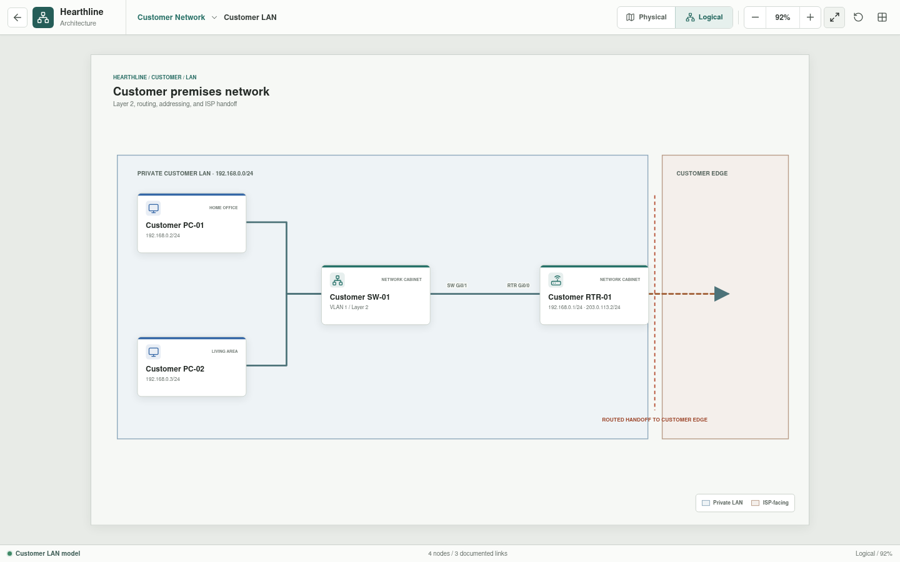

# Customer LAN

The Customer LAN is the private residential network inside the customer
premises. It owns the endpoints, access switch, and router inside interface.




## Implementation Status

The physical and logical LAN diagrams are implemented. Addressing and
connectivity below describe the intended baseline; they are not currently
configured on emulated devices or verified by an executable network model.

## Scope

```text
Customer PC-01 --+
                 +-- Customer SW-01 -- Customer RTR-01 Gi0/0
Customer PC-02 --+                         |
                                      Customer Edge
```

The modem, access network, and provider next hop belong to
[Customer Edge](../customer-edge/README.md).

## Inventory

| Asset | Role | Address |
| --- | --- | --- |
| `Customer PC-01` | Customer workstation | `192.168.0.2/24` |
| `Customer PC-02` | Customer workstation | `192.168.0.3/24` |
| `Customer SW-01` | Layer 2 access switch | Layer 2 |
| `Customer RTR-01` | Default gateway and routed boundary | `192.168.0.1/24` inside |

Both workstations use `192.168.0.1` as their default gateway and
`198.51.100.50` as their public DNS resolver.

## Physical Connectivity

| Local endpoint | Remote endpoint | Purpose |
| --- | --- | --- |
| `Customer PC-01 FastEthernet0` | `Customer SW-01 FastEthernet0/1` | Workstation access |
| `Customer PC-02 FastEthernet0` | `Customer SW-01 FastEthernet0/2` | Workstation access |
| `Customer SW-01 GigabitEthernet0/1` | `Customer RTR-01 GigabitEthernet0/0` | Default-gateway handoff |

The access links share one private Layer 2 domain. No trunk or inter-VLAN
routing is required for the baseline.

## Validation Targets

- Both workstations can reach the default gateway.
- Both workstations can communicate through the access switch.
- Non-local traffic is sent to `Customer RTR-01`.
- The LAN has no direct provider or business attachment.
- Translation and public reachability are evaluated at the next levels.

Planned work defines the four assets, their interfaces, the three links, the
private prefix, and positive and negative connectivity scenarios in canonical
YAML. Rust will then determine whether each target is satisfied.
