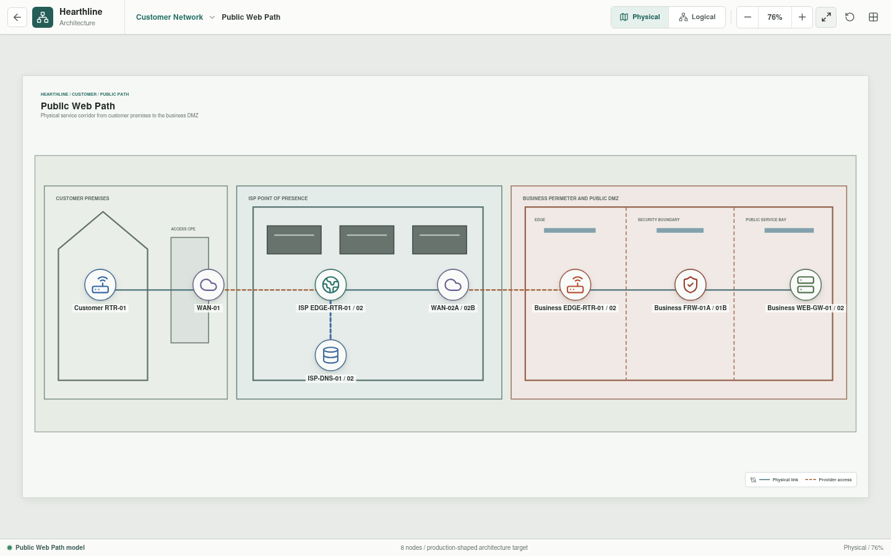
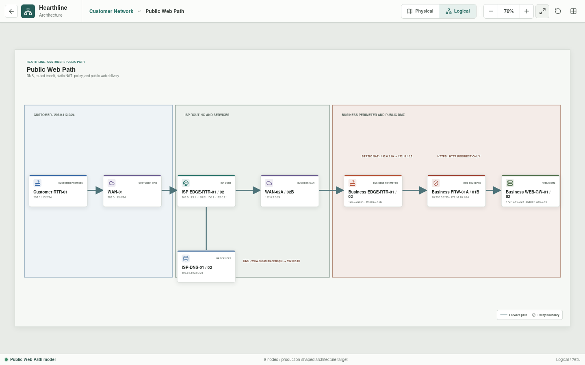

# Public Web Path

Public Web Path is the end-to-end customer journey from the residential edge to
Hearthline's published business web service.





## Implementation Status

The end-to-end physical and logical service path is implemented as an
architecture view. DNS, routing, static NAT, stateful policy, TLS termination,
and WAF behavior are design intent only; they are not currently executed or
tested by Hearthline.

## Service Path

Physical mode separates the path into customer premises, provider point of
presence, and the Central Office business perimeter. Logical mode shows DNS,
routed transit, static NAT, perimeter policy, and delivery to the public DMZ.

```text
Customer RTR-01
  -> WAN-01
  -> ISP EDGE-RTR-01/02
  -> WAN-02A/02B
  -> Business EDGE-RTR-01/02
  -> Business FRW-01A/01B
  -> Business WEB-GW-01/02
```

The current view uses `ISP-DNS-01/02` to represent the public DNS path for
`www.business.example`, whose authoritative test record maps to `192.0.2.10`.
This single icon is a presentation simplification. Canonical configuration must
model recursive resolution and authoritative hosting as separate service roles.

## Addressing Intent

| Segment or service | Addressing |
| --- | --- |
| Customer-facing provider network | `203.0.113.0/24` |
| Customer edge | `203.0.113.2/24` |
| Provider next hop | `203.0.113.1/24` |
| Provider services | `198.51.100.0/24` |
| Public DNS example | `198.51.100.50/24` |
| Business-facing provider network | `192.0.2.0/24` |
| Business edge | `192.0.2.2/24` |
| Published web address | `192.0.2.10` |
| Edge-to-firewall transit | `10.255.0.0/30` |
| Public DMZ | `172.16.10.0/24` |
| Business web-gateway VIP | `172.16.10.2/24` |

`192.0.2.0/24`, `198.51.100.0/24`, and `203.0.113.0/24` are the three
IPv4 documentation blocks defined by RFC 5737. They are used only in the
architecture model and must not appear on the public Internet.

## Responsibilities

| Asset | Responsibility |
| --- | --- |
| `Customer RTR-01` | Originating edge, PAT, and default route |
| `WAN-01` | Customer access network |
| `ISP EDGE-RTR-01/02` | Redundant provider gateway and service routing role |
| `ISP-DNS-01/02` | Simplified public DNS role; recursive and authoritative services will be separated in canonical configuration |
| `WAN-02A/02B` | Diverse business-facing provider circuits |
| `Business EDGE-RTR-01/02` | Redundant business edge and static publication |
| `Business FRW-01A/01B` | High-availability perimeter policy enforcement |
| `Business WEB-GW-01/02` | Reverse proxy, TLS termination, and web application firewall |

## Publication Policy

The target publication policy translates `192.0.2.10` to the DMZ gateway VIP at
`172.16.10.2`. The perimeter allows HTTPS; TCP/80 may exist only to redirect to
HTTPS. The gateway tier proxies named internal application dependencies through
the downstream policy boundary. Management access is not part of the public
conduit.

## Planned Validation Scenarios

| Scenario | Expected result |
| --- | --- |
| Customer DNS query for `www.business.example` | Allowed |
| Customer HTTPS connection to the published address | Allowed |
| Return traffic for an established web session | Allowed |
| Direct customer access to the private DMZ address | Denied or unroutable |
| Customer access to firewall management | Denied |
| Unpublished inbound service to the web gateway | Denied |
| Untranslated private customer source at the provider boundary | Denied |

The planned Rust evaluator will resolve DNS-independent test destinations,
route and translation stages, policy decisions, and the exact reason for each
result.
