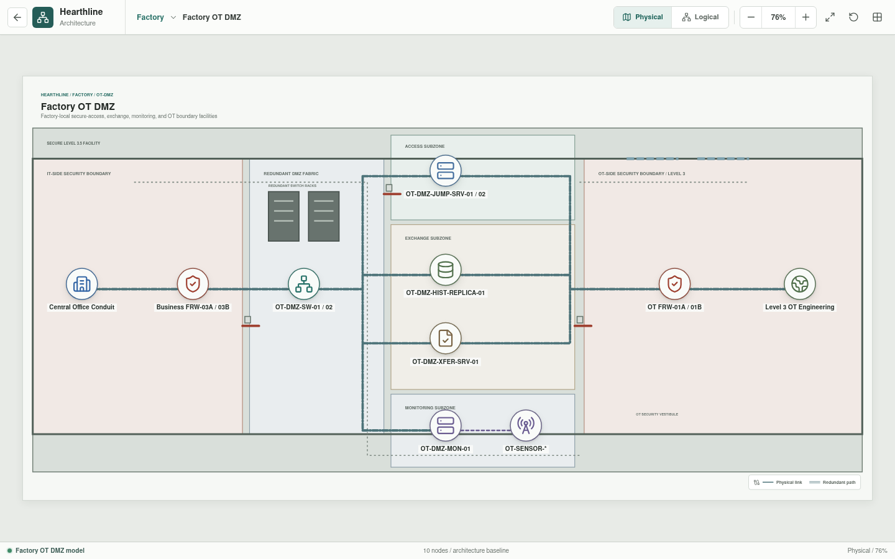
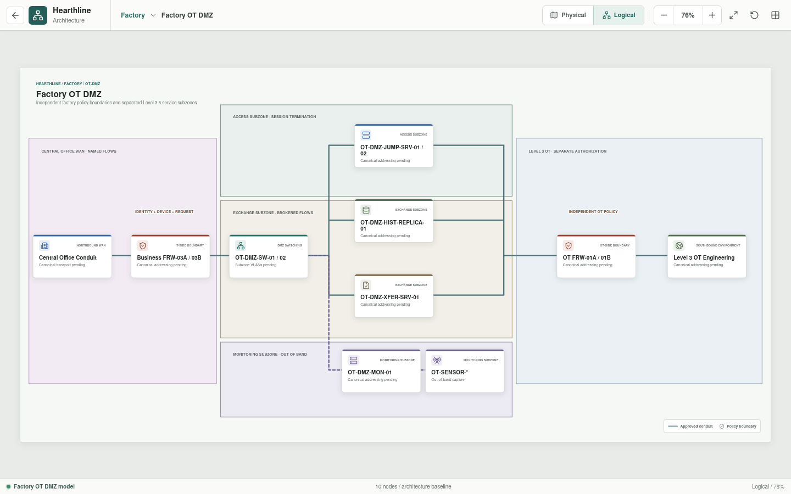

# Factory OT DMZ

The Factory OT DMZ is the controlled exchange layer between centrally governed
enterprise workflows and factory-local Level 3 operations.





## Implementation Status

The OT DMZ subzones, policy boundaries, service roles, and Level 3 handoff are
implemented as physical and logical diagrams. Firewall HA, session recording,
replication, transfer inspection, passive monitoring, identity checks, and
failover remain requirements rather than tested behavior. Parsed YAML now
provides separate member identities, default-deny firewall baselines, DMZ VLAN
baselines, service roles, and explicitly non-inline passive sensors.

## Architecture

```text
Central Office Conduit
        |
Business FRW-03A / 03B
        |
OT-DMZ-SW-01 / 02
        |
        +-- Access subzone
        |     `-- OT-DMZ-JUMP-SRV-01 / 02
        |
        +-- Exchange subzone
        |     |-- OT-DMZ-HIST-REPLICA-01
        |     `-- OT-DMZ-XFER-SRV-01
        |
        +-- Monitoring subzone
        |     |-- OT-DMZ-MON-01
        |     `-- OT-SENSOR-*
        |
OT FRW-01A / 01B
        |
Level 3 OT Engineering
```

The northbound and southbound firewall pairs are independent enforcement roles.
The DMZ is not a shared flat network, and no Central Office path bypasses the
OT-side boundary.

## Subzones

| Subzone | Assets | Purpose |
| --- | --- | --- |
| Access | `OT-DMZ-JUMP-SRV-01/02` | Controlled administrative session termination |
| Exchange | `OT-DMZ-HIST-REPLICA-01`, `OT-DMZ-XFER-SRV-01` | Selected data replication and managed transfer |
| Monitoring | `OT-DMZ-MON-01`, `OT-SENSOR-*` | Security telemetry, passive capture, and monitoring management |

Each subzone has a distinct policy surface. A permitted path into one subzone
does not imply access to another.

## Asset Roles

| Asset | Responsibility |
| --- | --- |
| `Central Office Conduit` | Authenticated transport for approved data and administration |
| `Business FRW-03A/03B` | Northbound IT-side policy enforcement |
| `OT-DMZ-SW-01/02` | Redundant service attachment across defined subzone VLANs |
| `OT-DMZ-JUMP-SRV-01/02` | Administrative access, strong authentication, and session recording |
| `OT-DMZ-HIST-REPLICA-01` | Business-facing replica of approved OT historian data |
| `OT-DMZ-XFER-SRV-01` | Scanned, staged, approved, and audited file exchange |
| `OT-DMZ-MON-01` | Monitoring collection and management |
| `OT-SENSOR-*` | Passive SPAN or TAP collection |
| `OT FRW-01A/01B` | Independent southbound policy enforcement |
| `Level 3 OT Engineering` | Adjacent supervisory and engineering environment |

## Trust and Access

The target trust model is:

- All northbound and southbound rules are deny by default.
- Administrative access terminates on a jump service before a separately
  authorized Level 3 session is created.
- Enterprise analytics consume replicated or brokered data, never direct
  controller sessions.
- File movement has an explicit direction, owner, approval state, malware
  inspection result, and audit record.
- Monitoring sensors are passive and are not required for process forwarding.
- Identity, device posture, authorization, session duration, and destination
  scope are evaluated in addition to network location.
- Emergency access is separately governed and audited.

## Conduit Register

The future conduit and policy extension to the current YAML model must record
every allowed flow with:

- Source and destination zone or asset.
- Protocol and service.
- Initiator and direction.
- Operational purpose and owner.
- Authentication and authorization requirements.
- Availability and recovery requirement.
- Logging and retention requirement.
- Expected behavior during failover or conduit loss.

No broad `any-to-any` conduit is valid.

## Availability Design

- `Business FRW-03A/03B` form one synchronized HA policy role.
- `OT FRW-01A/01B` form a separate synchronized HA policy role.
- `OT-DMZ-SW-01/02` provide independent attachment paths.
- State synchronization, management, and production traffic remain logically
  distinct.
- Redundant members use independent power and cable routes where justified.
- Failover preserves default-deny policy and cannot create a temporary bypass.
- Service redundancy is selected from recovery objectives, not icon count.

The switching design must declare loop avoidance or a multi-chassis mechanism.
Parallel unmanaged Layer 2 paths are not accepted.

## Availability

Loss of remote access, analytics, or the Central Office conduit must not stop
safe local process operation. Data may be buffered for later transfer, and
non-urgent changes remain staged until the authorized path returns.

## Planned Validation Scenarios

| Scenario | Expected result |
| --- | --- |
| Approved administrator to jump service | Allowed |
| Central Office source directly to Level 3 | Denied |
| Jump service to approved Level 3 target | Allowed only with separate authorization |
| Historian replica to selected enterprise consumer | Allowed in the declared direction |
| Enterprise source directly to OT historian | Denied |
| Approved signed package through transfer service | Allowed |
| Unapproved package or undeclared direction | Denied |
| Passive sensor receives mirrored traffic | Allowed without becoming a forwarding dependency |
| Inter-site conduit unavailable | Local process remains operational |

## Design Acceptance Criteria

- Both security boundaries are visibly factory-local and independently named.
- Access, exchange, and monitoring subzones are separate.
- Exchange services connect through explicit redundant trunks.
- Monitoring paths are visually and logically distinct from service forwarding.
- The engineering workstation remains inside Level 3.
- Analytics use replicas or brokers and have no direct controller path.
- Every allowed conduit has a named purpose and owner.
- Failover does not weaken policy or create an unmonitored bypass.

These criteria are currently review checks for the architecture. They become
test acceptance criteria only when complete policy configuration, service
behavior, and executable failover scenarios exist.
