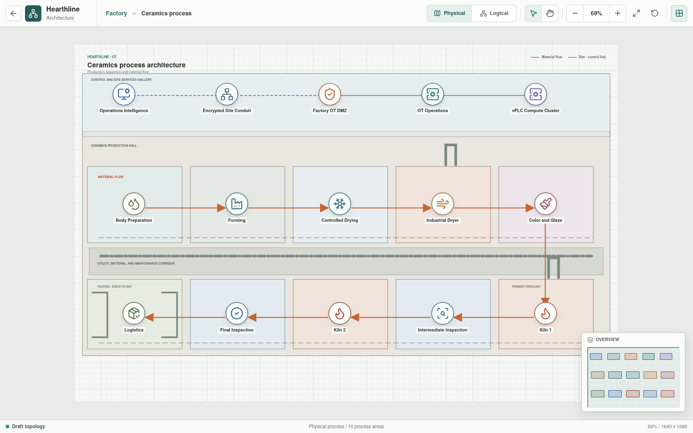

# Ceramics Process

The Factory process level contains ten independently enterable functional
areas. Each area models a cell network, virtual controller, operator interface,
distributed I/O, representative sensors and actuators, and a safety or
permissive role.




## Implementation Status

The ordered process canvas and ten process-area views are implemented. Each area
uses bootstrap JSON for representative equipment and relationships. The Rust
workspace now has provisional controller-scan, I/O, sensor, actuator, HMI,
safety, and connector primitives plus parsed YAML for all 90 area components,
both physical vPLC hosts, and the Level 3 aggregation pair. Per-connection YAML
records redundant cell uplinks, virtual runtime attachment, HMI and remote I/O
Ethernet, and individual field channels. These records are not yet connected
to running component instances, and no area-specific program, plant state,
material flow, or fault scenario executes.

## Process Sequence

```text
Body Preparation
  -> Forming
  -> Controlled Drying
  -> Industrial Dryer
  -> Color and Glaze
  -> Kiln 1
  -> Intermediate Inspection
  -> Kiln 2
  -> Final Inspection
  -> Logistics
```

## Areas

| Zone | Area |
| --- | --- |
| `OT-AREA-01` | [Body Preparation](body-preparation/README.md) |
| `OT-AREA-02` | [Forming](forming/README.md) |
| `OT-AREA-03` | [Controlled Drying](controlled-drying/README.md) |
| `OT-AREA-04` | [Industrial Dryer](industrial-dryer/README.md) |
| `OT-AREA-05` | [Color and Glaze](color-and-glaze/README.md) |
| `OT-AREA-06` | [Kiln 1](kiln-one/README.md) |
| `OT-AREA-07` | [Intermediate Inspection](intermediate-inspection/README.md) |
| `OT-AREA-08` | [Kiln 2](kiln-two/README.md) |
| `OT-AREA-09` | [Final Inspection](final-inspection/README.md) |
| `OT-AREA-10` | [Logistics](logistics/README.md) |

## Model Boundary

The Svelte views currently consume
[`process-view.json`](../../../web/src/generated/process-view.json), a versioned
bootstrap view model. Canonical appliance and connection YAML is available
through the generated configuration catalog, while presentation relationships
and coordinates remain in the bootstrap file. IEC 61131-3 sources, resolved
I/O bindings, connectivity results, virtual PLC state, and Rust process
outcomes will replace the remaining bootstrap records.

Svelte owns layout and interaction. Rust owns process state, material movement,
faults, accelerated time, network decisions, and generated results. The virtual
PLC runtime owns controller execution semantics.

## vPLC Deployment Model

The target vPLC deployment uses a factory-local redundant Level 3 compute
cluster. Each `AREA-xx-vPLC-01` is a logical workload, not a standalone physical
controller. The physical views therefore show:

- `OT-vPLC-HOST-01/02` as the shared industrial control compute cluster.
- A dedicated cell VLAN extended from each process-area boundary to its assigned
  runtime.
- `AREA-xx-RIO-01` as the cell-local distributed I/O station.
- Sensors and actuators terminated at remote I/O rather than directly at the
  virtual workload.
- Local HMI and safety/status relationships separated from field I/O.

Compute, network, storage, management, licensing, and failover behavior must be
selected so a management-plane or inter-site outage does not stop local
operation. Future qualification must validate resource reservation and
deterministic network behavior against the selected runtime and process timing
requirements.

## Shared Requirements

- Each area has an explicit network and process boundary.
- Cell separation continues through the network to the vPLC host.
- vPLC management and process communication use separate interfaces or
  enforcement contexts.
- Distributed I/O remains local to its automation cell.
- Cross-area flows are declared instead of inferred from adjacency.
- Shared mass, glaze, utility, and logistics paths have defined ownership.
- Safety and burner-management interfaces remain independent from ordinary
  process control.
- Every controller maps to declared programs, tasks, tags, and I/O.
- Process scenarios include expected state, timing, alarms, interlocks, and
  failure behavior.
