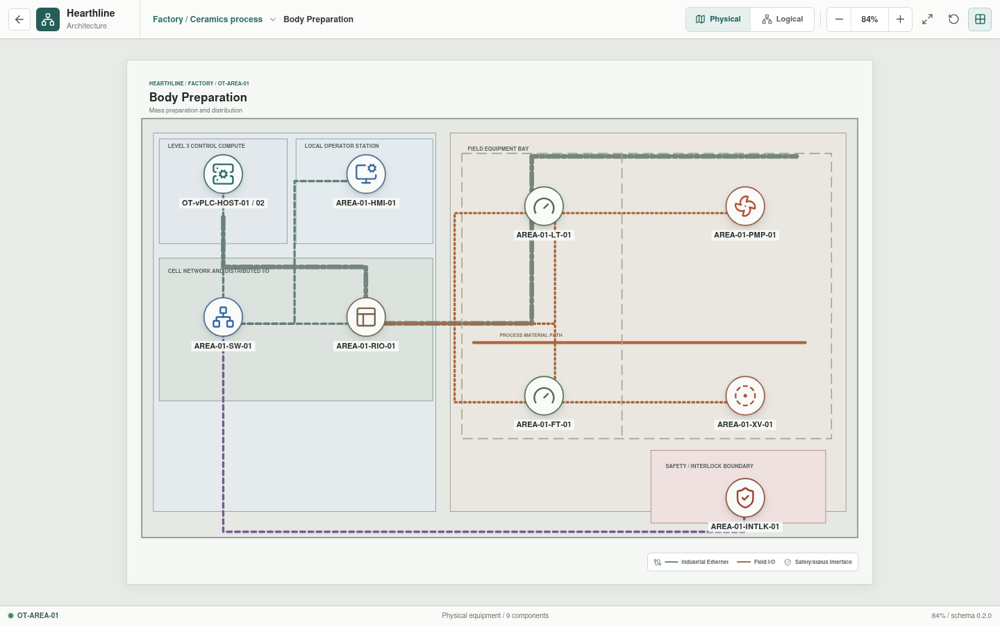

# Body Preparation

**Zone:** `OT-AREA-01`  
**Route:** `factory/process/body-preparation`

Body Preparation covers storage, mixing, body-mass transfer, and distribution
to Forming.

## Current Representation

The Svelte view renders the representative assets below from bootstrap JSON. It
does not currently execute control logic, I/O, or process behavior.

| Function | Representative component |
| --- | --- |
| Cell network | `AREA-01-SW-01` |
| Control workload | `AREA-01-vPLC-01` on `OT-vPLC-HOST-01/02` |
| Local operation | `AREA-01-HMI-01` |
| Distributed I/O | `AREA-01-RIO-01` |
| Sensors | `AREA-01-LT-01`, `AREA-01-FT-01` |
| Actuators | `AREA-01-PMP-01`, `AREA-01-XV-01` |
| Permissive | `AREA-01-INTLK-01` |

## Planned Work

Simulation will model material inventory, transfer flow, pump state, valve
position, and spill or invalid-transfer conditions. Per-appliance YAML is
implemented; resolved I/O bindings and control logic remain pending.
