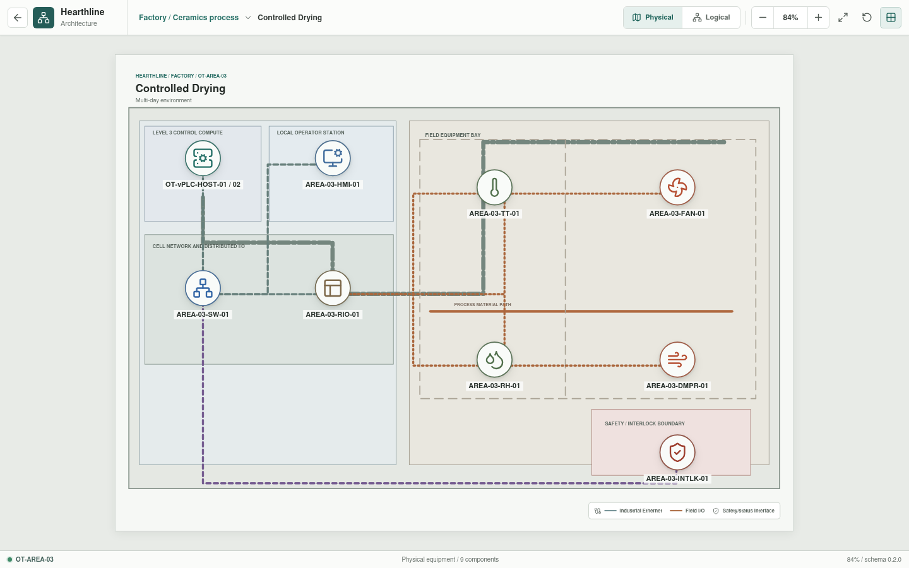
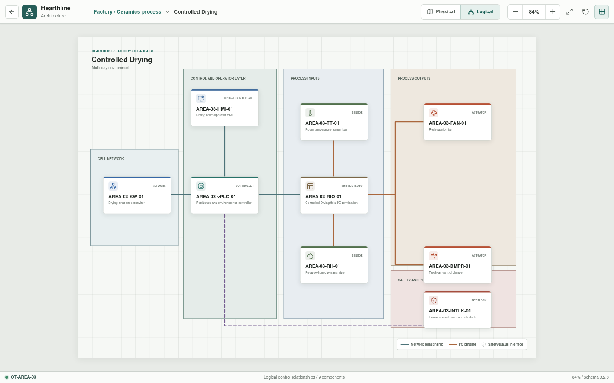

# Controlled Drying

**Zone:** `OT-AREA-03`  
**Route:** `factory/process/controlled-drying`

Controlled Drying represents the multi-day residence stage before the
industrial dryer.

## Current Representation

The Svelte view renders the representative assets below from bootstrap JSON. It
does not currently execute control logic, I/O, or process behavior.

| Function | Representative component |
| --- | --- |
| Cell network | `AREA-03-SW-01` |
| Control workload | `AREA-03-vPLC-01` on `OT-vPLC-HOST-01/02` |
| Local operation | `AREA-03-HMI-01` |
| Distributed I/O | `AREA-03-RIO-01` |
| Sensors | `AREA-03-TT-01`, `AREA-03-RH-01` |
| Actuators | `AREA-03-FAN-01`, `AREA-03-DMPR-01` |
| Interlock | `AREA-03-INTLK-01` |

## Planned Work

Rust will track accelerated residence time, temperature, humidity, airflow,
environmental history, and material moisture state. Per-appliance YAML is
implemented; resolved I/O bindings and process dynamics remain pending.
