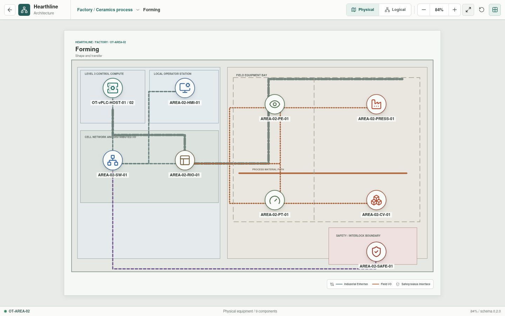

# Forming

**Zone:** `OT-AREA-02`  
**Route:** `factory/process/forming`

Forming covers local material feed, shape creation, press behavior, transfer,
and machine safety.

## Current Representation

The Svelte view renders the representative assets below from bootstrap JSON. It
does not currently execute control logic, I/O, or process behavior.

| Function | Representative component |
| --- | --- |
| Cell network | `AREA-02-SW-01` |
| Control workload | `AREA-02-vPLC-01` on `OT-vPLC-HOST-01/02` |
| Local operation | `AREA-02-HMI-01` |
| Distributed I/O | `AREA-02-RIO-01` |
| Sensors | `AREA-02-PE-01`, `AREA-02-PT-01` |
| Actuators | `AREA-02-PRESS-01`, `AREA-02-CV-01` |
| Safety interface | `AREA-02-SAFE-01` |

## Planned Work

Simulation will model machine cycles, pressure, part presence, discharge, jams,
guards, and emergency-stop state. Canonical component YAML and control
bindings remain pending.
