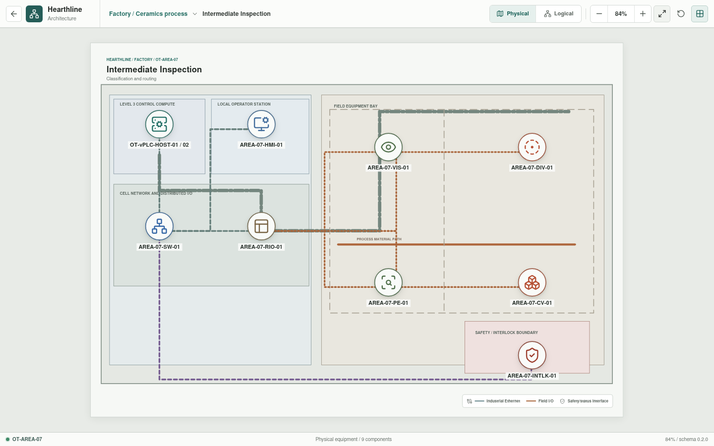
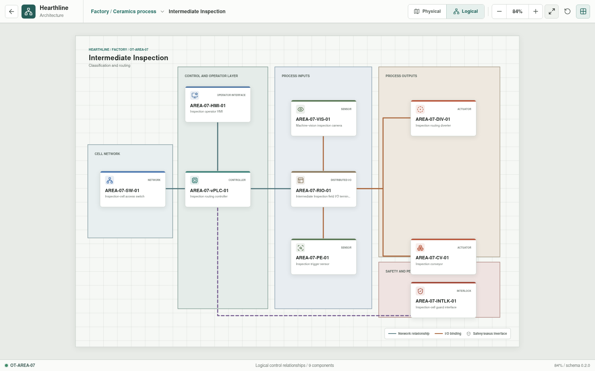

# Intermediate Inspection

**Zone:** `OT-AREA-07`  
**Route:** `factory/process/intermediate-inspection`

Intermediate Inspection classifies defects and routes material before the
second firing.

## Current Representation

The Svelte view renders the representative assets below from bootstrap JSON. It
does not currently execute control logic, I/O, or process behavior.

| Function | Representative component |
| --- | --- |
| Cell network | `AREA-07-SW-01` |
| Control workload | `AREA-07-vPLC-01` on `OT-vPLC-HOST-01/02` |
| Local operation | `AREA-07-HMI-01` |
| Distributed I/O | `AREA-07-RIO-01` |
| Sensors | `AREA-07-VIS-01`, `AREA-07-PE-01` |
| Actuators | `AREA-07-DIV-01`, `AREA-07-CV-01` |
| Safety interface | `AREA-07-INTLK-01` |

## Planned Work

Simulation will model inspection triggers, representative classifications,
traceability, conveyor state, routing decisions, and guard conditions.
Canonical YAML and I/O bindings remain pending.
