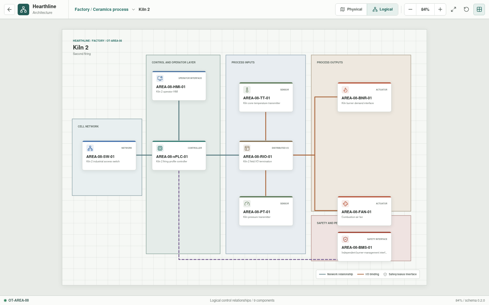

# Kiln 2

**Zone:** `OT-AREA-08`  
**Route:** `factory/process/kiln-two`

Kiln 2 represents the second firing profile, combustion interfaces,
interlocks, and unloading.

## Current Representation

The Svelte view renders the representative assets below from bootstrap JSON. It
does not currently execute control logic, I/O, burner-management, or process
behavior.

| Function | Representative component |
| --- | --- |
| Cell network | `AREA-08-SW-01` |
| Control workload | `AREA-08-vPLC-01` on `OT-vPLC-HOST-01/02` |
| Local operation | `AREA-08-HMI-01` |
| Distributed I/O | `AREA-08-RIO-01` |
| Sensors | `AREA-08-TT-01`, `AREA-08-PT-01` |
| Actuators | `AREA-08-BNR-01`, `AREA-08-FAN-01` |
| Burner-management interface | `AREA-08-BMS-01` |

## Planned Work

The same safety boundary applies as for Kiln 1: simulation and interface tests
do not constitute burner-management or functional-safety certification.
Per-appliance YAML is implemented; resolved control bindings and firing
behavior remain pending.
