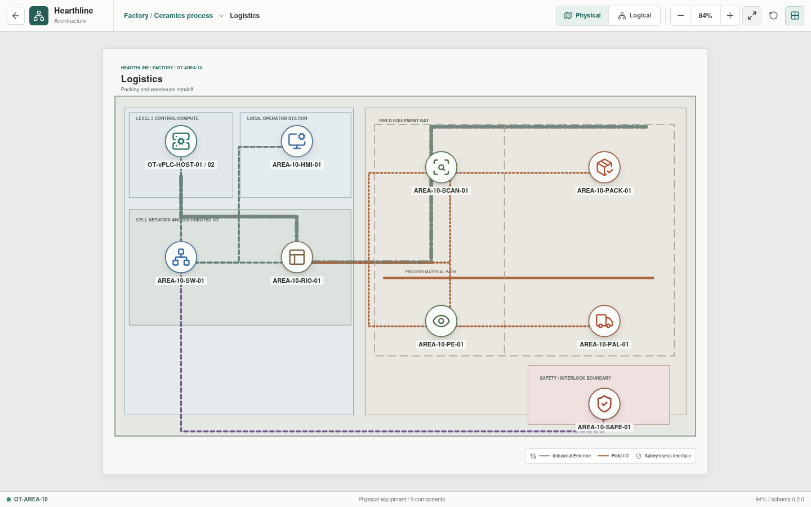

# Logistics

**Zone:** `OT-AREA-10`  
**Route:** `factory/process/logistics`

Logistics covers packing, palletizing, traceability, warehouse handoff, and
production reporting.

## Current Representation

The Svelte view renders the representative assets below from bootstrap JSON. It
does not currently execute control logic, I/O, or process behavior.

| Function | Representative component |
| --- | --- |
| Cell network | `AREA-10-SW-01` |
| Control workload | `AREA-10-vPLC-01` on `OT-vPLC-HOST-01/02` |
| Local operation | `AREA-10-HMI-01` |
| Distributed I/O | `AREA-10-RIO-01` |
| Sensors | `AREA-10-SCAN-01`, `AREA-10-PE-01` |
| Actuators | `AREA-10-PACK-01`, `AREA-10-PAL-01` |
| Safety interface | `AREA-10-SAFE-01` |

## Planned Work

Simulation will model product identity, pallet presence, packing and
palletizing state, discharge, warehouse handoff, and representative reporting.
Canonical YAML and control bindings remain pending.
