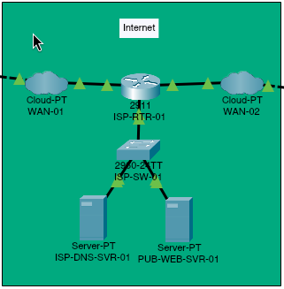

# Internet Segment

## Overview

The Internet segment represents the service provider infrastructure between the customer network and the business IT DMZ. It contains two simulated WAN connections, an ISP edge router, an access switch, a DNS server, and a public web server.

`WAN-01` provides connectivity to the customer network through the `203.0.113.0/24` network. `WAN-02` provides connectivity to the business IT DMZ through the `203.0.114.0/24` network. The ISP services are hosted on the separate `198.51.100.0/24` network.

The `198.51.100.0/24` and `203.0.113.0/24` blocks are reserved documentation networks. `203.0.114.0/24` is not a reserved documentation prefix and is used only inside this isolated Packet Tracer simulation; it must not be treated as a safe example or production allocation outside the project.

## Topology



Traffic between the customer and business networks follows this path:

```text
Customer Network -> WAN-01 -> ISP-RTR-01 -> WAN-02 -> Business IT DMZ
```

The ISP-hosted DNS and web services are reached through `ISP-SW-01`, which connects directly to `ISP-RTR-01`.

## Device Inventory

| Device | Packet Tracer model | Role |
| --- | --- | --- |
| WAN-01 | Cloud-PT | Simulated WAN connection to the customer network |
| ISP-RTR-01 | Cisco 2911 | Routes traffic between the customer, ISP services, and business networks |
| ISP-SW-01 | Cisco 2960-24TT | Layer 2 access switch for ISP-hosted services |
| ISP-DNS-SVR-01 | Server-PT | Public DNS server |
| PUB-WEB-SVR-01 | Server-PT | Public HTTP and HTTPS server |
| WAN-02 | Cloud-PT | Simulated WAN connection to the business IT DMZ |

## IPv4 Addressing

### Customer-Facing Network

| Device | Interface or role | IPv4 address | Subnet mask |
| --- | --- | --- | --- |
| ISP-RTR-01 | GigabitEthernet0/0 | `203.0.113.1` | `255.255.255.0` |

### ISP Services Network

| Device | Interface or role | IPv4 address | Subnet mask | Default gateway |
| --- | --- | --- | --- | --- |
| ISP-RTR-01 | GigabitEthernet0/1 | `198.51.100.1` | `255.255.255.0` | Not applicable |
| ISP-DNS-SVR-01 | FastEthernet0 | `198.51.100.50` | `255.255.255.0` | `198.51.100.1` |
| PUB-WEB-SVR-01 | FastEthernet0 | `198.51.100.51` | `255.255.255.0` | `198.51.100.1` |

### Business-Facing Network

| Device | Interface or role | IPv4 address | Subnet mask |
| --- | --- | --- | --- |
| ISP-RTR-01 | GigabitEthernet0/2 | `203.0.114.1` | `255.255.255.0` |

## Routing Configuration

`ISP-RTR-01` provides Layer 3 forwarding between three directly connected networks. No static or dynamic routing protocol is required for the currently configured ISP services.

| Router interface | Connected segment | IPv4 configuration | State |
| --- | --- | --- | --- |
| GigabitEthernet0/0 | Customer-facing WAN through `WAN-01` | `203.0.113.1/24` | Enabled |
| GigabitEthernet0/1 | ISP services through `ISP-SW-01` | `198.51.100.1/24` | Enabled |
| GigabitEthernet0/2 | Business-facing WAN through `WAN-02` | `203.0.114.1/24` | Enabled |

| Route type | Destination | Outgoing interface |
| --- | --- | --- |
| Connected | `203.0.113.0/24` | GigabitEthernet0/0 |
| Connected | `198.51.100.0/24` | GigabitEthernet0/1 |
| Connected | `203.0.114.0/24` | GigabitEthernet0/2 |

`ISP-RTR-01` does not perform NAT. Customer address translation is performed by `Customer RTR-01`.

## Switch Configuration

`ISP-SW-01` uses VLAN 100 (`ISP_SERVICES`) as the single Layer 2 broadcast domain for the ISP-hosted servers.

| Switch interface | Connected device | VLAN | Port mode | PortFast |
| --- | --- | --- | --- | --- |
| GigabitEthernet0/1 | ISP-RTR-01 | 100 | Access | Disabled |
| FastEthernet0/1 | ISP-DNS-SVR-01 | 100 | Access | Enabled |
| FastEthernet0/2 | PUB-WEB-SVR-01 | 100 | Access | Enabled |

## Network Services

| Server | IPv4 configuration | Default gateway | DNS server | Enabled services |
| --- | --- | --- | --- | --- |
| ISP-DNS-SVR-01 | `198.51.100.50/24` | `198.51.100.1` | `198.51.100.50` | DNS |
| PUB-WEB-SVR-01 | `198.51.100.51/24` | `198.51.100.1` | `198.51.100.50` | HTTP and HTTPS |

The DNS service contains the following A records:

| Hostname | IPv4 address | Service location |
| --- | --- | --- |
| `www.isp.example` | `198.51.100.51` | ISP public web server |
| `www.business.example` | `203.0.114.10` | Business web server published through static NAT |

Both ISP servers use static addressing, and unrelated services remain disabled.

## Physical Connectivity

| Source device | Source port | Destination device | Destination port | Connection type |
| --- | --- | --- | --- | --- |
| Customer DSL-MDM-01 | Port 0 | WAN-01 | Modem4 | Telephone/DSL cable |
| WAN-01 | Ethernet6 | ISP-RTR-01 | GigabitEthernet0/0 | Copper Ethernet |
| ISP-RTR-01 | GigabitEthernet0/1 | ISP-SW-01 | GigabitEthernet0/1 | Copper Ethernet |
| ISP-SW-01 | FastEthernet0/1 | ISP-DNS-SVR-01 | FastEthernet0 | Copper Ethernet |
| ISP-SW-01 | FastEthernet0/2 | PUB-WEB-SVR-01 | FastEthernet0 | Copper Ethernet |
| ISP-RTR-01 | GigabitEthernet0/2 | WAN-02 | Ethernet6 | Copper Ethernet |
| WAN-02 | Modem4 | Business DSL-MDM-01 | Port 0 | Telephone/DSL cable |

## WAN Configuration

The Cloud-PT devices emulate the DSL links between each modem and the ISP router. They do not perform IP routing.

| WAN device | DSL modem port | Mapped Ethernet port |
| --- | --- | --- |
| WAN-01 | Modem4 | Ethernet6 |
| WAN-02 | Modem4 | Ethernet6 |

## Validated Connectivity

| Source | Destination or service | Result |
| --- | --- | --- |
| ISP-RTR-01 | Customer router at `203.0.113.2` | Reachable |
| ISP-RTR-01 | ISP DNS server at `198.51.100.50` | Reachable |
| ISP-RTR-01 | ISP public web server at `198.51.100.51` | Reachable |
| Customer network | ISP DNS server at `198.51.100.50` | Reachable through PAT |
| Customer network | ISP public web server at `198.51.100.51` | Reachable through PAT |
| Customer network | DNS resolution for `www.isp.example` | Operational |
| Customer network | HTTP access to `www.isp.example` | Operational |
| Customer network | Business public address at `203.0.114.10` | Reachable |
| Customer network | DNS resolution for `www.business.example` | Operational |
| Customer network | HTTP access to `www.business.example` | Operational |

## Network Boundaries

- `ISP-RTR-01` routes between the customer-facing, ISP services, and business-facing networks.
- `ISP-RTR-01` does not perform NAT or stateful firewall inspection.
- `WAN-01` links the customer network to the ISP through `203.0.113.0/24`.
- `WAN-02` links the business IT DMZ to the ISP through `203.0.114.0/24`.
- The business edge router publishes `203.0.114.10` on the directly connected business-facing network and translates it to the private business web server.
- The ISP-hosted services are isolated on `198.51.100.0/24` behind `ISP-SW-01`.
- The two Cloud-PT devices provide media conversion and DSL port mapping but do not act as routers.
