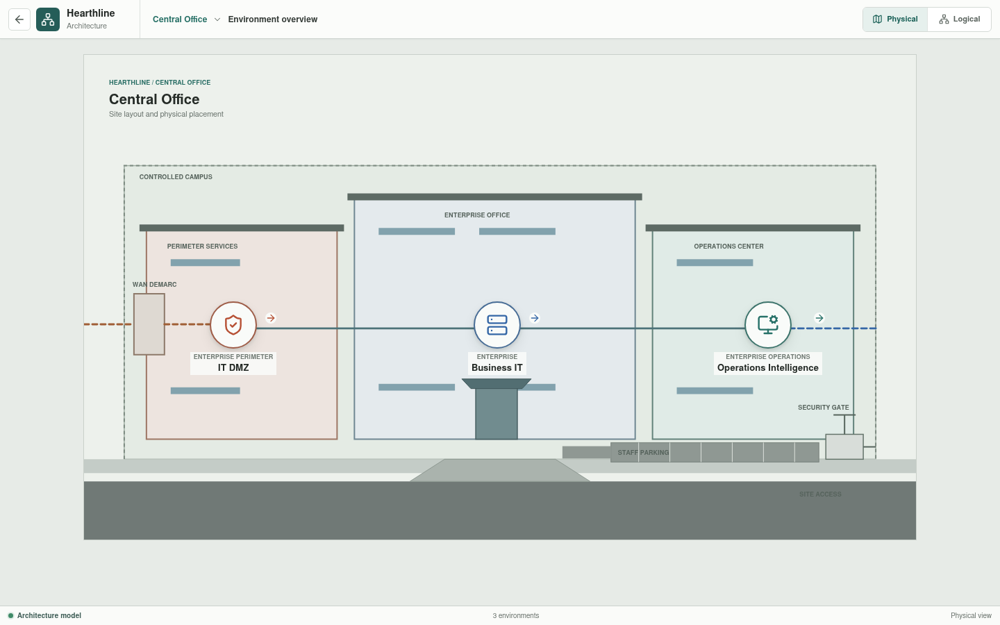
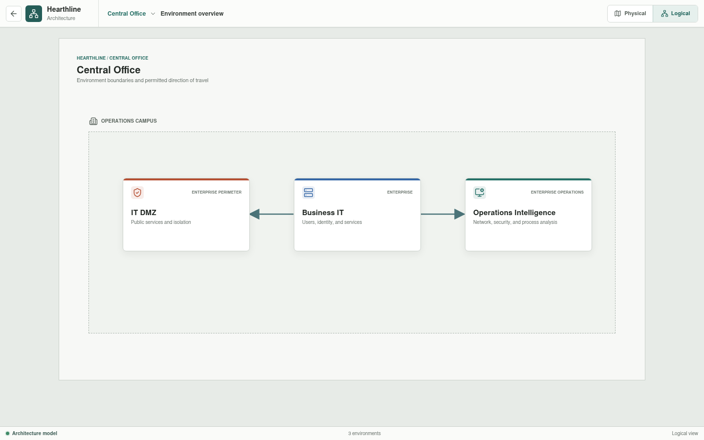

# Central Office

The Central Office is Hearthline's enterprise, governance, security, and
analysis site.

## Implementation Status

The campus overview and all three environment routes are implemented in Svelte.
The rendered roles and trust boundaries describe the target architecture;
per-appliance YAML now supplies validated identities and behavior baselines.
Identity integration, complete policy enforcement, monitoring behavior,
and broad HA behavior remain future work. Two selected path families are executable:
customer HTTPS crosses the public DMZ and named downstream policy to an
internal application response while public SSH is denied, and the Factory OT
DMZ historian replica reaches Central Office analytics over HTTPS through
`Business FRW-03A` while SSH is denied by default policy.
The northbound pair additionally supports one bounded, protocol-timed session
continuity case through `Business FRW-03B`; this does not establish vendor HA
conformance or production recovery performance.

## Environments

| Environment | Responsibility |
| --- | --- |
| [IT DMZ](it-dmz/README.md) | Internet edge, public static NAT, perimeter policy, published services, and the downstream IT boundary |
| [Business IT](business-it/README.md) | Enterprise users, infrastructure services, management, voice, printing, and guest access |
| [Operations Intelligence](operations-intelligence/README.md) | NOC and SOC functions, identity and policy, analytics, change governance, and the Factory conduit |

## Site Authority

Central Office owns enterprise architecture, policy intent, identity,
monitoring, analysis, and change approval. It does not directly control factory
equipment. Factory-bound administration and selected data exchange traverse the
governed inter-site conduit and terminate at the factory-local OT DMZ.

The physical view separates perimeter services, enterprise office space, and
the operations center. The logical view preserves their distinct trust and
information-flow boundaries.

Planned implementation will move the remaining site and conduit relationships
into canonical inputs, expand configured topology construction, and expose
additional Rust-validated network, policy, and availability scenarios in the
same views.
