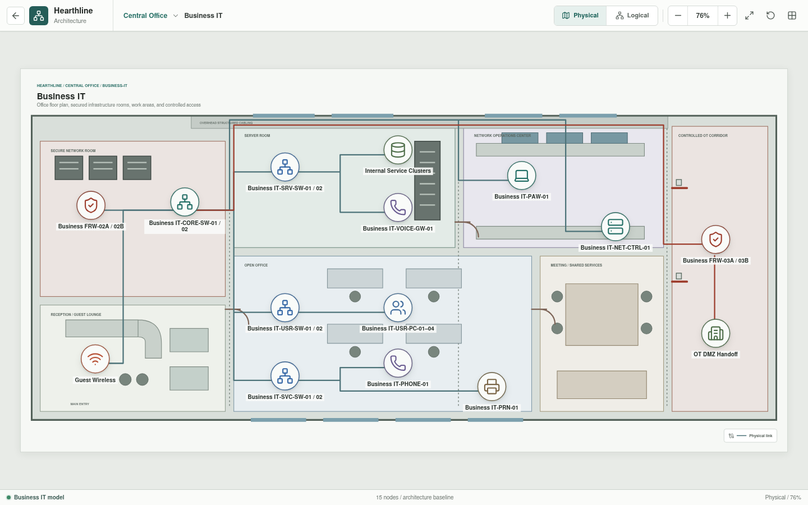
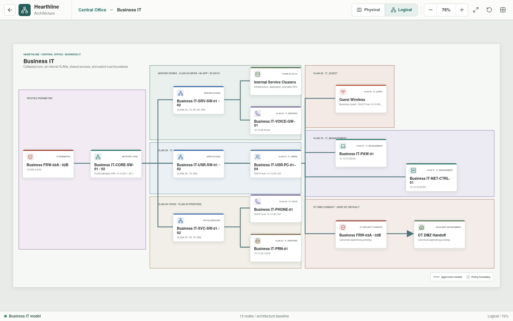
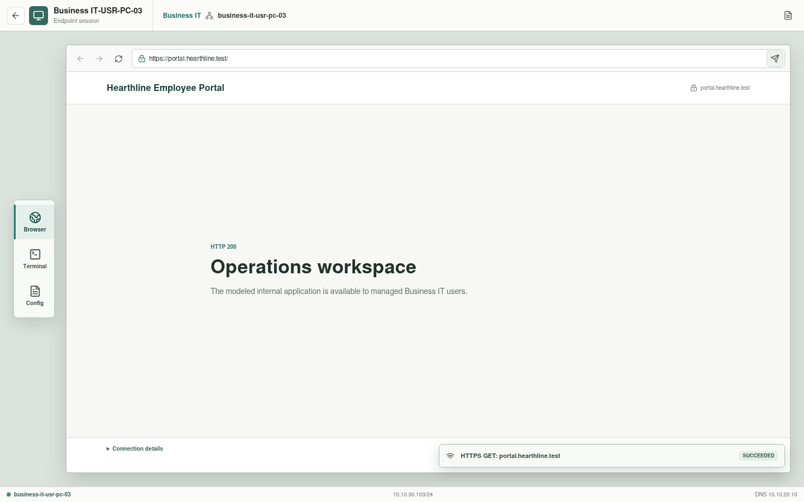
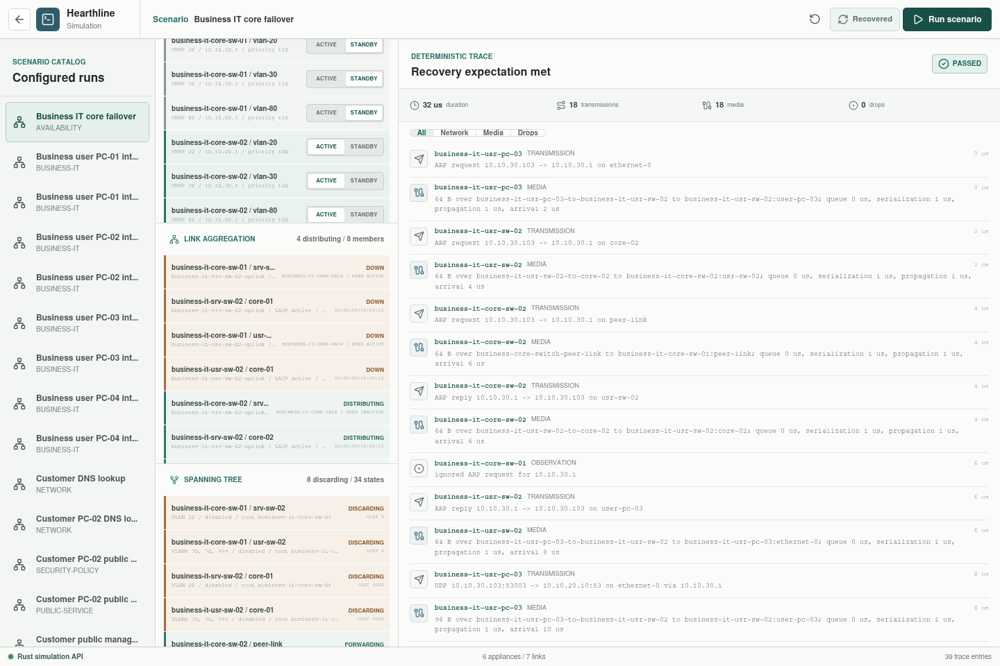

# Business IT

Business IT contains Hearthline's internal enterprise users, services,
management systems, voice, printers, and isolated guest access.









## Implementation Status

The enterprise zones, representative assets, and intended access relationships
are rendered in Svelte. Parsed appliance YAML now records VLAN baselines,
representative interfaces, services, voice, wireless, and default-deny
boundaries. These records are not yet assembled into the full topology, and
identity, broad policy, monitoring, and complete HA behavior are not simulated.

`Business IT-USR-PC-01` through `Business IT-USR-PC-04` are enterable from the
grouped user node. Each desktop exposes a terminal, browser, and canonical
configuration. Terminal `nslookup` and browser or `curl` HTTPS requests execute
in Rust through independent scenario records. The browser home is selected
from the workstation's compatible HTTPS scenario rather than embedded in
Svelte.

The normal internal paths use the preferred Core-01 member:

```text
Business IT-USR-PC-01/02 -> Business IT-USR-SW-01 --+
Business IT-USR-PC-03/04 -> Business IT-USR-SW-02 --+
                                                     +-> Business IT-CORE-SW-01
                                                           |-> Business IT-SRV-SW-02 -> Business IT-DNS-01
                                                           `-> Business IT-SRV-SW-01 -> Business IT-PORTAL-01
```

Both access-switch paths carry users VLAN 30 to the active `vlan-30` virtual
gateway. DNS
crosses to infrastructure VLAN 20 and resolves
`portal.hearthline.test` to `10.10.80.20`. HTTPS then crosses to applications
VLAN 80 and returns the configured employee-portal document. The trace records
ARP, switching, routing, media timing, service response, and client delivery.

The selected public-service scenario executes `Business FRW-02A`, the core,
server access switching, and `Business IT Services-01` for a configured HTTP
response. The selected factory-data scenario also executes `Business FRW-03A`,
`Business IT-CORE-SW-01`, `Business IT-SRV-SW-01`, and Applications VLAN 80
as one routed path to analytics.

## Architecture

`Business IT-CORE-SW-01/02` is the redundant Layer 3 core role. Each member has
a unique physical SVI address (`.2` on Core-01 and `.3` on Core-02) and a
shared VRRP `.1` gateway identity for VLANs 20, 30, and 80. Core-01 starts
active at priority 110; Core-02 starts standby at priority 100. Rust validates
matching virtual identities, distinct priorities, and exactly one configured
active member per group.
`Business FRW-02A/02B` is the upstream boundary toward the public IT DMZ. The
governed factory path leaves through the Operations Intelligence workflow and
`Business FRW-03A/03B`; it does not provide a direct controller route.

## VLANs

| VLAN | Name | Prefix | Purpose |
| --- | --- | --- | --- |
| 20 | Servers | `10.10.20.0/24` | Infrastructure and internal applications |
| 30 | Users | `10.10.30.0/24` | Managed employee endpoints |
| 40 | Voice | `10.10.40.0/24` | Enterprise voice |
| 50 | Printers | `10.10.50.0/24` | Shared printing |
| 60 | Guest | `10.10.60.0/24` | Isolated guest wireless |
| 70 | Management | `10.10.70.0/24` | Restricted administration |
| 80 | Applications | `10.10.80.0/24` | Internal application and API services |
| 90 | Data | `10.10.90.0/24` | Databases and protected application state |
| 999 | Native black hole | No routed prefix | Unused native VLAN |

The core gateway convention uses `.1` in each routed VLAN.

## Infrastructure

| Asset | Role |
| --- | --- |
| `Business FRW-02A/02B` | High-availability upstream security boundary |
| `Business IT-CORE-SW-01/02` | Redundant routed core and gateway role |
| `Business IT-SRV-SW-01/02` | Infrastructure, application, and data-zone access |
| `Business IT-DNS-01` | Executable internal DNS member at `10.10.20.10` |
| `Business IT-PORTAL-01` | Executable employee HTTPS application at `10.10.80.20` |
| `Internal Service Clusters` | Remaining provisional DHCP, PKI, time, data, transfer, monitoring, backup, and recovery roles |
| `Business IT-VOICE-GW-01` | Enterprise voice services |
| `Business IT-USR-SW-01/02` | Employee workstation access |
| `Business IT-USR-PC-01/02` | Executable managed workstation sessions through User Access Switch 01 |
| `Business IT-USR-PC-03/04` | Executable managed workstation sessions through User Access Switch 02 |
| `Business IT-SVC-SW-01/02` | Voice, printer, and wireless access |
| `Guest Wireless` | Isolated wireless clients |
| `Business IT-PAW-01` | Privileged access workstation |
| `Business IT-NET-CTRL-01` | Network-management controller |
| `Business FRW-03A/03B` | Governed northbound boundary for factory workflows |

## Policy Intent

- User devices receive only the internal and external services required for
  their role.
- Guest clients receive public access without routes to enterprise or factory
  networks.
- Printer access is limited to approved user and service sources.
- Management interfaces accept administration only from defined management
  identities and endpoints.
- Server-to-server traffic is declared by application dependency.
- Public DMZ traffic enters through `Business FRW-02A/02B`; it is not trusted
  because it crossed a perimeter.
- Public gateways reach only named application VIPs; application services reach
  only named data-service dependencies.
- Factory administration and data exchange follow the approved Operations
  Intelligence conduit.

## Service Intent

The internal service layer includes DNS, DHCP, time, identity dependencies,
application services, managed file transfer, monitoring, and voice. DNS and
the employee portal now have dedicated appliance and connection records. The
remaining roles still use one provisional logical service cluster. Later
expansion must define each service endpoint and consumer rather than granting
broad VLAN-to-VLAN access.

## Validation Status

| Scenario | Status | Result |
| --- | --- | --- |
| PC-01 to internal DNS | Executable | Delivered |
| PC-02 to internal DNS | Executable | Delivered |
| PC-03 to internal DNS | Executable | Delivered |
| PC-04 to internal DNS | Executable | Delivered |
| PC-01 to employee portal | Executable | HTTP 200 returned |
| PC-02 to employee portal | Executable | HTTP 200 returned |
| PC-03 to employee portal | Executable | HTTP 200 returned |
| PC-04 to employee portal | Executable | HTTP 200 returned |
| PC-03 DNS through preferred Core-01 | Executable | Delivered |
| PC-03 DNS after Core-01 path failure | Executable recovery | Delivered through Core-02 |
| VLAN 20 and 30 redundant uplinks | Executable converged state | Both LACP members distribute at baseline; Core-02 remains after recovery |
| Historian HTTPS through northbound firewall pair | Executable recovery | FRW-03A delivers at baseline; FRW-03B delivers after converged ownership transfer |
| Managed user to approved public service | Planned | Not evaluated |
| Guest client to internal VLANs | Planned | Not evaluated |
| User endpoint to management interfaces | Planned | Not evaluated |
| Admin workstation to approved management service | Planned | Not evaluated |
| Printer to unrelated user endpoints | Planned | Not evaluated |
| Public DMZ to arbitrary internal server | Planned | Not evaluated |
| Central analytics to an OT controller | Planned | Not evaluated |

The Layer 3 switch runtime combines VLAN-scoped MAC learning, physical access
or trunk ports, routed physical ports, virtual SVIs, and active first-hop
identities. The recovery preset fails the selected Core-01 user and server
uplinks, changes all three Core-01 groups to standby, promotes all three
Core-02 groups, and executes the same DNS packet through Core-02. Reports
project effective link, gateway, LACP member, and Rapid-PVST state and reject
split-brain role input. The core peer link carries the Business IT VLAN set.
Six access or service switches form one logical LACP uplink each against the
shared system identity of Core-01 and Core-02. For the selected user and
server bundles, all eight endpoint records distribute at baseline. Recovery
removes the four Core-01-side endpoints while the four Core-02-side endpoints
remain operational; learned bundle destinations do not require CAM relearning.

This proves only the declared converged forwarding snapshots. Timed VRRP or
LACP exchanges, BPDU proposal/agreement, topology-change propagation,
vendor-specific multi-chassis control protocols, MAC-table synchronization,
firewall heartbeat or election timing, HA-medium session transfer, and measured
recovery are not modeled; no production HA or recovery-time claim is made.
