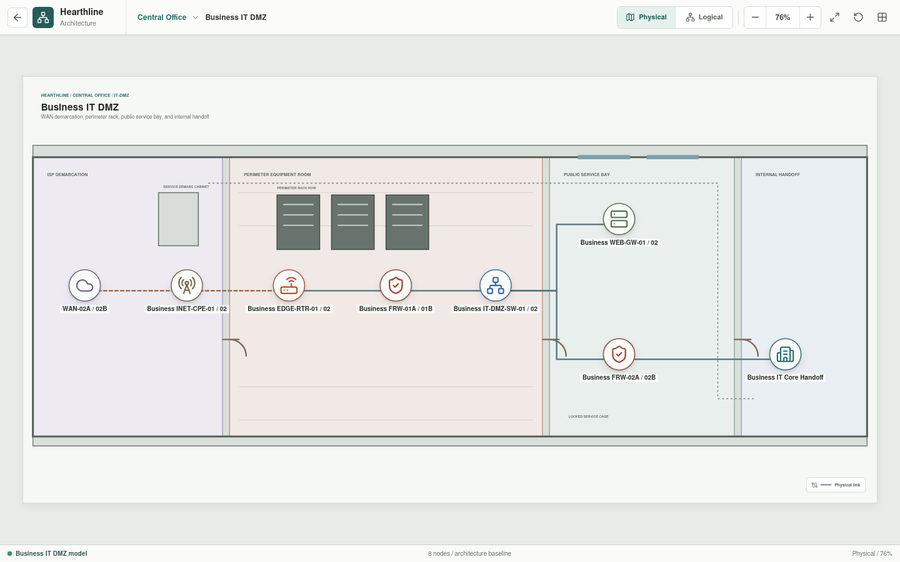
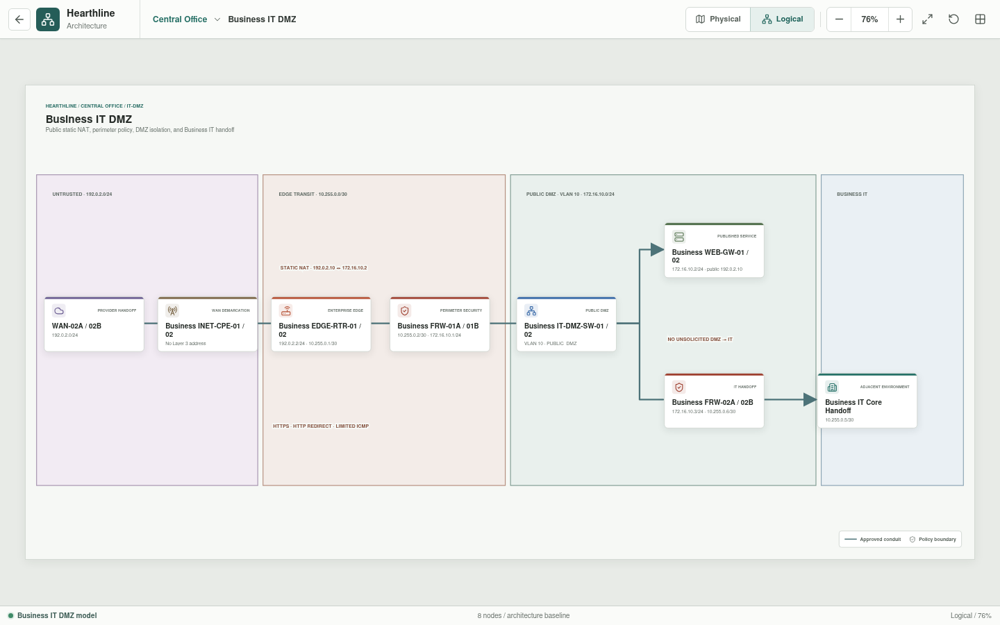

# Central Office IT DMZ

The IT DMZ publishes the business web service and provides controlled handoffs
to the provider and internal Business IT.





## Implementation Status

The DMZ architecture, addressing intent, and policy boundaries are represented
in Svelte. Rust assembles and tests one selected A-side customer path through
the business edge, external firewall, DMZ switch, and web gateway. Static
destination NAT publishes `192.0.2.10`, named policy permits HTTPS to
`172.16.10.2`, and the gateway validates `shop.hearthline.test/shop` before an
upstream request crosses `Business FRW-02A` to `Business IT Services-01`.
Configured HTTP 200 content returns to the customer through stateful policy and
reverse NAT. The gateway allows GET, HEAD, and POST from canonical YAML, and
rejects configured traversal, DELETE, and SQL-injection request-body probes
with separate evidence.
Public SSH is denied by default policy. The paired assets indicate an
availability target; TLS cryptography, synchronized HA state, and failover are
not implemented or tested.

## Architecture

```text
WAN-02A / WAN-02B
  -> Business INET-CPE-01/02
  -> Business EDGE-RTR-01/02
  -> Business FRW-01A/01B
  -> Business IT-DMZ-SW-01/02
       |-- Business WEB-GW-01/02
       `-- Business FRW-02A/02B
             `-- Business IT Core Handoff
```

## Inventory

| Asset | Role |
| --- | --- |
| `WAN-02A/02B` | Diverse business-facing provider circuits |
| `Business INET-CPE-01/02` | Provider-managed access CPE |
| `Business EDGE-RTR-01/02` | Redundant Internet edge and static NAT role |
| `Business FRW-01A/01B` | High-availability external perimeter policy boundary |
| `Business IT-DMZ-SW-01/02` | Redundant public DMZ switching |
| `Business WEB-GW-01/02` | Reverse proxy, TLS termination, and web application firewall |
| `Business FRW-02A/02B` | High-availability internal boundary toward Business IT |
| `Business IT Core Handoff` | Adjacent routed enterprise environment |

## Addressing

| Zone or link | Addressing | Purpose |
| --- | --- | --- |
| Provider-facing network | `192.0.2.0/24` | Business edge attachment |
| Edge-to-perimeter transit | `10.255.0.0/30` | Routed external firewall handoff |
| Public DMZ | `172.16.10.0/24` | Published services and internal boundary |
| DMZ-to-IT transit | `10.255.0.4/30` | Routed Business IT handoff |

The target design assigns `Business EDGE-RTR-01/02` a static translation from
`192.0.2.10` to the `Business WEB-GW-01/02` VIP at `172.16.10.2`.

## Policy Intent

- `Business FRW-01A/01B` allows HTTPS to the published gateway VIP. TCP/80 is
  redirect-only when enabled.
- Unmatched inbound traffic is denied.
- The public DMZ does not initiate unrestricted sessions into Business IT.
- `Business FRW-02A/02B` independently enforces named gateway-to-application
  dependencies across the DMZ-to-IT boundary.
- Device management uses dedicated management roles, not the public conduit.
- NAT and firewall policy remain separate concerns and are evaluated in order.

## Scenario Coverage

| Flow | Status | Result |
| --- | --- | --- |
| Public DNS-resolved HTTPS to `192.0.2.10` | Implemented | Translated, admitted at both firewall boundaries, answered by `10.10.80.10`, and returned to the customer |
| Public SSH to `192.0.2.10` | Implemented | Translated, then denied at the external perimeter |
| Public traversal probe over HTTPS | Implemented | Admitted through the perimeter, then rejected at `Business WEB-GW-01` with security evidence |
| Public DELETE probe over HTTPS | Implemented | Admitted through the perimeter, then rejected by the gateway's YAML-defined method allowlist with separate evidence |
| Public SQL-injection POST probe over HTTPS | Implemented | Admitted through the perimeter, then rejected by the gateway's YAML-defined body inspection rule with separate evidence |
| Public HTTP to the published service | Planned | Redirect behavior exists as a primitive but is not configured end to end |
| Other unpublished public service | Planned | Expected denied |
| Public source to Business IT | Planned | Expected denied |
| Web gateway to an approved internal dependency | Implemented | Exact HTTPS policy permits `172.16.10.2` to `10.10.80.10` on the selected A-side path |
| DMZ source to network-management interfaces | Planned | Expected denied |

The current test proves only the selected A-side path and the declared
outcomes. It does not prove arbitrary DMZ reachability or redundant service
operation.
