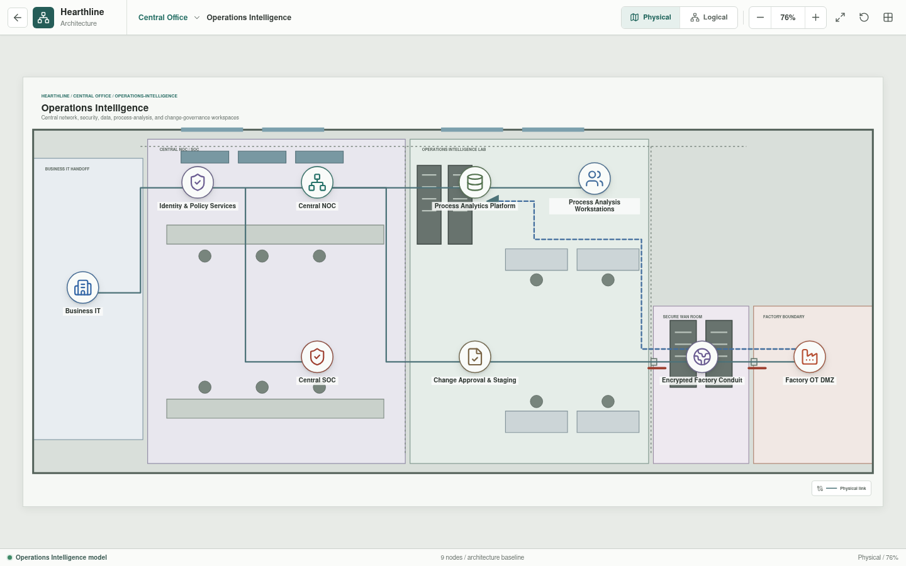
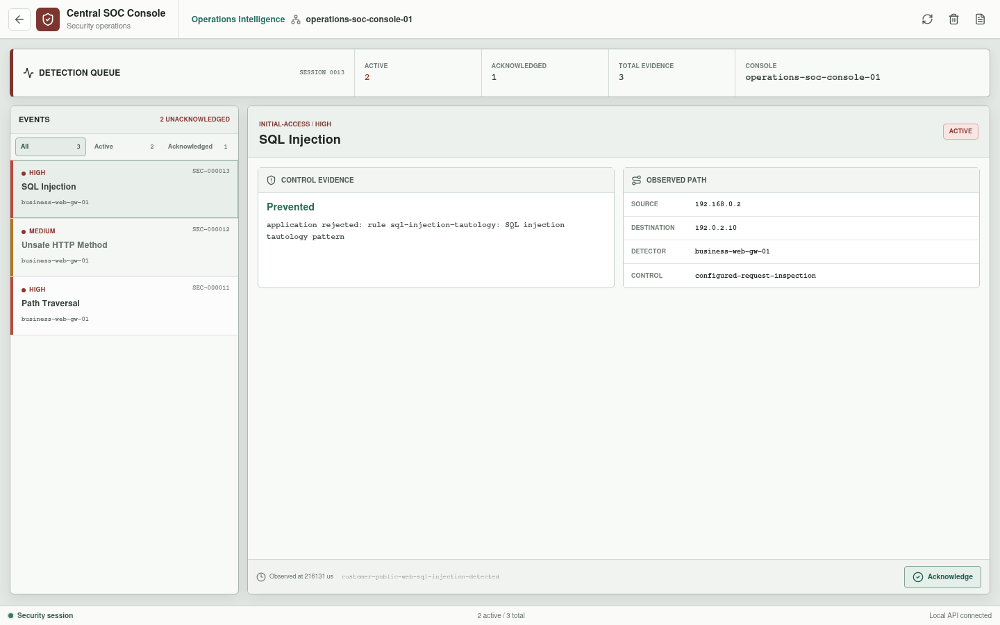
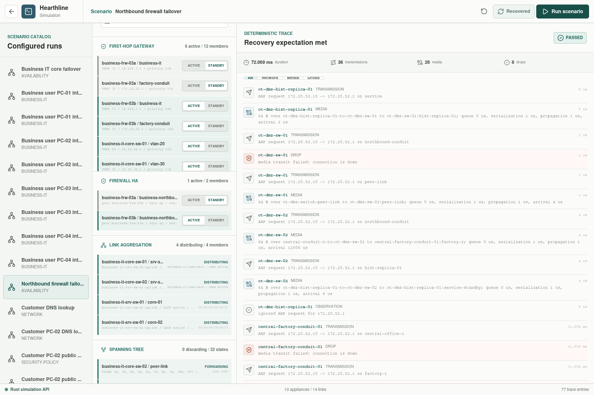
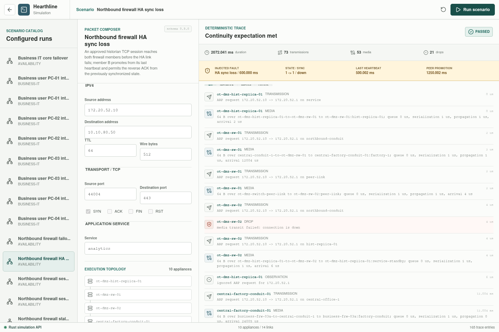
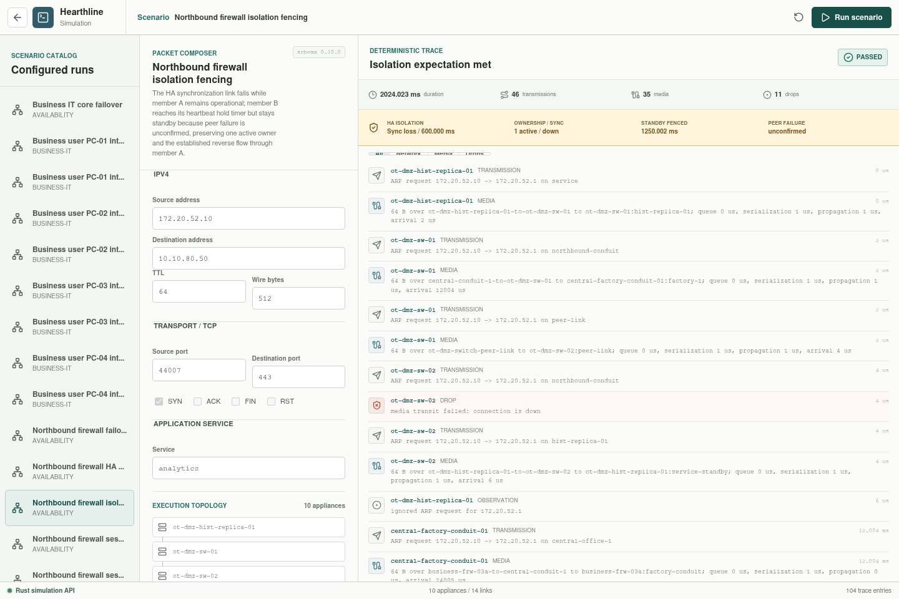

# Operations Intelligence

Operations Intelligence is the Central Office environment for architecture
governance, identity, monitoring, security operations, analytics, and approved
factory change workflows.

## Implementation Status

The governance, monitoring, analytics, identity, change, and conduit roles are
implemented as architecture views with parsed appliance identity and behavior
baselines. The Central SOC appliance now opens a bounded local security-event
session used by the traversal, disallowed-method, and SQL-injection request-body
WAF exercises, including queue filtering, evidence review, acknowledgement,
and clearing. Hearthline
does not yet provide an
identity system, NOC tooling, routed telemetry, SIEM correlation, a full
analytics pipeline, or a package-signing workflow. The selected
historian-replica path is executable through the inter-site conduit: HTTPS
reaches the analytics service, while SSH is denied at the northbound firewall.
Its permitted application is a bounded telemetry frame. Forming telemetry is
collected automatically into a factory-local in-memory store, replicated
through the OT firewall into the DMZ store, and exposed in SCADA with both
route traces. An authorized action then publishes the latest replica record
and inspects the analytics delivery trace.
The northbound pair also has an executable converged recovery in which
`Business FRW-03B` takes both virtual identities and the same HTTPS flow after
the active member's data links are withdrawn. A separate continuity scenario
establishes one TCP flow, carries its session record and heartbeats over the
HA-sync medium, promotes `Business FRW-03B` after the configured hold timer,
advertises both virtual identities, and delivers the reverse ACK from
synchronized state. The protocol is a deterministic Hearthline abstraction;
vendor HA behavior and production RTO/RPO are not claimed.
The HA-sync-loss variant drops the dedicated medium after that session reaches
the standby, then verifies retained-state continuity from the last heartbeat.
The standby-state-loss variant clears the replicated table before promotion
and verifies that the reverse ACK is denied by default policy.
The stale-session variant promotes with retained state, delays the reverse ACK
beyond the modeled 300-second TCP timeout, and verifies explicit expiry before
the firewall applies its default deny.
The HA-isolation variant drops only the synchronization medium while FRW-03A
remains healthy. FRW-03B reaches its hold timer but remains fenced because
peer failure is unconfirmed; FRW-03A retains sole ownership and completes the
reverse flow.

## Responsibilities

| Capability | Responsibility |
| --- | --- |
| Identity and policy services | Authentication, authorization, device posture, and policy decisions |
| Central NOC | Architecture standards, availability, configuration governance, and change coordination |
| Central SOC | Security monitoring, investigation, and incident coordination |
| Process analytics platform | Analysis of approved production, quality, energy, and maintenance data |
| Process analysis workstations | Managed engineering and business analysis endpoints |
| Change approval and staging | Review, scanning, signing, approval, and controlled release |
| Encrypted Factory conduit | Authenticated inter-site transport to the factory perimeter |

## Authority Boundary

Central Office may define desired state, approve changes, and analyze selected
production data. Factory-local systems enforce OT policy and retain operational
authority. Analytics platforms consume brokered or replicated data and receive
no direct controller route.

The target workflow terminates administrative sessions at the Factory OT DMZ
jump service before a separately authorized southbound session is considered.
Change packages are intended to pass through managed transfer, inspection,
approval, and audit stages.

## Availability

Loss of Central Office or the inter-site conduit may interrupt analytics,
remote administration, and non-urgent changes. It must not stop local control,
safe shutdown, or essential factory operation.

## Validation Scenarios

| Scenario | Status |
| --- | --- |
| Historian replica publishes selected data to analytics over HTTPS | Implemented; a typed canonical telemetry frame is delivered through the named firewall rule |
| Forming vPLC publishes to the Level 3 historian | Implemented; addressed controller traffic traverses the virtual host and Level 3 core |
| Level 3 historian replicates into the OT DMZ | Implemented; the named southbound firewall rule admits the bounded record and failed records remain pending for retry |
| Forming SCADA publishes the latest replica record | Implemented; the operator-triggered payload and sequence traverse the historian-replica path and return delivery evidence |
| Historian replica attempts SSH to analytics | Implemented; denied by default policy |
| Northbound firewall A-to-B ownership transfer | Implemented converged recovery; HTTPS delivered through FRW-03B |
| Northbound firewall session continuity | Implemented deterministic run; one synchronized TCP session survives timer-based FRW-03B promotion |
| Northbound firewall HA sync loss | Implemented deterministic fault run; state synchronized before link loss survives promotion |
| Northbound firewall standby state loss | Implemented deterministic fault run; absent state causes the reverse ACK to fail closed |
| Northbound firewall stale-session expiry | Implemented long-idle run; retained state expires before the delayed reverse ACK and fails closed |
| Northbound firewall sync-path isolation | Implemented deterministic fencing run; standby promotion is inhibited and one active owner remains |
| Approved administrator reaches the OT DMZ jump service | Planned |
| Central Office source routes directly to a controller | Planned denial |
| Unsigned or unapproved change package | Planned denial |
| Customer traversal probe reaches WAF and Central SOC session | Implemented; prevented at `Business WEB-GW-01` with trace-derived evidence |
| Customer disallowed-method probe reaches WAF and Central SOC session | Implemented; denied by the YAML-defined method allowlist with separate trace-derived evidence |
| Customer SQL-injection request body reaches WAF and Central SOC session | Implemented; denied by a YAML-defined body inspection rule with separate trace-derived evidence |
| Routed SOC telemetry without inline process dependency | Planned |
| Factory command path during conduit loss | Implemented bounded local-autonomy proof; both northbound handoffs fail while the Body Preparation pump command succeeds locally |

The implemented data paths and security exercises validate selected network,
service, process-snapshot, and analyst-session behavior. They do not establish
durable historian persistence, protocol subscriptions, dataset authorization,
analytics processing, identity, SIEM correlation,
administrative access, package approval, controller-program execution, vendor
HA conformance, or broad failover behavior.
