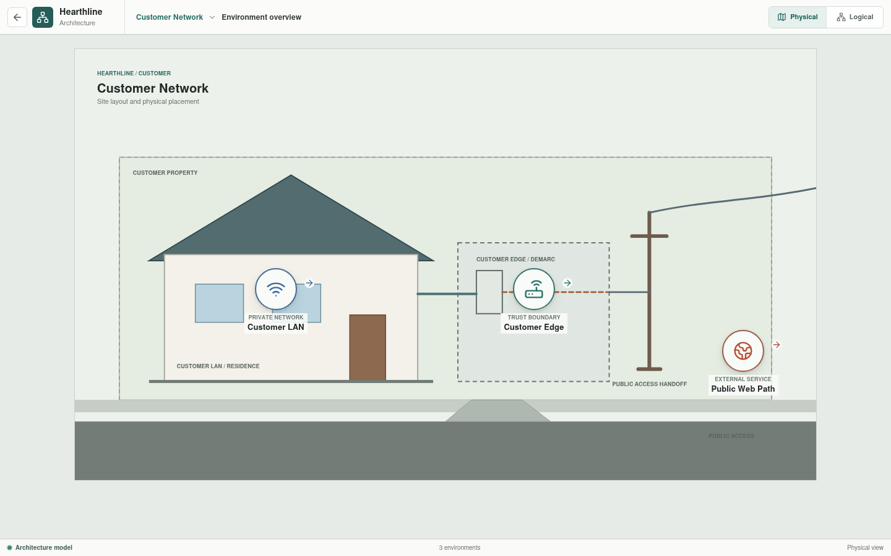

# Customer Network

The Customer Network represents an independently managed residential network
used to reach Hearthline's public services.

## Implementation Status

The location overview and its three environment routes are implemented in
Svelte. Appliance identity, interfaces, behavior baselines, and source
documents are loaded from Rust-generated data backed by canonical YAML. Rust
executes selected customer DNS, public HTTPS, and public management-denial
paths through configured links and appliances. The simulation workspace can
also take the residential access circuit out of service and verify that public
DNS traffic is dropped at the provider CPE, then apply the scenario's declared
recovery state and verify DNS delivery to the customer PC. Link geometry and
some policy descriptions remain presentation data, and the complete customer
topology is not yet evaluated as one running graph.

## Environments

| Environment | Responsibility |
| --- | --- |
| [Customer LAN](customer-lan/README.md) | Workstations, access switching, private addressing, and the router's LAN-facing boundary |
| [Customer Edge](customer-edge/README.md) | Default routing, PAT, media conversion, customer WAN access, and the provider next hop |
| [Public Web Path](public-web-path/README.md) | DNS, provider transit, business publication policy, and delivery to the public web service |

## Scope Boundaries

The Customer LAN ends at `Customer RTR-01`'s inside interface. Customer Edge
owns the router's boundary behavior and the access path to `ISP-RTR-01`. Public
Web Path is an end-to-end service view: it references customer, provider, and
business assets without becoming their configuration owner.

Planned work moves the remaining link and policy ownership into canonical
inputs, constructs the complete configured topology, and broadens Rust
evaluation beyond the selected translation, route, service, and denial
scenarios.
