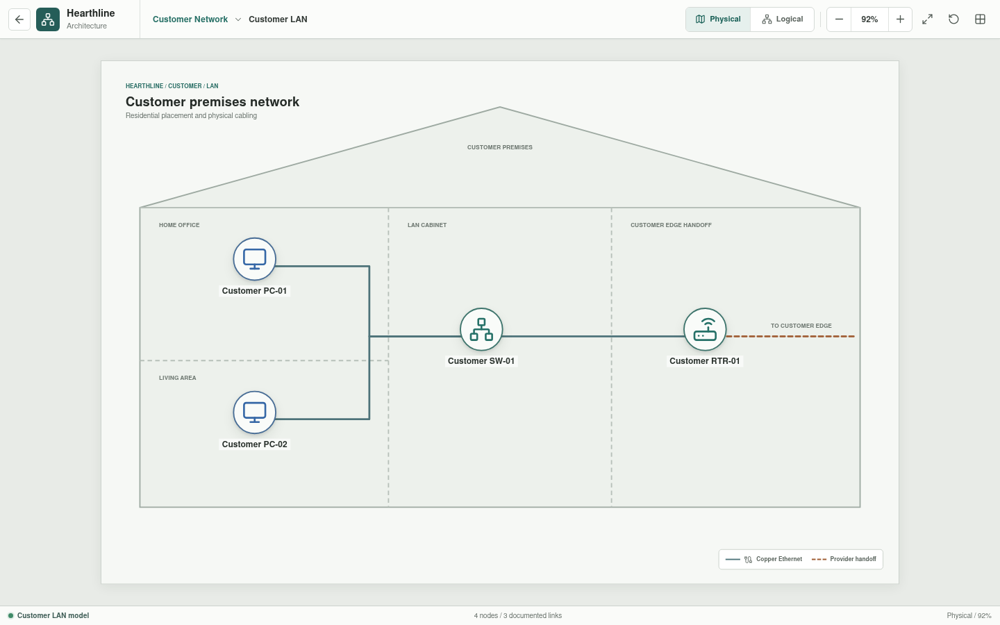
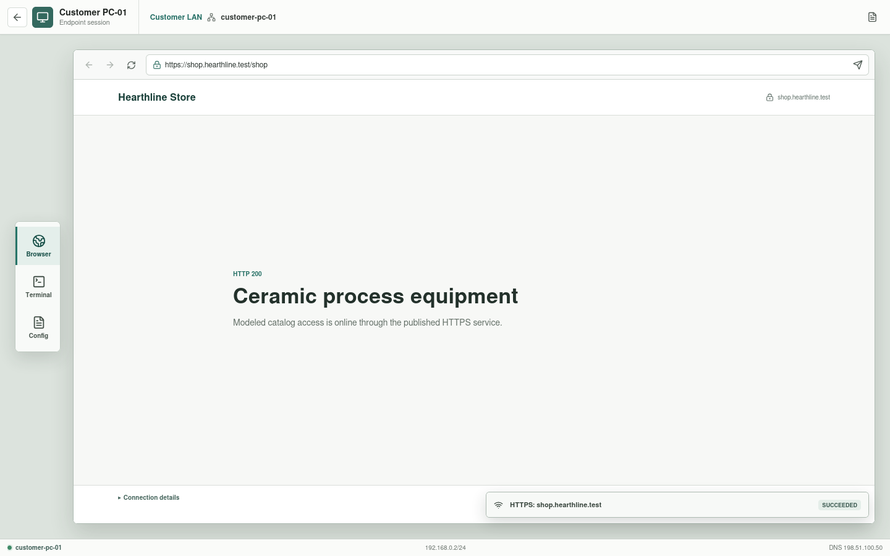

# Customer LAN

The Customer LAN is the private residential network inside the customer
premises. It owns the endpoints, access switch, and router inside interface.






## Implementation Status

The physical and logical LAN diagrams are implemented. Addressing and
per-appliance interfaces are now represented in parsed YAML and available from
each device inspector. Customer PC-01 and PC-02 are enterable as responsive
workstations whose profiles, terminals, browsers, and activity traces are
supplied by the local Rust API. Each endpoint has independent DNS, public
HTTPS, and perimeter-denied SSH scenarios. Complete LAN-only reachability
remains unimplemented. Customer PC-01 can also run configured traversal,
disallowed-method, and SQL-injection request-body probes with `curl`; all three
are prevented by the business DMZ WAF and create distinct defensive evidence
for the Central SOC session.

## Scope

```text
Customer PC-01 --+
                 +-- Customer SW-01 -- Customer RTR-01 Gi0/0
Customer PC-02 --+                         |
                                      Customer Edge
```

The modem, access network, and provider next hop belong to
[Customer Edge](../customer-edge/README.md).

## Inventory

| Asset | Role | Address |
| --- | --- | --- |
| `Customer PC-01` | Customer workstation | `192.168.0.2/24` |
| `Customer PC-02` | Customer workstation | `192.168.0.3/24` |
| `Customer SW-01` | Layer 2 access switch | Layer 2 |
| `Customer RTR-01` | Default gateway and routed boundary | `192.168.0.1/24` inside |

Both workstations use `192.168.0.1` as their default gateway and
`198.51.100.50` as their public DNS resolver.

## Physical Connectivity

| Local endpoint | Remote endpoint | Purpose |
| --- | --- | --- |
| `Customer PC-01 FastEthernet0` | `Customer SW-01 FastEthernet0/1` | Workstation access |
| `Customer PC-02 FastEthernet0` | `Customer SW-01 FastEthernet0/2` | Workstation access |
| `Customer SW-01 GigabitEthernet0/1` | `Customer RTR-01 GigabitEthernet0/0` | Default-gateway handoff |

The access links share one private Layer 2 domain. No trunk or inter-VLAN
routing is required for the baseline.

## Validation Targets

- Both workstations can reach the default gateway.
- Both workstations can communicate through the access switch.
- Non-local traffic is sent to `Customer RTR-01`.
- The LAN has no direct provider or business attachment.
- Translation and public reachability are evaluated at the next levels.

The four assets, their baseline interfaces, and the private prefix are parsed
from canonical YAML. The selected DNS and public-service scenarios construct
the originating workstation, access switch, and router from those records and
exercise their selected links. PC-01 and PC-02 terminal and browser actions
use independent source addresses and scenario documents for `nslookup`,
HTTPS, and denied SSH. LAN-only reachability scenarios remain planned.

PC-01 additionally selects a security exercise only for its exact configured
method, path, and request body. `curl -I` follows the normal configured HTTPS
scenario, whereas the traversal URL, `curl -X DELETE` request, and quoted
`curl --data "username=admin' OR '1'='1"` payload select their respective
controlled denials. A benign quoted POST uses the normal HTTPS path. Ordinary
browsing continues to use GET on the successful public HTTPS scenario.
