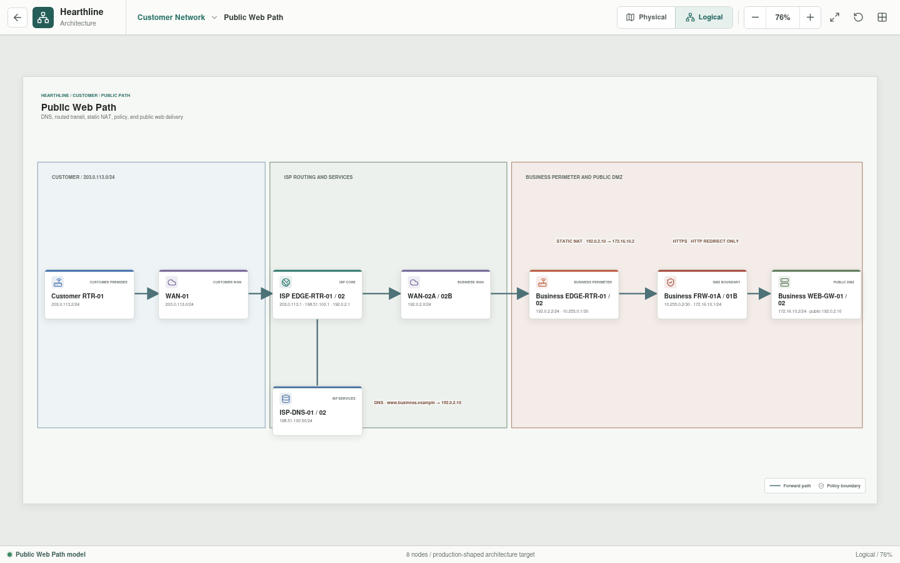

# Public Web Path

Public Web Path is the end-to-end customer journey from the residential edge to
Hearthline's published business web service.




## Implementation Status

The end-to-end physical and logical service path is implemented as an
architecture view. A selected A-side path is also assembled from canonical
YAML and tested end to end in Rust. It covers DNS, customer PAT, provider
routing, business static destination NAT, named perimeter HTTPS policy, web
gateway host and path validation, named downstream firewall policy, internal
application delivery, HTTP response relay, and reverse NAT to the customer.
The gateway's GET, HEAD, and POST allowlist is configuration-owned and
validated before Rust constructs the selected path. Its bounded path and body
inspection signatures are configuration-owned as well. TLS cryptography, full
TCP semantics, and synchronized HA remain unimplemented.

## Service Path

Physical mode separates the path into customer premises, provider point of
presence, and the Central Office business perimeter. Logical mode shows DNS,
routed transit, static NAT, perimeter policy, and delivery to the public DMZ.

```text
Customer RTR-01
  -> WAN-01
  -> ISP EDGE-RTR-01/02
  -> WAN-02A/02B
  -> Business EDGE-RTR-01/02
  -> Business FRW-01A/01B
  -> Business WEB-GW-01/02
  -> Business FRW-02A/02B
  -> Business IT Core
  -> Business IT Services
  -> return path to Customer PC
```

The current view uses `ISP-DNS-01/02` to represent the public DNS path for
`shop.hearthline.test`, whose authoritative test record maps to `192.0.2.10`.
This single icon is a presentation simplification. The current YAML preserves
that simplified authoritative role; recursive resolution and authoritative
hosting must be separated before DNS behavior can be considered complete.

## Addressing Intent

| Segment or service | Addressing |
| --- | --- |
| Customer-facing provider network | `203.0.113.0/24` |
| Customer edge | `203.0.113.2/24` |
| Provider next hop | `203.0.113.1/24` |
| Provider services | `198.51.100.0/24` |
| Public DNS example | `198.51.100.50/24` |
| Business-facing provider network | `192.0.2.0/24` |
| Business edge | `192.0.2.2/24` |
| Published web address | `192.0.2.10` |
| Edge-to-firewall transit | `10.255.0.0/30` |
| Public DMZ | `172.16.10.0/24` |
| Business web-gateway VIP | `172.16.10.2/24` |
| Internal application service | `10.10.80.10/24` |

`192.0.2.0/24`, `198.51.100.0/24`, and `203.0.113.0/24` are the three
IPv4 documentation blocks defined by RFC 5737. They are used only in the
architecture model and must not appear on the public Internet.

## Responsibilities

| Asset | Responsibility |
| --- | --- |
| `Customer RTR-01` | Originating edge, PAT, and default route |
| `WAN-01` | Customer access network |
| `ISP EDGE-RTR-01/02` | Redundant provider gateway and service routing role |
| `ISP-DNS-01/02` | Simplified public DNS role; recursive and authoritative services will be separated in canonical configuration |
| `WAN-02A/02B` | Diverse business-facing provider circuits |
| `Business EDGE-RTR-01/02` | Redundant business edge and static publication |
| `Business FRW-01A/01B` | High-availability perimeter policy enforcement |
| `Business WEB-GW-01/02` | Reverse proxy, TLS termination, and web application firewall |
| `Business FRW-02A/02B` | Named DMZ-to-application policy boundary |
| `Business IT Services-01` | Provisional configured HTTPS application endpoint |

## Publication Policy

The target publication policy translates `192.0.2.10` to the DMZ gateway VIP at
`172.16.10.2`. The perimeter allows HTTPS; TCP/80 may exist only to redirect to
HTTPS. The gateway tier proxies named internal application dependencies through
the downstream policy boundary. Management access is not part of the public
conduit.

## Scenario Coverage

| Scenario | Status | Result |
| --- | --- | --- |
| Customer DNS query for `shop.hearthline.test` | Implemented | Returns `192.0.2.10` through the selected provider path |
| Customer HTTPS request to `/shop` | Implemented | Crosses both named firewall policies, reaches `10.10.80.10`, and returns configured HTTP 200 content through both NAT boundaries |
| Customer SSH to the published address | Implemented | Dropped at `Business FRW-01A` by default policy |
| Customer traversal probe to `/shop?file=../../etc/passwd` | Implemented | Reaches `Business WEB-GW-01`, is rejected by the Rust WAF, and projects evidence to the Central SOC session |
| Customer DELETE request to `/shop/admin` | Implemented | Reaches `Business WEB-GW-01`, is rejected by the YAML-defined method allowlist, and projects separate evidence to the Central SOC session |
| Customer SQL-injection POST to `/shop/login` | Implemented | Reaches `Business WEB-GW-01`, is rejected by a YAML-defined body inspection rule, and projects separate evidence to the Central SOC session |
| Return traffic for the modeled web exchange | Implemented | Stateful reverse policy and NAT restore responses independently to `Customer PC-01` or `Customer PC-02` |
| Direct customer access to the private DMZ address | Planned | Expected denied or unroutable |
| Unpublished inbound service to the web gateway | Planned | Expected denied |
| Untranslated private customer source at the provider boundary | Planned | Expected denied |

The implemented scenarios use the A-side appliances only. The paired B-side
assets remain availability targets until synchronized state and failover
behavior are modeled.

The traversal, method, and SQL-injection cases are controlled deterministic
exercises, not real host compromise. The current WAF uses a bounded
application-data contract, configured path or body substring signatures, and a
configured method allowlist; it is not a production HTTP parser or WAF
ruleset.
