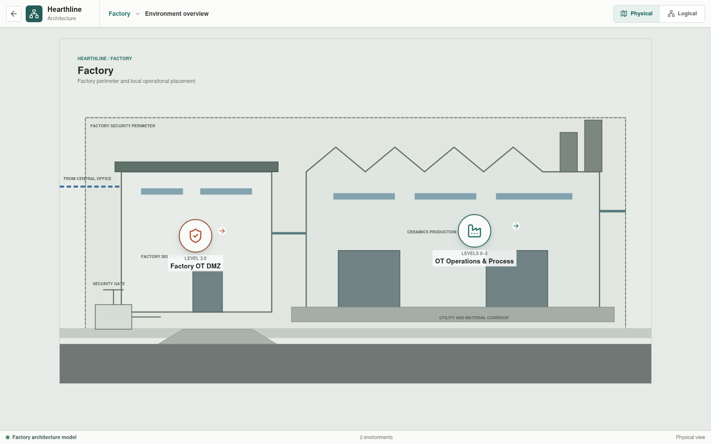
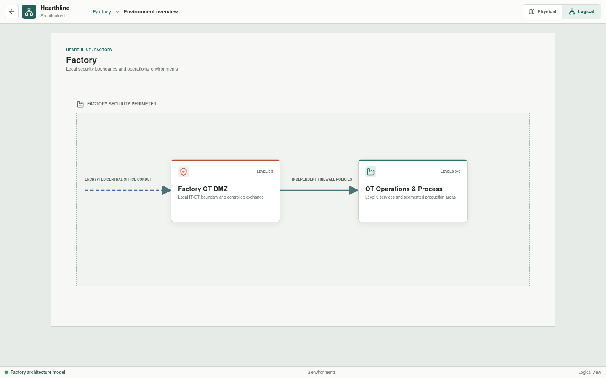

# Factory

The Factory is Hearthline's local OT execution and enforcement site. It owns
the OT DMZ, Level 3 operational handoff, local engineering authority, and the
segmented ceramics process.





## Implementation Status

The Factory overview, OT DMZ route, process route, and ten area routes are
implemented in Svelte. The rendered segmentation and equipment are an
architecture baseline. Generic Rust controller, I/O, field-device, safety,
firewall, and connector primitives now exist, and all factory appliances and
current attachment records have parsed YAML. The configuration includes a
redundant Level 3 aggregation pair between the OT firewall, factory-local
services, vPLC hosts, and cell uplinks. No area-specific control logic, plant
dynamics, or complete factory topology currently runs outside the bounded
Forming process slice described below.
Three selected data paths are executable: Forming to the Level 3 historian,
Level 3 through the OT firewall to the DMZ replica, and the replica to Central
Office analytics. The northbound pair includes a positive HTTPS result and a
negative SSH result. Each process area also exposes deterministic YAML-derived operator
sessions; Forming includes an embedded machine-PC SCADA, four mould-local HMIs,
and an independent robot joystick. These
interfaces share one Rust-backed cell session with four independently started
mould runtimes, live instruments, outputs, alarms, and fault injection. A
bounded API-session historian samples once per second,
retries DMZ replication, and exposes local/replica state in Forming SCADA. The
SCADA publication action sends the latest replica record through the governed
inter-site path to Central Office analytics. A composite
availability scenario drops both
factory-facing conduit handoffs while the Body Preparation HMI resets its
safety interface and commands its pump over an independently validated local
path. Forming now executes independent instances of one validated, bounded
Structured Text sequence through an explicit YAML I/O map; Rust remains
responsible for plant dynamics and scoped trips. The other nine areas do not
yet execute control sources.

## Environments

| Environment | Responsibility |
| --- | --- |
| [OT DMZ](ot-dmz/README.md) | Governed inter-site access, exchange, monitoring, and independent IT/OT policy boundaries |
| [Ceramics Process](process/README.md) | Ten enterable production areas with controllers, HMIs, field I/O, and safety or permissive interfaces |

## Site Authority

Central Office defines enterprise policy, approved change workflows, and
analysis requirements. The Factory enforces those decisions at local
boundaries and retains process authority. Central services do not receive direct
routes to controllers.

Loss of the Central Office or inter-site conduit may interrupt remote
administration and analytics, but it must not stop local control or safe
operation.

## Segmentation Model

- The factory OT DMZ is local to the Factory.
- `Business FRW-03A/03B` and `OT FRW-01A/01B` are independent policy roles.
- Access, exchange, and monitoring services occupy separate DMZ subzones.
- Level 3 engineering is south of the OT-side boundary.
- Each production area is an independently modeled zone.
- Area-specific control networks remain separated from the cell boundary to
  the factory-local vPLC compute cluster.
- Distributed I/O remains physically local to each automation cell.
- Cross-area and shared-utility communication requires an explicit conduit.
- Safety and burner-management functions remain separate from general process
  control.

## Process Sequence

```text
Body Preparation
  -> Forming
  -> Controlled Drying
  -> Industrial Dryer
  -> Color and Glaze
  -> Kiln 1
  -> Intermediate Inspection
  -> Kiln 2
  -> Final Inspection
  -> Logistics
```

The first executable area model represents four independently controlled mould
sequences with selected process conditions, runtime-bound setpoints,
source-driven equipment commands, and five injected faults. Each equal mould
station has local I/O, an external control cabinet, a mould-embedded utility
section, local production authority, selector, live visualization, and safety
state. A dedicated robot controller arbitrates mould pickup and four guarded
operator-handoff transfer stations. Robot recovery and collision envelopes,
remaining areas, broader control-language support, and cross-area material
state are planned.

## Physical Deployment Requirements

Factory hardware selection must account for ceramics-process dust, heat,
vibration, electromagnetic conditions, enclosure rating, cooling, maintainable
access, and contamination control. Critical compute, switching, storage, and
policy systems require independent power paths and UPS capacity aligned with
the safe-state and recovery strategy.

These are deployment requirements to be resolved through site-specific
engineering; the current model does not select or qualify equipment.
