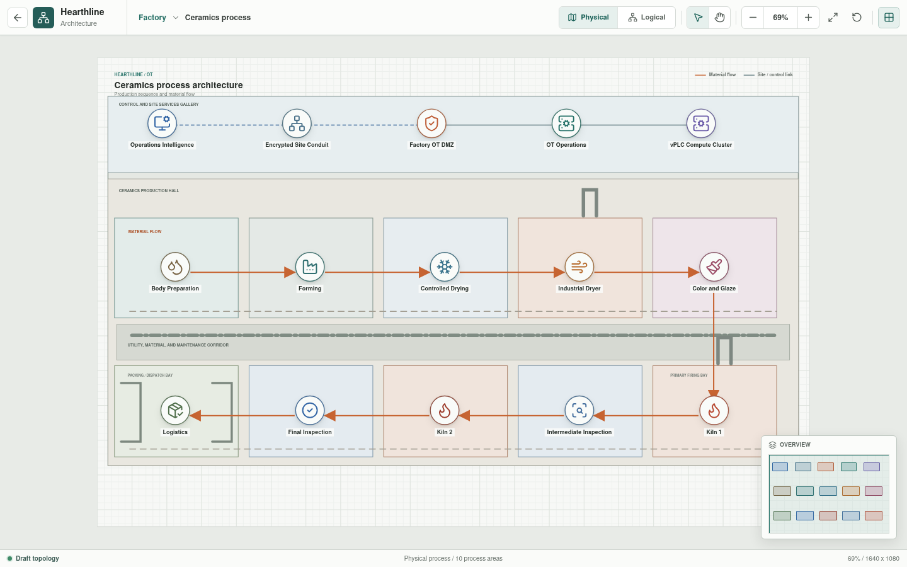
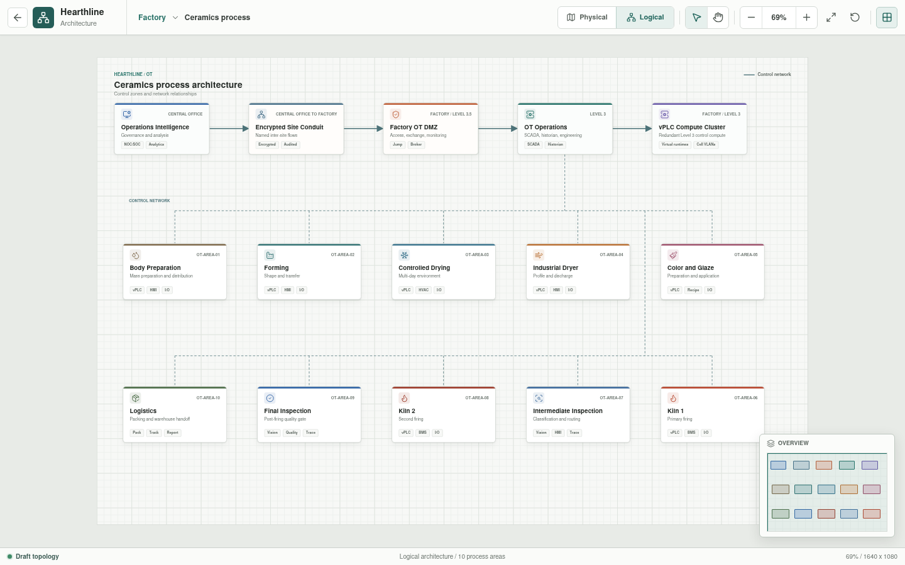
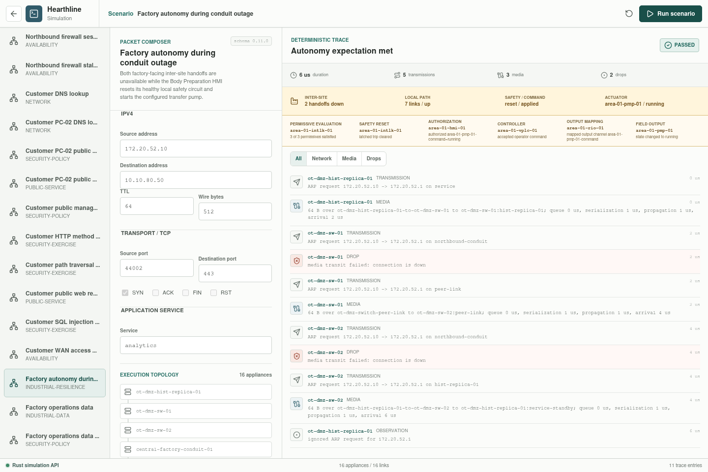

# Ceramics Process

The Factory process level contains ten independently enterable top-level
functional areas. Body Preparation is also a gateway to three separate process
buildings. Each detailed area models its control boundary, operator interface,
distributed I/O, representative sensors and actuators, and safety or
permissive role.





## Implementation Status

The ordered process canvas and ten process-area views are implemented. Eight
areas still use bootstrap JSON for representative presentation relationships.
Body Preparation and Forming are detailed executable areas. Body Preparation
provides a three-building gateway and scoped walkdown/logical views for Slip
Preparation, Water Preparation and Distribution, and Glaze Preparation. Its
166 components derive from canonical YAML and include six HMI/vPLC scopes,
three access switches, seven remote-I/O stations, six safety scopes, eight
water routes, 16 pumps, and four monitored material handoffs. Four independently controlled Rust trains execute
changing inventory, material quality, equipment output, release, and fault
state against explicit public-reference development recipes. Forming derives 84
components from the generated YAML catalog and separates shared ceramic-slip
supply, four mould stations, robotic demoulding, the embedded machine-PC
supervisory application, four mould-local HMIs, an independent robot pendant,
a dedicated robot controller, four handoff transfer stations, guarded-cell
safety, control, distributed I/O, and field equipment.

The Rust workspace has provisional controller-scan, I/O, sensor, actuator,
supervisory/HMI, safety, and connector primitives plus parsed YAML for the
process-area components, both physical vPLC hosts, and the Level 3 aggregation pair. Every
configured local operator interface is assembled from area YAML with declared
signal and command scope, alarm and audit state, and a command path executed
through the operator interface, vPLC, remote I/O, and actuator primitives.
The first composite resilience scenario also disables both factory-facing
inter-site handoffs while the Slip Preparation HMI resets its healthy safety
circuit and starts the transfer pump over an independently validated local
path. Body Preparation provides independent Start/Hold/Resume controls,
quality release, and 14 deterministic fault paths across slip, water,
return-water, and glaze trains. Released slip updates Forming material
properties and derived drying/firing indicators; finite inventory and
downstream drying/kiln consumers remain planned.
Forming additionally runs a deterministic Rust sequence through mould
filling, pressure casting, excess-slip drainage, water/air release, robotic
pickup and handoff, mould washing, air purging, vacuum drying, and mould
closure. Its bounded Structured Text sequence and explicit YAML I/O binding
are executable; production-fidelity plant dynamics, the remaining eight area
programs, and broader IEC 61131-3 language support remain unimplemented.
The Forming machine PC can capture the current process scan and invoke the existing
brokered factory operations-data path. The resulting typed telemetry packet,
analytics delivery result, and media trace are returned to the same operator
session.



The screenshot is command-level evidence: it does not claim that a PLC program
continued scanning or that material state advanced during the outage.

## Process Sequence

```text
Body Preparation
  -> Forming
  -> Controlled Drying
  -> Industrial Dryer
  -> Color and Glaze
  -> Kiln 1
  -> Intermediate Inspection
  -> Kiln 2
  -> Final Inspection
  -> Logistics
```

## Areas

| Zone | Area |
| --- | --- |
| `OT-AREA-01` | [Body Preparation gateway](material/body-preparation/README.md), with separate slip, water preparation/distribution, and glaze buildings |
| `OT-AREA-02` | [Forming](material/forming/README.md) |
| `OT-AREA-03` | [Controlled Drying](material/controlled-drying/README.md) |
| `OT-AREA-04` | [Industrial Dryer](thermal/industrial-dryer/README.md) |
| `OT-AREA-05` | [Color and Glaze](thermal/color-and-glaze/README.md) |
| `OT-AREA-06` | [Kiln 1](thermal/kiln-one/README.md) |
| `OT-AREA-07` | [Intermediate Inspection](finishing/intermediate-inspection/README.md) |
| `OT-AREA-08` | [Kiln 2](finishing/kiln-two/README.md) |
| `OT-AREA-09` | [Final Inspection](finishing/final-inspection/README.md) |
| `OT-AREA-10` | [Logistics](finishing/logistics/README.md) |

## Model Boundary

The Svelte views currently consume
[`process-view.json`](../../../../packages/web/src/generated/process-view.json), a versioned
bootstrap view model for the process sequence and eight representative area
views. Body Preparation and Forming derive their component inventories and
descriptions from the generated canonical configuration catalog; Svelte
retains only their presentation grouping, building scope, and coordinates.
Forming HMI state,
four independent
accelerated mould cycles, station selector state, mutable development parameters and recipes,
parsed control-source state, and resolved Forming I/O bindings are supplied by
the Rust API. Body Preparation supplies independent slip, water, return-water,
and glaze state, recipes, water inventories, quality checks, phase outputs,
and validated slip-control-source references through the same API. Each
mould-local HMI owns production enable, Stop, and End for
its own sequence; the machine PC supervises without production-start or robot
authority. The dedicated robot controller provides bounded FIFO arbitration,
exclusive robot ownership, and mould-specific pickup and handoff completion
gates. Broader connectivity results, remaining area control sources, and
generated process-area topology will replace the remaining bootstrap records.

Svelte owns layout and interaction. Rust owns process state, material movement,
faults, accelerated time, network decisions, and generated results. The virtual
PLC runtime owns controller execution semantics.

## vPLC Deployment Model

The target vPLC deployment uses a factory-local redundant Level 3 compute
cluster. Each `AREA-xx-vPLC-01` is a logical workload, not a standalone physical
controller. The physical views therefore show:

- `OT-vPLC-HOST-01/02` as the shared industrial control compute cluster.
- A dedicated cell VLAN extended from each process-area boundary to its assigned
  runtime.
- One or more `AREA-xx-RIO-*` stations as cell-local distributed I/O. Body
  Preparation uses five stations to separate its process functions.
- Sensors and actuators terminated at remote I/O rather than directly at the
  virtual workload.
- Local HMI and safety/status relationships separated from field I/O.

Compute, network, storage, management, licensing, and failover behavior must be
selected so a management-plane or inter-site outage does not stop local
operation. Future qualification must validate resource reservation and
deterministic network behavior against the selected runtime and process timing
requirements.

## Shared Requirements

- Each area has an explicit network and process boundary.
- Cell separation continues through the network to the vPLC host.
- vPLC management and process communication use separate interfaces or
  enforcement contexts.
- Distributed I/O remains local to its automation cell.
- Cross-area flows are declared instead of inferred from adjacency.
- Shared mass, glaze, utility, and logistics paths have defined ownership.
- Safety and burner-management interfaces remain independent from ordinary
  process control.
- Every controller maps to declared programs, tasks, tags, and I/O.
- Process scenarios include expected state, timing, alarms, interlocks, and
  failure behavior.
