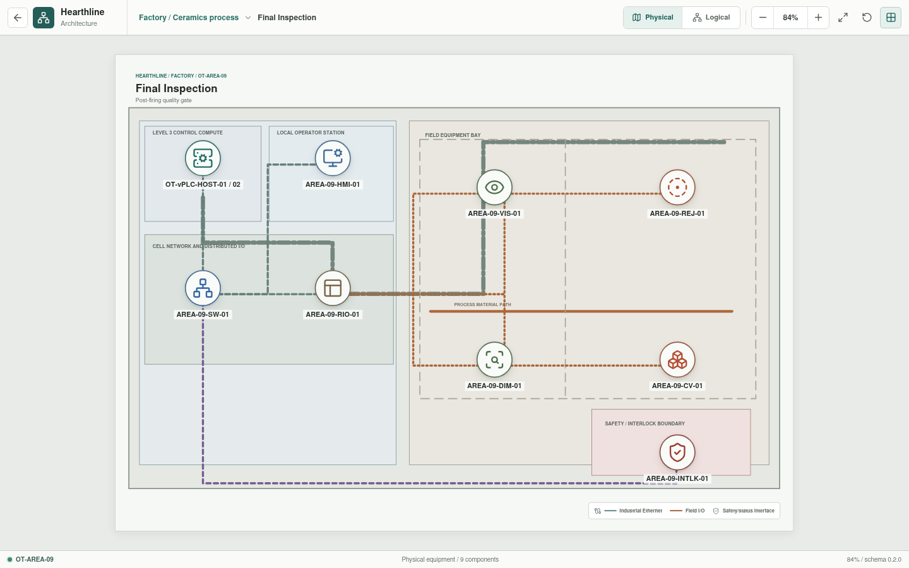
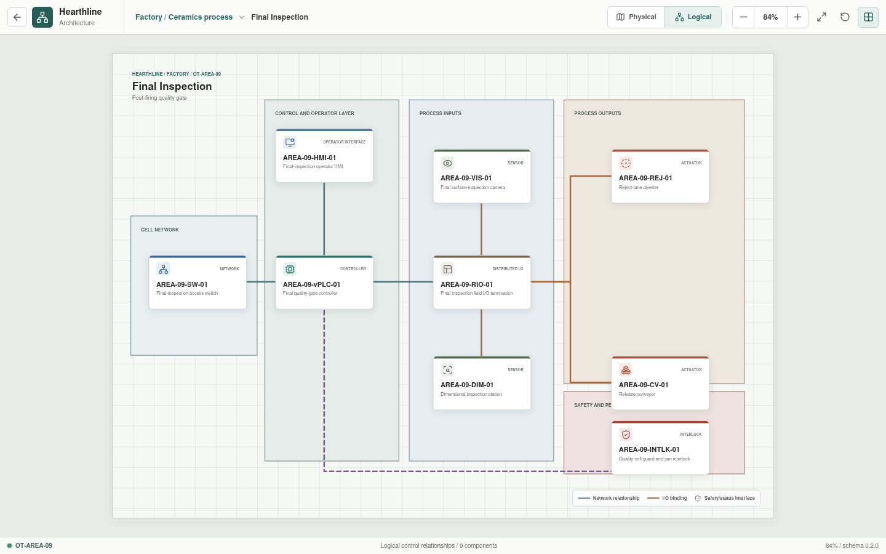

# Final Inspection

**Zone:** `OT-AREA-09`  
**Route:** `factory/process/final-inspection`

Final Inspection is the post-Kiln-2 quality gate before release to Logistics.

## Current Representation

The architecture view renders the representative assets below from bootstrap
JSON. `AREA-09-HMI-01` is enterable as a Rust-backed operator session assembled
from the area appliance YAML. It displays configured vision and dimensional
states, requires a healthy interlock reset, and exposes stopped, pass, and
reject diverter states plus conveyor control. Accepted commands traverse the
HMI, vPLC, remote I/O, and selected field actuator.

This is a deterministic operator-command baseline. Image analysis, dimensional
measurement, disposition logic, traceability, and Structured Text execution
remain pending.

| Function | Representative component |
| --- | --- |
| Cell network | `AREA-09-SW-01` |
| Control workload | `AREA-09-vPLC-01` on `OT-vPLC-HOST-01/02` |
| Local operation | `AREA-09-HMI-01` |
| Distributed I/O | `AREA-09-RIO-01` |
| Sensors | `AREA-09-VIS-01`, `AREA-09-DIM-01` |
| Actuators | `AREA-09-REJ-01`, `AREA-09-CV-01` |
| Interlock | `AREA-09-INTLK-01` |

## Planned Work

Simulation will model surface and dimensional results, quality disposition,
reject routing, release to Logistics, traceability, and jam or guard
conditions. Per-appliance YAML is implemented; resolved I/O bindings and
inspection behavior remain pending.
