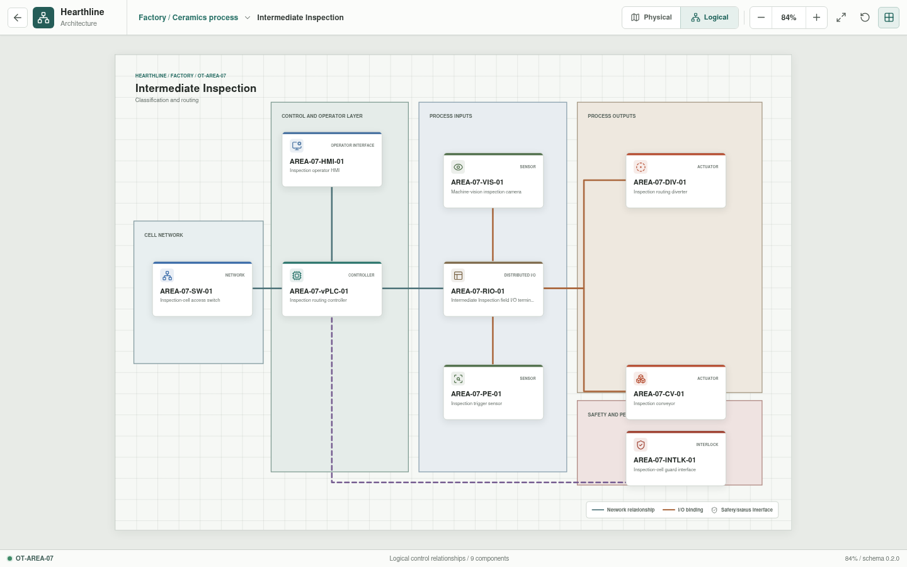
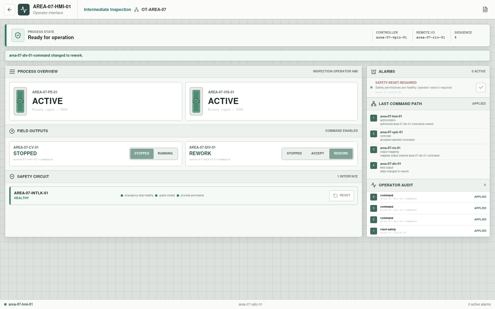

# Intermediate Inspection

**Zone:** `OT-AREA-07`  
**Route:** `factory/process/intermediate-inspection`

Intermediate Inspection classifies defects and routes material before the
second firing.

## Current Representation

The architecture view renders the representative assets below from bootstrap
JSON. `AREA-07-HMI-01` is enterable as a Rust-backed operator session assembled
from the area appliance YAML. It displays configured vision and presence
states, requires a healthy interlock reset, and exposes stopped, accept, and
rework diverter states plus conveyor control. Accepted commands traverse the
HMI, vPLC, remote I/O, and selected field actuator.

This is a deterministic operator-command baseline. Image analysis, automatic
classification, traceability, routing logic, and Structured Text execution
remain pending.

| Function | Representative component |
| --- | --- |
| Cell network | `AREA-07-SW-01` |
| Control workload | `AREA-07-vPLC-01` on `OT-vPLC-HOST-01/02` |
| Local operation | `AREA-07-HMI-01` |
| Distributed I/O | `AREA-07-RIO-01` |
| Sensors | `AREA-07-VIS-01`, `AREA-07-PE-01` |
| Actuators | `AREA-07-DIV-01`, `AREA-07-CV-01` |
| Safety interface | `AREA-07-INTLK-01` |

## Planned Work

Simulation will model inspection triggers, representative classifications,
traceability, conveyor state, routing decisions, and guard conditions.
Per-appliance YAML is implemented; resolved I/O bindings and inspection
behavior remain pending.
