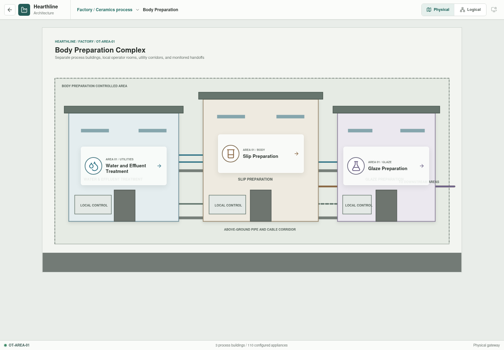
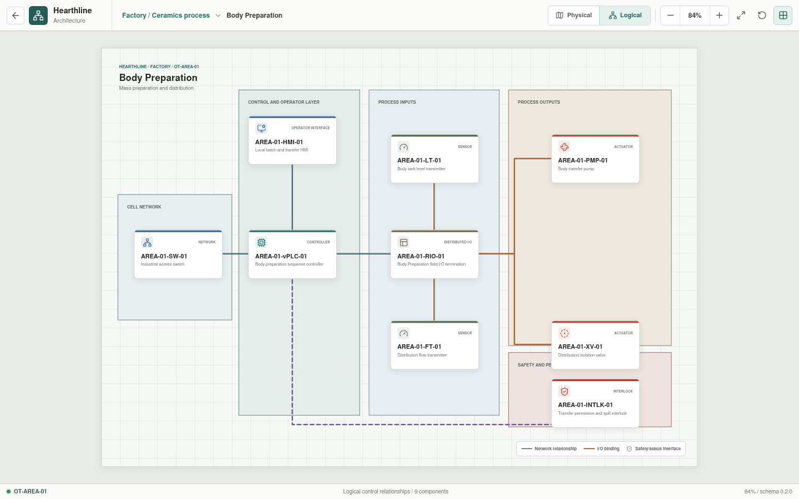
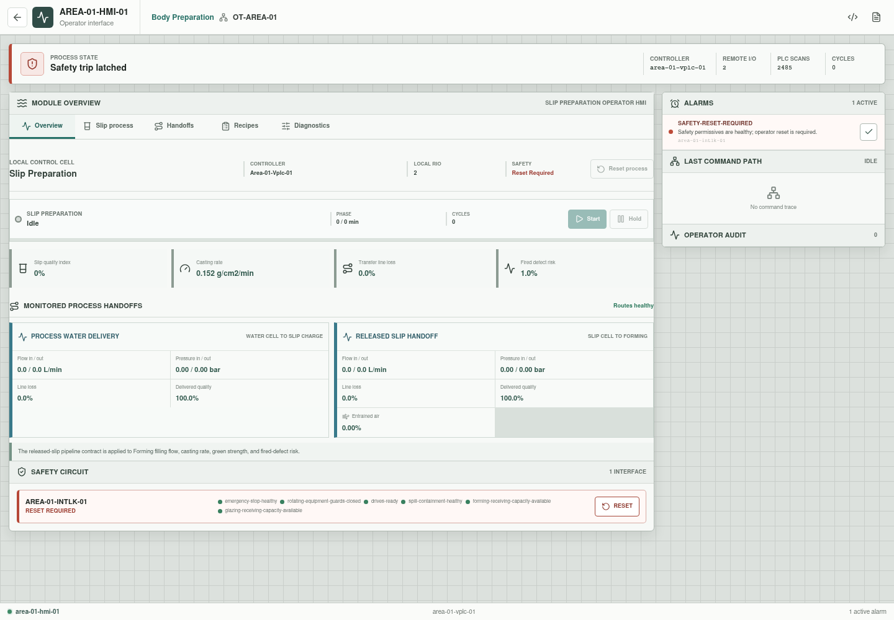

# Body Preparation

**Zone:** `OT-AREA-01`  
**Route:** `factory/process/body-preparation`

Body Preparation covers raw-material storage, batching, mixing, conditioning,
and transfer of prepared ceramic slip to Forming. By the Forming boundary the
material is a thick liquid, not dry powder. The receiving Forming tank uses an
initial simulator reference of approximately 40 degrees Celsius.

## Current Representation

The architecture view renders the representative assets below from bootstrap
JSON. `AREA-01-HMI-01` is also enterable as a Rust-backed operator
session. Its profile and state are assembled from the area appliance YAML:

- `AREA-01-FT-01` and `AREA-01-LT-01` provide configured initial samples.
- `AREA-01-INTLK-01` starts latched, validates three configured permissives,
  and requires an authorized operator reset.
- Pump and valve commands traverse `AREA-01-HMI-01`,
  `AREA-01-vPLC-01`, `AREA-01-RIO-01`, and the selected field actuator.
- Alarm acknowledgement, command audit, and the last component trace persist
  in the local API session.

This is an operator-command baseline, not a running body-preparation process.
No Structured Text program, changing inventory, transfer dynamics, or automatic
sequence executes yet.

| Function | Representative component |
| --- | --- |
| Cell network | `AREA-01-SW-01` |
| Control workload | `AREA-01-vPLC-01` on `OT-vPLC-HOST-01/02` |
| Local operation | `AREA-01-HMI-01` |
| Distributed I/O | `AREA-01-RIO-01` |
| Sensors | `AREA-01-LT-01`, `AREA-01-FT-01` |
| Actuators | `AREA-01-PMP-01`, `AREA-01-XV-01` |
| Permissive | `AREA-01-INTLK-01` |

## Planned Work

Simulation will add material inventory, slip-property state, transfer flow,
automatic pump and valve sequencing, and spill or invalid-transfer conditions.
It will also define the handoff to the Forming supply tank without making the
two areas one control zone. Explicit I/O-binding files, Structured Text
parsing, controller task execution, and Body Preparation dynamics remain
pending.
