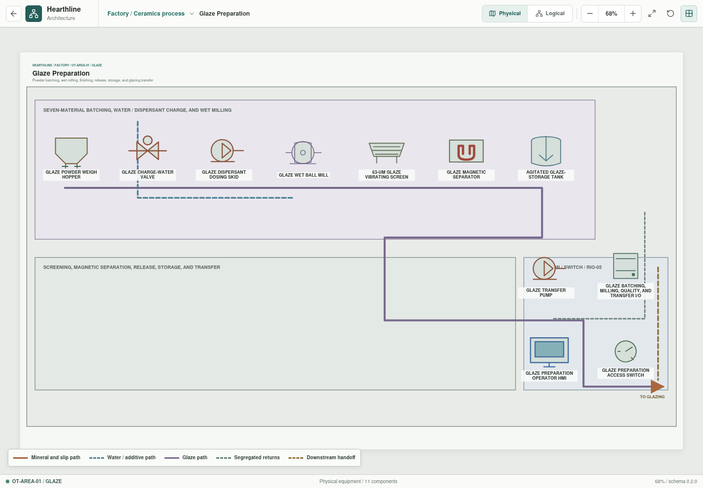
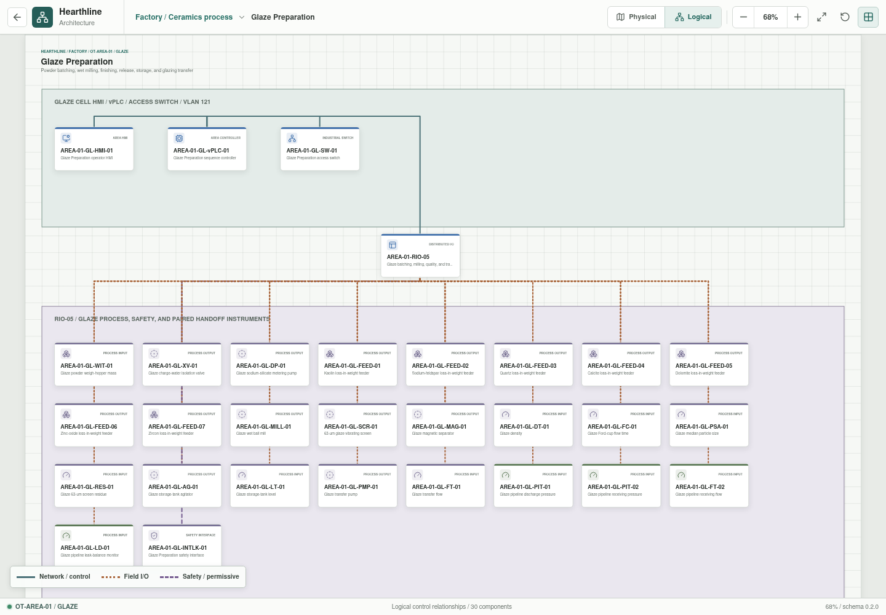

# Glaze Preparation

- **Zone:** `OT-AREA-01 / GLAZE`
- **Route:** `factory/process/body-preparation/glaze`
- **Runtime train:** `glaze`
- **Implementation status:** Executable development model

Glaze Preparation converts seven weighed dry materials, process water, and
dispersant into a screened, magnetically finished, quality-released liquid
glaze. The physical view follows batching, wet milling, finishing, agitated
storage, and transfer. The logical view exposes all 26 field channels owned by
RIO-05 beneath the local Glaze HMI, vPLC, and VLAN 121 access switch.

## Public Reference Batch

| Addition | Setpoint | Dry fraction |
| --- | ---: | ---: |
| Kaolin | `30.00 kg` | 6.00% |
| Sodium feldspar | `170.00 kg` | 34.00% |
| Quartz | `130.00 kg` | 26.00% |
| Calcite | `50.00 kg` | 10.00% |
| Dolomite | `35.00 kg` | 7.00% |
| Zinc oxide | `6.25 kg` | 1.25% |
| Zircon | `78.75 kg` | 15.75% |
| Process water | `250.00 kg` | 50% of dry charge |
| Sodium silicate | `2.50 kg` | 0.5% of dry charge |

The modeled batch contains `500 kg` dry material and `752.5 kg` total mass,
or approximately `66.4%` dry solids.

## Process Sequence

1. Reserve acceptable process water, with no more than `40%` supplied from the
   segregated glaze-return tank.
2. Charge water, weigh the seven powders, and dose sodium silicate.
3. Wet-mill for `180 min`.
4. Screen at `63 um` and apply magnetic separation.
5. Adjust density and Ford-cup flow time, then perform quality release.
6. Hold under agitation and transfer to Color and Glaze.

Release requires density `1.70-1.72 kg/L`, Ford-cup flow time `20-30 s`,
`63 um` residue no greater than `2%`, turbidity no greater than `3 NTU`, and
conductivity no greater than `500 uS/cm`.

## Control And Protection

`AREA-01-RIO-05` owns powder feeders, charge-water and dispersant dosing,
mill, screen, magnetic separator, quality instruments, agitated storage, and
transfer instrumentation, plus local safety and paired pressure/flow leak
monitoring at the glazing handoff. Deterministic disturbances cover mill
overload, out-of-range density/flow/residue, and handoff leakage. The first
trips the train, the second denies quality release, and the last raises a
delivery warning with visible pressure, balance, and quality effects.

## Model Boundary

The batch and sequence follow a [published sanitaryware glaze formulation and
preparation method](https://doi.org/10.2298/SOS2102209B): a `1:1:0.5`
raw-material to milling-ball to water ratio, `0.5%` sodium silicate, `3 h` wet
milling, a `63 um` screen, `20-30 s` flow time at `20 deg C`, and density of
`1.70-1.72 g/cm3`.

The implementation does not model detailed grinding distributions, mill-media
wear, slip chemistry, glaze color, application behavior, firing response, or
laboratory uncertainty. The values are a reproducible development baseline,
not a production formulation or acceptance specification.
