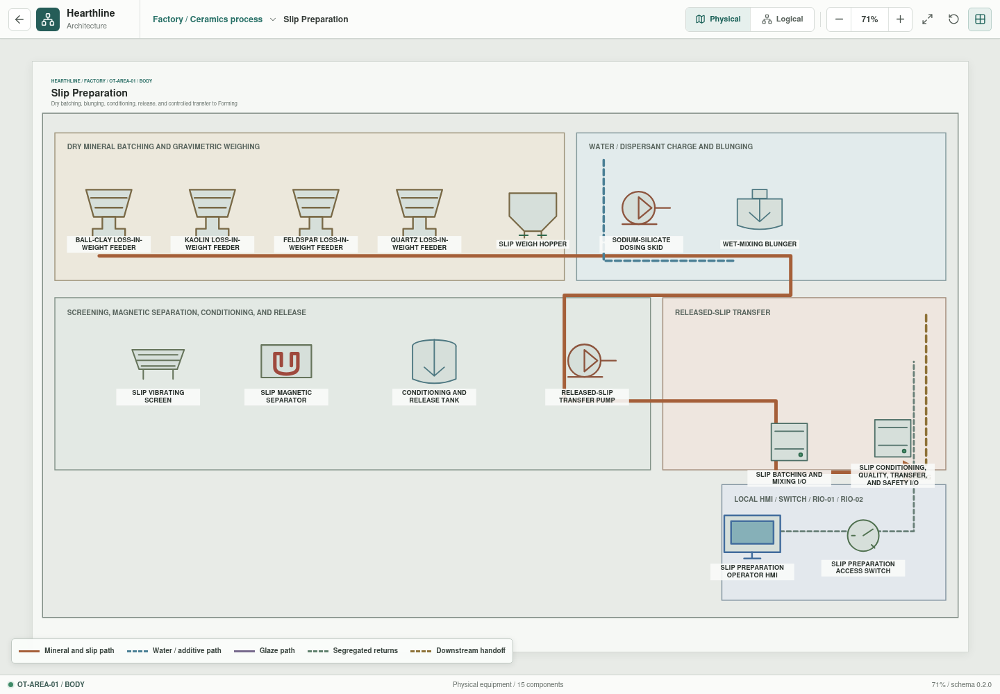
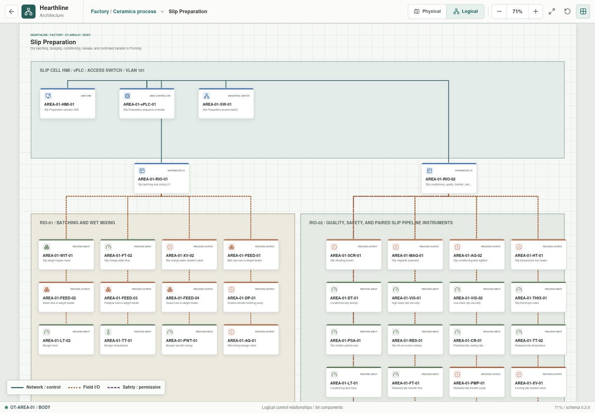

# Slip Preparation

- **Zone:** `OT-AREA-01 / BODY`
- **Route:** `factory/process/body-preparation/slip`
- **Runtime train:** `slip`
- **Implementation status:** Executable development model

Slip Preparation converts weighed dry minerals, process water, and dispersant
into a conditioned and quality-released ceramic slip for Forming. The physical
view separates dry batching, wet mixing, finishing, transfer, and local I/O.
The logical view shows the local Slip HMI, vPLC, VLAN 101 access switch,
RIO-01, RIO-02, and the monitored handoff pipeline to Forming.

## Public Reference Batch

The dry body uses a published `50%` clay, `25%` feldspar, and `25%` quartz
sanitaryware baseline. Hearthline transparently divides the clay fraction into
`35%` ball clay and `15%` kaolin. The liquid recipe scales a published
laboratory slip prepared from `3,000 g` dry material, `1,000 mL` water, and
`6 mL` sodium silicate.

| Addition | Setpoint | Dry-basis role |
| --- | ---: | --- |
| Ball clay | `350.0 kg` | 35% plastic clay fraction |
| Kaolin | `150.0 kg` | 15% kaolinitic fraction |
| Sodium feldspar | `250.0 kg` | 25% flux fraction |
| Quartz | `250.0 kg` | 25% silica fraction |
| Process water | `333.3 kg` | Treated/recovered blend reserved at batch start |
| Sodium silicate | `2.0 kg` | 0.2% of dry mineral charge |

The reference batch contains `1,000 kg` dry mineral and `1,335.3 kg` total
mass, or approximately `74.9%` mineral solids. The dispersant demand is a
scaled public-reference value, not a universal production setting.

## Process Sequence

1. Reserve acceptable process water, with no more than `35%` supplied from the
   body-return reuse tank.
2. Charge water and sodium silicate.
3. Weigh ball clay, kaolin, feldspar, and quartz independently.
4. Wet-mix for `90 min` to a modeled `3.75 kWh/t` specific-energy endpoint.
5. Screen at `125 um` and apply magnetic separation.
6. Condition under agitation for `8 h`.
7. Evaluate density, high- and low-shear viscosity, thixotropy, `44 um`
   residue, particle size, casting rate, and water quality.
8. Trim to `40 deg C` and transfer the released batch to Forming.

Release requires density `1.78-1.84 kg/L`, high-shear viscosity
`400-850 mPa s`, thixotropic index `4.0-7.5`, `44 um` residue `7-11%`,
turbidity no greater than `2 NTU`, conductivity no greater than `350 uS/cm`,
hardness no greater than `80 mg/L as CaCO3`, and glaze contamination no greater
than `0.05%`.

The released material contract carries the measured properties plus modeled
filling flow, casting rate, green moisture, drying shrinkage, drying energy,
green strength, and fired-defect risk. Forming consumes these values. Drying
and kiln areas do not yet execute the contract, so their values remain bounded
predictions rather than downstream plant state.

## Control And Protection

`AREA-01-RIO-01` owns 12 batching and wet-mixing channels.
`AREA-01-RIO-02` owns 22 finishing, laboratory-quality, transfer, safety, and
pipeline-monitoring channels. The transfer line adds discharge and receiving
pressure, receiving flow, ultrasonic entrained-air, and derived leak-balance
measurements. The validated Structured Text sequence and explicit YAML binding
currently cover this train.

Deterministic disturbances cover ingredient shortage, mixer overload, blocked
screen, out-of-range quality, transfer no-flow, and slip-pipeline leakage. The
pipeline disturbance can release a degraded batch rather than silently
converting every abnormal delivery into a process trip; its warning and
material effects remain visible to the Slip HMI and Forming model.

## Model Boundary

The implementation uses bounded interpolation and compact empirical
relationships. It does not model full particle-size distributions, detailed
non-Newtonian rheology, raw-material variability, laboratory uncertainty, or
industrial scale-up. Reference values come from
[public body](https://doi.org/10.1016/j.ceramint.2013.11.139) and
[slip](https://doi.org/10.1590/0366-69132019653752687) studies and remain
development inputs rather than a production formula.
