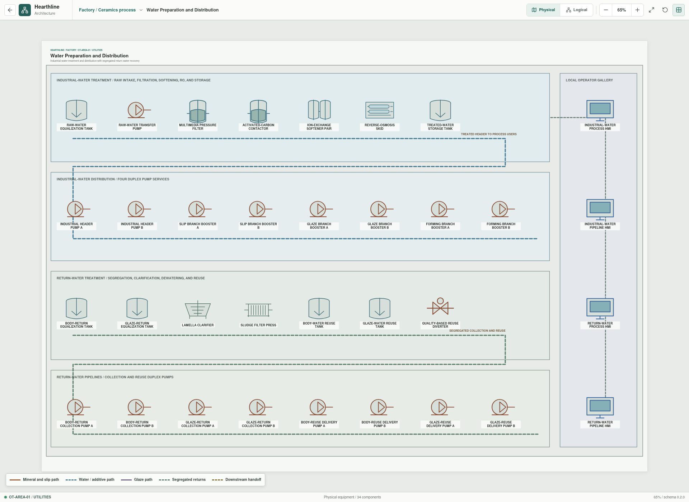
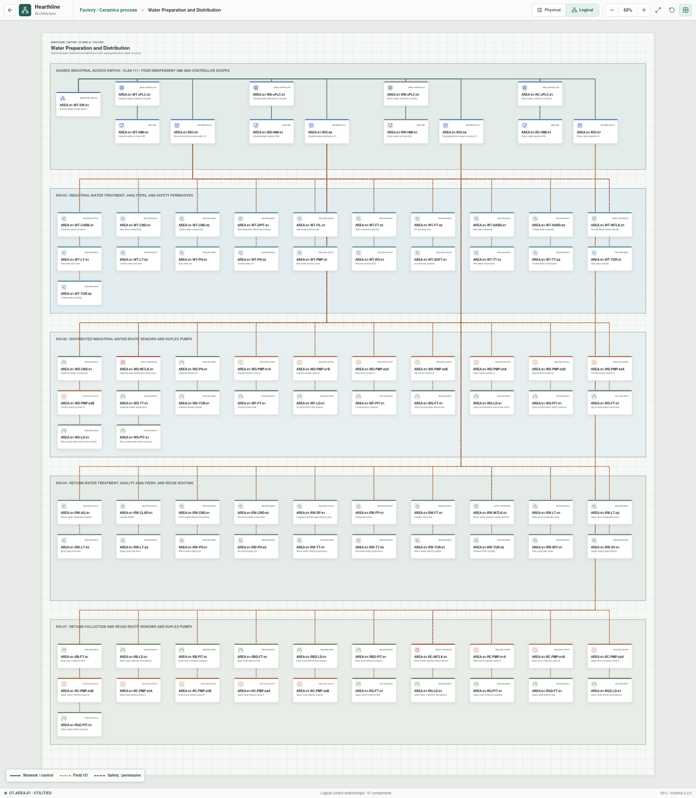

# Water Preparation And Distribution

- **Zone:** `OT-AREA-01 / UTILITIES`
- **Route:** `factory/process/body-preparation/water`
- **Runtime trains:** `water`, `return-water`
- **Topology:** `97` appliances and `102` connected relationships
- **Implementation status:** Executable development model with provisional configuration

The utilities building models industrial-water treatment and delivery together
with segregated body- and glaze-return recovery. The physical view is limited
to machinery, duplex pump groups, four local operator stations, and the visible
water routes. The logical view exposes all `97` configured control, field,
instrumentation, pumping, and safety endpoints.

## Operator Interfaces

The four HMIs have separate command authority. They share VLAN `111` and one
industrial access switch, but each HMI communicates with its own virtual
controller and remote-I/O station.

| HMI | Controller | Remote I/O | Responsibility | Field endpoints |
| --- | --- | --- | --- | ---: |
| [`AREA-01-WT-HMI-01`](industrial-process-hmi-screenshot.png) | `AREA-01-WT-vPLC-01` | `AREA-01-RIO-03` | Industrial-water treatment and direct analyzer readings | 21 |
| [`AREA-01-WD-HMI-01`](industrial-pipeline-hmi-screenshot.png) | `AREA-01-WD-vPLC-01` | `AREA-01-RIO-06` | Industrial-water routes, duplex pumps, and heartbeat supervision | 22 |
| [`AREA-01-RW-HMI-01`](return-process-hmi-screenshot.png) | `AREA-01-RW-vPLC-01` | `AREA-01-RIO-04` | Return-water treatment, segregation, and quality routing | 20 |
| [`AREA-01-RC-HMI-01`](return-pipeline-hmi-screenshot.png) | `AREA-01-RC-vPLC-01` | `AREA-01-RIO-07` | Return collection/reuse routes, duplex pumps, and heartbeat supervision | 21 |

Process HMIs expose treatment state and measured values. Pipeline HMIs expose
route hydraulics, pump feedback, heartbeat age, failover state, and maintenance
status. A pipeline HMI cannot start or hold a treatment train, and a process
HMI cannot inject a pump failure or dispatch pipeline maintenance.

## Industrial-Water Process

The reference train processes a `2,000 L` batch through raw-water intake,
equalization, multimedia filtration, activated carbon, ion-exchange softening,
a modeled `75%` reverse-osmosis recovery/blend, quality release, and treated
storage.

The HMI reports direct raw and treated measurements rather than a narrative
claim about what a composition will do:

| Measurement | Raw baseline | Treated baseline |
| --- | ---: | ---: |
| Temperature | `24.0 degC` | `25.0 degC` |
| pH | `7.40` | `7.00` |
| Turbidity | `8.0 NTU` | `0.25 NTU` |
| Specific conductance | `650 uS/cm` | `80 uS/cm` |
| Hardness | `220 mg/L as CaCO3` | `8 mg/L as CaCO3` |
| Suspended solids | `18 mg/L` | `0.5 mg/L` |

These are transparent development baselines, not commissioning targets or
universal process-water limits. A cycle is denied when raw inventory cannot
supply the complete batch or treated storage cannot accept the recovered
volume.

## Industrial-Water Distribution

Four routes represent the treated-water header and its Slip Preparation,
Glaze Preparation, and Forming branches. Distributed pressure, flow, balance,
temperature, pH, conductivity, and turbidity values expose the state available
to an operator at each modeled monitoring point. Branch loss changes pressure
and outlet flow; no text-only quality conclusion replaces the measurements.

The distribution system uses four duplex pump groups:

| Pump group | Service | Normal duty strategy |
| --- | --- | --- |
| `industrial-header` | Treated tank to factory ring main | Pump A preferred, pump B standby |
| `industrial-slip` | Ring main to Slip Preparation | Pump A preferred, pump B standby |
| `industrial-glaze` | Ring main to Glaze Preparation | Pump A preferred, pump B standby |
| `industrial-forming` | Ring main to Forming service water | Pump A preferred, pump B standby |

## Return-Water Recovery

A `600 L` cycle selects an available body or glaze stream and executes
equalization, coagulation/flocculation, lamella clarification, filter-press
dewatering, polishing filtration, and quality routing. The model recovers
`88%`, or `528 L`, and accumulates a derived sludge-cake mass.

Body and glaze returns remain segregated through collection, treatment,
storage, and reuse. Return-process instruments report influent and effluent
temperature, pH, conductivity, and turbidity, plus stream-specific direct
measurements for the body- and glaze-reuse tanks. Glaze return is never routed
to the body blend.

## Return-Water Pipelines

Four additional monitored routes represent body collection, glaze collection,
body-water reuse delivery, and glaze-water reuse delivery. Each route has
pressure, inlet/outlet flow, and derived loss monitoring and uses a dedicated
duplex pump group. Collection and reuse remain separate so a route fault does
not silently merge the two material streams.

## Heartbeat And Maintenance

All `16` distribution pumps publish a simulated heartbeat every `500 ms`. A
heartbeat is stale after `1,500 ms`. When the duty pump becomes stale, Rust:

1. Stops command and running feedback for the unavailable pump.
2. Marks maintenance as required and raises a scoped warning alarm.
3. Starts the healthy standby pump when that route is demanded.
4. Allows the owning pipeline HMI to dispatch maintenance.
5. Retains the dispatched state until the simulated failure is cleared.

Heartbeat loss does not represent a complete pump condition-monitoring model.
Motor current, winding temperature, bearing vibration, seal leakage, runtime
hours, and work-order integration remain planned.

## Engineering Basis

The distributed online-monitoring approach follows the US EPA guidance for
real-time water-quality instruments, monitoring stations, and parameters such
as pH, specific conductance, temperature, and turbidity
([OWQM resources](https://www.epa.gov/waterresilience/online-water-quality-monitoring-resources),
[design guidance](https://www.epa.gov/sites/default/files/2018-05/documents/owqm-ds_guidance_042018.pdf)).
The actionable pump warning and maintenance handoff are aligned conceptually
with the alarm lifecycle described by the
[ISA-18 series](https://www.isa.org/standards-and-publications/isa-standards/isa-18-series-of-standards).

Return-stream separation and same-process reuse are informed by the
[European Commission ceramic-manufacturing BREF](https://bureau-industrial-transformation.jrc.ec.europa.eu/sites/default/files/2019-11/cer_bref_0807.pdf).
Hearthline does not treat public ranges as permit limits or site targets.

## Model Boundary

The current model does not represent chemical equilibria, instrument
calibration, membrane fouling, filter loading, settling kinetics, filter-cake
resistance, pipe volume, hydraulic transients, full factory water balance, or
environmental discharge compliance. Pumps and route instruments are bounded
deterministic simulations, not equipment-sizing calculations.

Architecture values and YAML configurations remain provisional while work is
focused on executable behavior. Treatment selection, alarm limits, pump duty,
pipe sizing, and maintenance procedures require site demand, water analysis,
regulation, and qualified engineering.

## Planned Work

1. Add finite pipe volume, transit delay, demand, receiving capacity, and
   isolation/recovery behavior.
2. Add pump current, vibration, temperature, runtime-hour, and maintenance
   history signals without converting the HMI into a maintenance system.
3. Add analyzer calibration state, signal quality, stale-value handling, and
   monitoring-station availability.
4. Add explicit water and return-water controller-source definitions after a
   formal controller-language compatibility target is selected.
5. Refine treatment, water balance, and reuse scenarios from further public
   engineering references.
