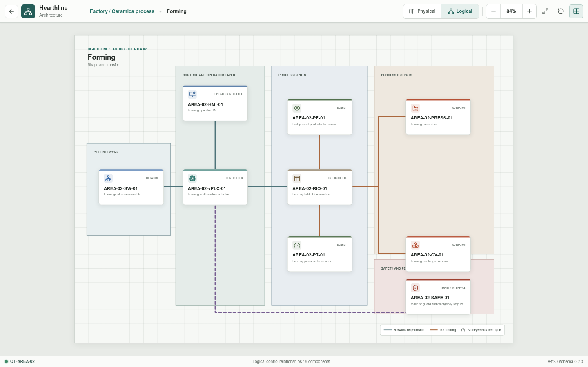
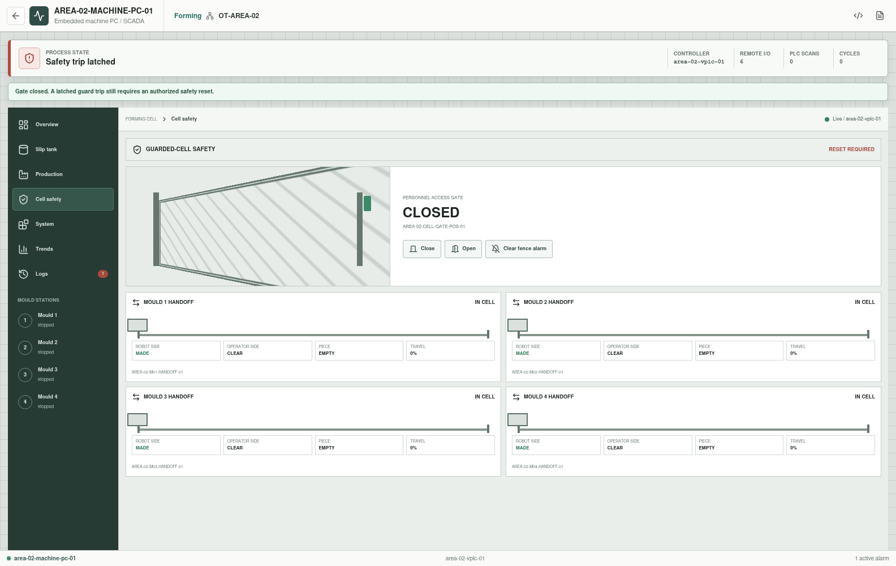
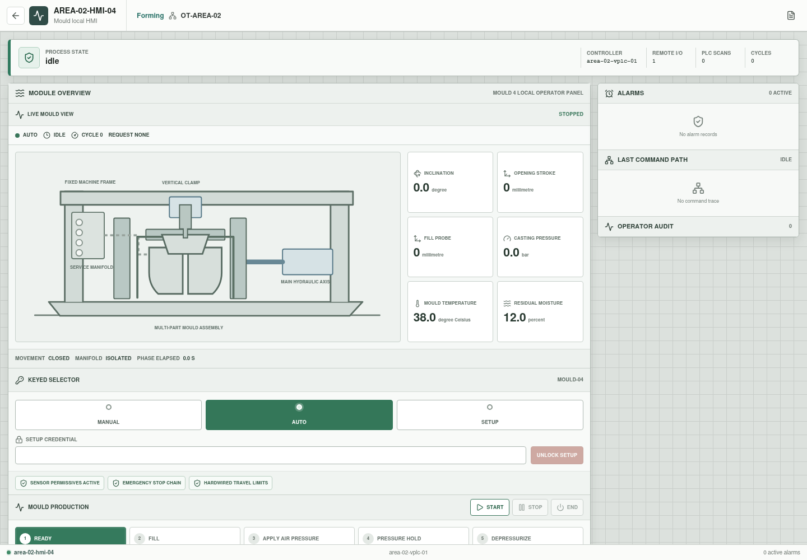
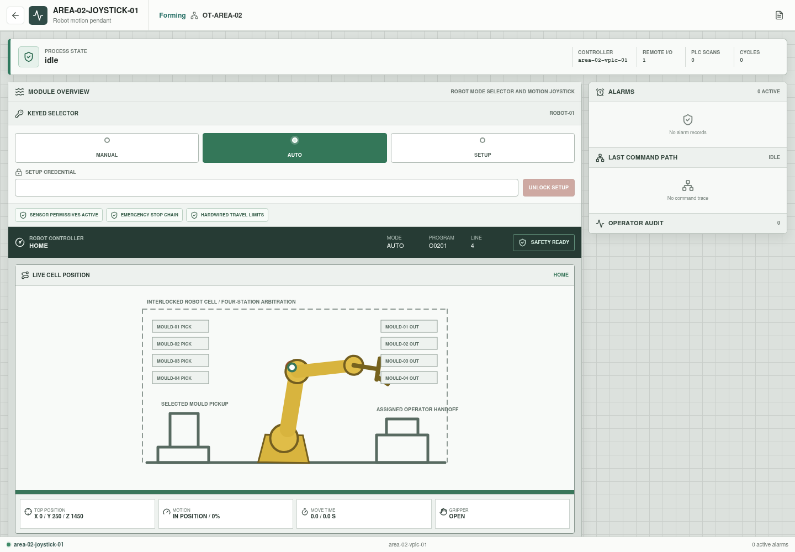
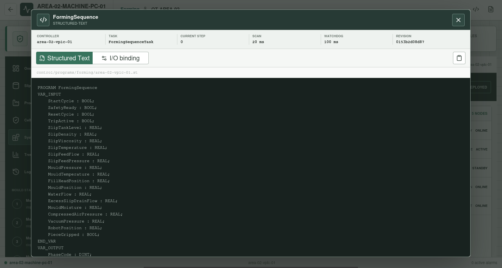

# Forming

**Zone:** `OT-AREA-02`  
**Route:** `factory/process/forming`




Forming represents a four-mould ceramic-slip pressure-casting machine. Prepared
slip arrives from Body Preparation as a thick liquid and is held in a local,
recirculating buffer at a development reference temperature of approximately
40 degrees Celsius. The model separates machine supervision, local mould
operation, robot operation, controller execution, remote I/O, field equipment,
and hardwired safety status.

The architecture is vendor-neutral and provisional. Equipment capacities,
setpoints, timings, recipes, credentials, and interlocks are development data,
not a production machine specification.

## Current Representation

The view derives 84 components from canonical appliance YAML. The physical
view deliberately shows only the 21 machine-floor items visible from above:
four mould assemblies with embedded utility sections, four local HMIs, four
external control cabinets, four fence-crossing handoff stations, the robot,
robot controller, robot pendant, machine PC, and interlocked access gate. The
logical view retains all configured controllers, network nodes, remote I/O,
sensors, actuators, and safety relationships:

The four mould-control cabinets occupy the service side outside the fence. The
robot controller is installed in the operator-side control area with the
machine PC and pendant; it is not part of the mould-cabinet row.

All 21 physical markers are selectable and open their YAML-derived component
inspector. The status-bar inventory is currently informational. A
viewport-fixed legend keeps transfer, guard, utility, and gate-movement line
patterns readable when the architecture canvas is zoomed out; the logical
legend separately identifies network/control, I/O, and safety/status paths.

- One vPLC workload, one industrial switch, one machine-integrated PC, one
  standby supervisory/historian node, one shared process remote-I/O station,
  and one dedicated guarded-cell remote-I/O station.
- Four equal mould stations, each with a local HMI, local remote I/O, six
  process inputs, a movement output, a service manifold, and a safety
  interface.
- A shared slip and utility subsystem with material, flow, pressure,
  temperature, viscosity, water, air, and vacuum roles.
- A robotic pickup cell with a dedicated motion controller, six-axis
  manipulator, independent pendant, four mould-specific pickup definitions,
  four transfer stations with inner and operator-side position feedback, an
  interlocked personnel gate, and separate robot and guard safety interfaces.

Each mould exposes casting pressure, mould temperature, fill-head position,
mould position, residual moisture, and inclination. Rust updates these values
from that mould's current process phase. Its valve manifold is logically
addressable but physically represented inside the mould assembly, not as a
standalone floor cabinet. The physical and logical views remain architecture
models; dimensions and placement are illustrative.

## Control Authority

| Interface | Scope | Command authority |
| --- | --- | --- |
| `AREA-02-MACHINE-PC-01` | Object-based cell supervision, live Mould 1-4 views, slip-tank view, production summary, guarded-cell and transfer status, quality-aware tag trends, alarms/events, deployment nodes, role identity, 28 mould-scoped parameters, three development recipe identities, and controller-source inspection | Shared supply commands, guarded-cell gate commands, safety reset, and mould valve service when the owning local selector is in manual; no mould production-start or robot-motion authority |
| `AREA-02-HMI-01` | Mould 1 live machine view, six local values, selector, production controls, movement, and local safety state | Mould 1 Start, Stop, End, and retained movement in manual or authenticated setup |
| `AREA-02-HMI-02` | Mould 2 equivalent scope | Mould 2 production and movement only |
| `AREA-02-HMI-03` | Mould 3 equivalent scope | Mould 3 production and movement only |
| `AREA-02-HMI-04` | Mould 4 equivalent scope | Mould 4 production and movement only |
| `AREA-02-JOYSTICK-01` | Live cell view, TCP and joint values, motion progress, sequence commands, Cartesian/joint jog, coordinate targets, taught positions, `.g` source, executing line, selector, and robot safety | Motion-enable-gated movement in manual; teaching, source loading, run, pause, reset, and single-line execution in authenticated setup |

The machine PC hosts the supervisory application; it is not a second PLC and
does not replace either local mould authority or the robot pendant. The vPLC
executes the configured control sequence. All six operator interfaces observe
one Rust-backed cell session, while each mould owns an independent sequence
runtime and process state.

The PC opens on an asset overview. Selecting a mould, slip tank, production,
trends, or logs shows only that object's relevant data. Each mould page and
local HMI uses the same live equipment model at the appropriate scope.







## Mould Production Controls

Production is commanded at the owning mould HMI while its selector is in
`auto`:

| Control | Implemented behavior |
| --- | --- |
| `Start` | Enables production. A completed cycle automatically starts the next cycle until Stop or End is requested. If the mould is paused at a phase boundary, Start resumes from that boundary. |
| `Stop` | Disables repeat production, finishes the current phase, then pauses before executing the next phase. |
| `End` | Disables repeat production, completes the current full cycle, and stops at idle. If requested while paused, the mould resumes only to finish that cycle. |

The machine PC cannot submit these actions. Starting one mould does not start
or advance the other three, and different moulds may occupy different phases.

## Selector And Safety Boundary

Each mould HMI and the robot pendant models a three-position keyed selector:

| Position | Modeled behavior |
| --- | --- |
| `manual` | Enables the station's declared local commands. A mould in manual also authorizes its PC valve-service faceplate. The robot pendant additionally requires its motion-enable control before a jog, sequence command, taught-position move, or coordinate target is accepted. |
| `auto` | Enables the local mould production controls or returns robot motion to automatic cell authority. Manual output commands are inhibited. |
| `setup` | Requires the configured maintenance credential and bypasses declared process-sensor permissives for setup movement. On the robot pendant this is also the programming and teaching mode. |

Manual and setup output selections are retained until the operator selects the
active state again, selects another state, or the controller applies an
automatic/safe state. Setup never bypasses the emergency-stop chain or
hardwired travel limits. A mould automatic start evaluates both its own safety
interface and the shared robot-cell safety interface, while each HMI can reset
only safety objects in its configured authority scope. Recovery is evaluated
per mould: a healthy mould may return to idle while another mould's local
safety interface remains tripped.

The fenced cell has one monitored personnel gate. Opening it while the cell is
idle removes the shared motion permissive. Opening it during mould, robot, or
transfer motion stops those movements and latches a guard trip. A new motion
request from an authorized station while the gate is open is denied and also
latches the trip; unauthorized requests are rejected before they can change
guard state. Closing the gate restores the physical condition but does not
clear a latched trip. The explicit `Clear fence alarm` control is enabled, and
the Rust reset is accepted, only after the gate is closed. This modeled
sequence prevents a gate close from silently restarting hazardous movement.

Each mould has one transfer station that crosses the fence boundary. The robot
places the piece on the in-cell side, after which Rust advances that station to
the operator side and exposes travel progress plus both end-position sensors.
The mould sequence does not enter post-handoff cleaning until its station has
reached the operator side. The station subsequently returns to the cell side
for the next cycle. If a gate trip interrupts transfer travel, reset preserves
the piece, travel progress, and interrupted direction instead of silently
discarding material or restarting the station from an endpoint.

This is a control-authority simulation, not a functional-safety implementation
or evidence of a validated safety integrity level.

## Robot Motion And Program

The robot-controller YAML owns its Cartesian and joint workspace, maximum
speeds, default speed override, home pose, frames, tool, payload, 17 physical
reference positions, four mould-to-routine assignments, pickup/handoff
tolerances, and program reference. The
manipulator is a separate actuator reached through the modeled motion bus.
Rust rejects non-finite values, invalid ranges, unresolved references,
out-of-workspace
targets, concurrent manual moves, and motion without the configured pendant
authority. Accepted movements interpolate pose, displayed joint state, elapsed
time, and completion percentage on the API clock.

The pendant has Status, Jog, and Program workspaces. Manual mode supports
configured sequence states, world-coordinate and joint jog, direct Cartesian
targets, and moves to taught positions. Authenticated setup additionally stores
the current pose as a session-scoped taught position and can parse, load, run,
pause, reset, or execute one line of a bounded `.g` source. The active source
line and parsed operation are returned by Rust and highlighted in Svelte.
Releasing pendant motion enable stops active manual movement and pauses a
running manual program, so a later simulation tick cannot reissue the active
instruction without a new operator run command.

The default
[robot motion source](../../../../../control/programs/forming/area-02-robot-01.g)
is authoritative for automatic robot motion and gripper sequencing. It defines
complete routines `O0201` through `O0204`, one for each mould and its separate
operator handoff. The runtime selects the routine assigned by YAML, executes
its commanded coordinates, and validates the pose reached when the gripper
closes at pickup and opens at handoff. A coordinate error outside the configured
translation or orientation tolerance stops robot motion, faults the cell, and
raises a named trip alarm rather than silently using the YAML reference pose.

The source uses the implemented development subset: `G0`/`G1` motion, `G4` dwell,
`G28` home, `G90`/`G91` positioning, `M64`/`M65` gripper state, and `M30`
termination. This is not a general CNC interpreter or a vendor robot language.
Loaded source and taught-position changes are volatile session state; YAML and
the referenced file remain canonical.

## Parameters, Recipes, And Control Source

The PC exposes seven separately named values per mould: fill duration, casting
pressure, pressure hold, slip drain, robot-pickup delay, mould wash, and vacuum
drying. Three development recipe identities are also present.

The values are range-checked and bound to the selected mould runtime while the
cell is stopped. Fill, pressure hold, drain, release-air-to-pickup delay, wash,
and vacuum values override the source timer baselines; casting pressure drives
the Rust pressure profile. The Structured Text remains the sequence source,
and the runtime records that these overrides are bound. Recipe identities are
still placeholders: selecting one does not yet deploy a parameter bundle or
modify controller source.

Only the authorized machine PC can open the exact validated Structured Text and
YAML I/O documents backing the running session. The viewer includes task,
watchdog, current step, paths, and combined source revision.



## Control And I/O Flow

```text
Process input -> owning mould RIO -> AREA-02-vPLC-01 -> PC and owning HMI

Mould Start/Stop/End -> owning HMI -> vPLC -> independent mould sequence
Local movement       -> keyed local selector -> vPLC -> mould RIO -> movement
Mould valve service  -> PC + local manual authorization -> vPLC -> mould RIO
Robot auto request   -> vPLC -> shared RIO -> robot controller FIFO -> manipulator
Robot manual/setup   -> pendant -> robot controller -> manipulator
Robot program        -> .g parser/runtime -> motion -> YAML geometry check
Gate + transfer I/O  -> guarded-cell RIO -> vPLC and safety projection
Piece handoff        -> robot -> mould transfer -> operator side -> return
```

`AREA-02-M01-RIO-01` through `AREA-02-M04-RIO-01` own equal mould-station
channels and one external control cabinet each. Every mould also owns an
embedded utility section with separately declared slip, air, water, vacuum,
and hydraulic circuits. `AREA-02-RIO-01` owns shared material supply, utility
headers, robot-cell requests, and robot-safety status.
`AREA-02-CELL-RIO-01` terminates the gate, guard-safety, and four transfer
stations with their inner and outer position sensors. Operator interfaces
submit only YAML-declared commands; they do not terminate field wiring or
drive outputs directly.

## Implemented Mould Cycle

Each mould executes an independent instance of the versioned
[Structured Text source](../../../../../control/programs/forming/area-02-vplc-01.st)
through the
[I/O binding](../../../../../control/bindings/forming/area-02-vplc-01.yaml)
on a 20-millisecond task:

1. Fill the closed mould with prepared ceramic slip.
2. Apply compressed-air casting pressure and hold it.
3. Remove pressure and drain excess slip.
4. Apply release water, followed by release air.
5. Open and incline the mould for pickup.
6. Request robot pickup and placement on the mould-specific transfer station.
7. Move the transfer station to the operator side and confirm its end sensor.
8. Wash the empty mould with water.
9. Purge the mould with compressed air.
10. Apply vacuum to reduce modeled residual moisture.
11. Close the mould and return to ready.

Cycle time depends on that mould's configured values and access to the shared
robot. All timer decisions remain quantized to the 20-millisecond PLC scan.
These accelerated values do not represent production cycle time.
Release water and release air assist demoulding before pickup; mould wash and
cleaning-air purge are separate post-handoff phases.

Independent mould timing, bounded robot interpolation, FIFO request
arbitration, exclusive active ownership, four handoff assignments, and
pickup/delivery completion gates are implemented. Collision avoidance,
production inverse kinematics, continuous path planning, payload dynamics, and
physical operator confirmation are not. The current queue, motion, and joint
display are deterministic development simplifications and must not be treated
as robot commissioning logic.

## Operations Telemetry

Rust samples the active Forming state once per simulated second. The telemetry
payload identifies the represented mould and carries its phase, cycle, process
values, shared utility values, and robot status. The vPLC sends the bounded
record through its virtual host and Level 3 core to
`ot-operations-services-01`. Accepted records are queued for policy-controlled
replication to `ot-dmz-hist-replica-01`.

The machine PC displays bounded local and replica stores, pending and loss
state, route traces, and the latest replicated payload. Publication sends only
the latest replica record through the governed inter-site path to
`operations-analytics-01`.

This volatile API-session state is not a production historian. It does not
provide durable persistence, industrial subscriptions, certificates, analytics
processing, or retention governance.

## Fault Coverage

The machine PC can inject five deterministic development disturbances:

- Slip-supply loss during filling.
- Compressed-air loss during pressure or air-use phases.
- Mould overpressure during pressurization or dwell.
- Vacuum loss during mould drying.
- Missing piece-gripped confirmation during robot pickup.

The robot runtime independently detects missing assigned routines, invalid
gripper order, motion failures, unresolved station geometry, and pickup or
handoff coordinate mismatch. These faults stop the active robot program and
surface through the pendant state and shared alarm list.

The guarded-cell runtime additionally detects motion requested with the gate
open and a gate opened during active mould, robot, or transfer movement. It
stops the affected state machines, records a named guard alarm, and requires a
closed-gate reset before motion can be permitted again.

The disturbance input is cell-wide, but only moulds currently in an applicable
phase trip. Mould overpressure latches the owning mould safety interface rather
than unrelated mould safety interfaces. Tests cover independent starts and
phase offsets, continuous production, Stop and End boundaries, retained manual
commands, robot interpolation and workspace rejection, pendant authority,
four-routine `.g` parsing and line execution, wrong-coordinate trips, setup
authentication, fault handling, guarded-cell inhibition and reset ordering,
scoped safety reset, telemetry, and source inspection.

## Engineering Basis

The generic equipment categories and interface patterns were informed by public
technical descriptions of multi-mould pressure-casting machines, industrial
supervisory systems, and robot teach pendants. Those descriptions are design
inputs only. They do not validate Hearthline's values, logic, safety behavior,
or suitability for a real machine.

## Simulation Boundary And Planned Work

The current model does not independently calculate rheology or filtration. It
consumes a released Body Preparation batch through bounded material-effect
relationships, but does not calculate wall thickness, deformation, rigid-body
robot dynamics, production inverse kinematics,
collision envelopes, drying physics, quality, wear, or functional safety. The
Structured Text grammar is a Hearthline sequence subset, and the robot `.g`
grammar is a bounded motion subset. Neither is a production controller runtime.
Ladder Diagram is not executed.

The three fidelity tracks now have bounded implementations: robot controller
and arbitration, per-mould cabinet/setpoint execution, and object-based machine
supervision. They do not reproduce proprietary firmware or complete production
behavior.

Next work will replace the current latest-batch property handoff with finite
material balance from Body Preparation to the slip buffer, receiving capacity,
replenishment and interrupted-transfer recovery. It will also add reviewed
process-condition transitions, robot recovery paths,
collision-envelope checks, and recipe-to-setpoint deployment. Broader language
support requires a declared compatibility target first.
