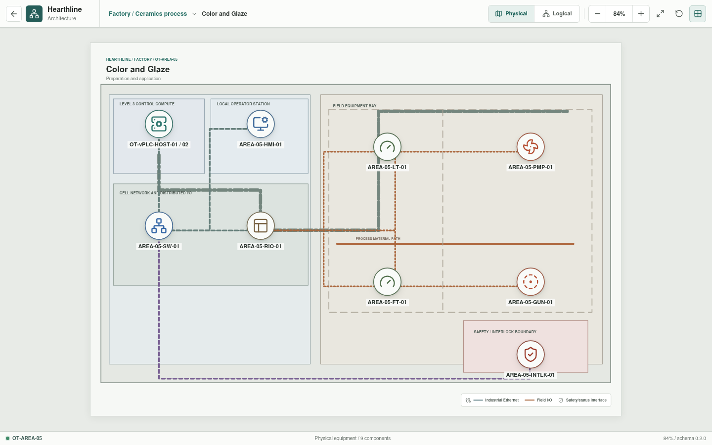
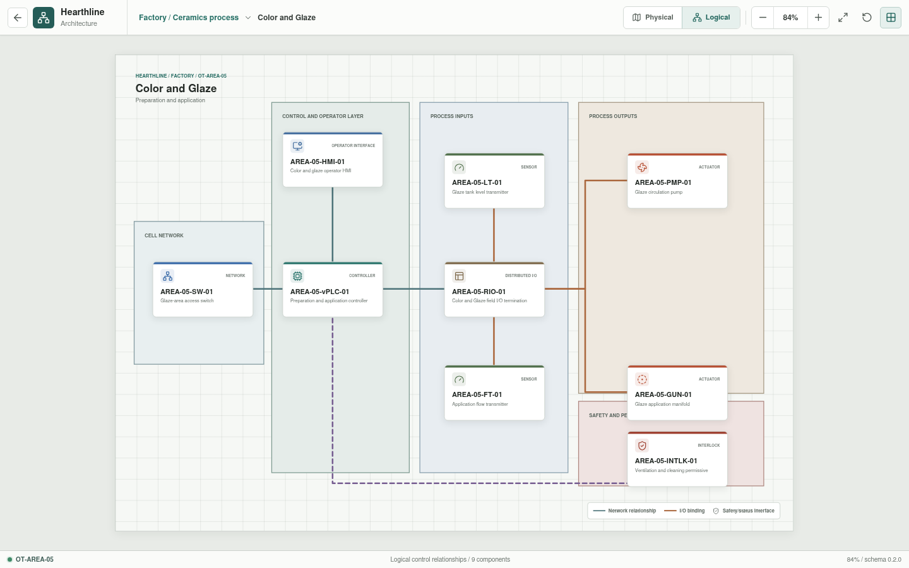

# Color and Glaze

**Zone:** `OT-AREA-05`  
**Route:** `factory/process/color-and-glaze`

Color and Glaze covers material preparation, recipes, circulation, application,
and controlled cleaning cycles.

## Current Representation

The architecture view renders the representative assets below from bootstrap
JSON. `AREA-05-HMI-01` is enterable as a Rust-backed operator session assembled
from the area appliance YAML. It displays configured tank-level and flow
samples, requires a healthy interlock reset, and exposes pump and spray-gun
states through the HMI, vPLC, remote I/O, and field-actuator path.

This is a deterministic operator-command baseline. Recipe handling, circulation
and cleaning sequences, process dynamics, and Structured Text execution remain
pending.

| Function | Representative component |
| --- | --- |
| Cell network | `AREA-05-SW-01` |
| Control workload | `AREA-05-vPLC-01` on `OT-vPLC-HOST-01/02` |
| Local operation | `AREA-05-HMI-01` |
| Distributed I/O | `AREA-05-RIO-01` |
| Sensors | `AREA-05-LT-01`, `AREA-05-FT-01` |
| Actuators | `AREA-05-PMP-01`, `AREA-05-GUN-01` |
| Permissive | `AREA-05-INTLK-01` |

## Planned Work

Simulation will model recipe state, tank level, application flow, circulation,
flush state, and ventilation or cleaning permissives. Per-appliance YAML is
implemented; resolved I/O bindings and process behavior remain pending.
