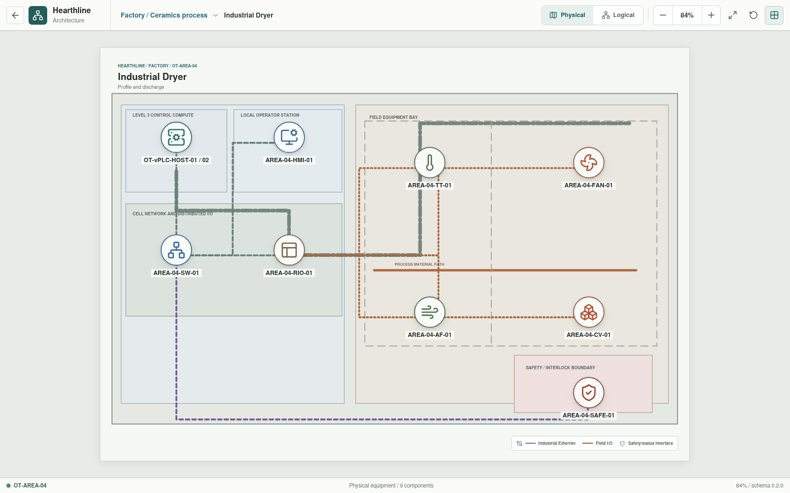
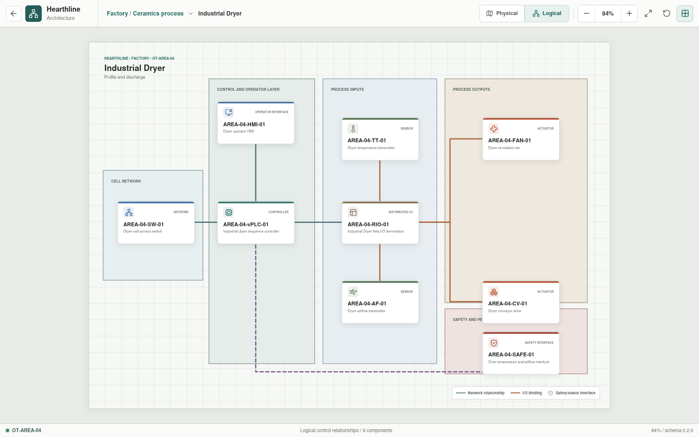

# Industrial Dryer

**Zone:** `OT-AREA-04`  
**Route:** `factory/process/industrial-dryer`

Industrial Dryer covers loading, the controlled drying profile, airflow,
temperature, interlocks, and discharge.

## Current Representation

The architecture view renders the representative assets below from bootstrap
JSON. `AREA-04-HMI-01` is enterable as a Rust-backed operator session assembled
from the area appliance YAML. It displays configured temperature and airflow
samples, requires a healthy safety reset, and exposes fan and conveyor state
commands through the HMI, vPLC, remote I/O, and field-actuator path.

This is a deterministic operator-command baseline. Dryer profiles, automatic
sequencing, thermal and airflow dynamics, and Structured Text execution remain
pending.

| Function | Representative component |
| --- | --- |
| Cell network | `AREA-04-SW-01` |
| Control workload | `AREA-04-vPLC-01` on `OT-vPLC-HOST-01/02` |
| Local operation | `AREA-04-HMI-01` |
| Distributed I/O | `AREA-04-RIO-01` |
| Sensors | `AREA-04-TT-01`, `AREA-04-AF-01` |
| Actuators | `AREA-04-FAN-01`, `AREA-04-CV-01` |
| Safety interface | `AREA-04-SAFE-01` |

## Planned Work

Simulation will cover profile state, product movement, airflow loss,
over-temperature conditions, and safe discharge. Per-appliance YAML is
implemented; resolved control bindings and process behavior remain pending.
