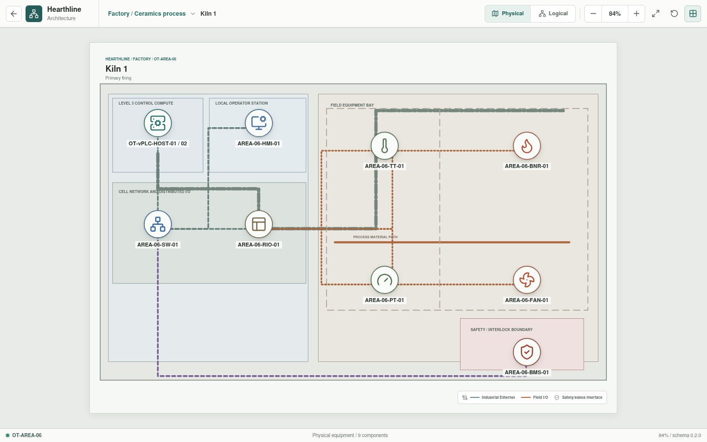
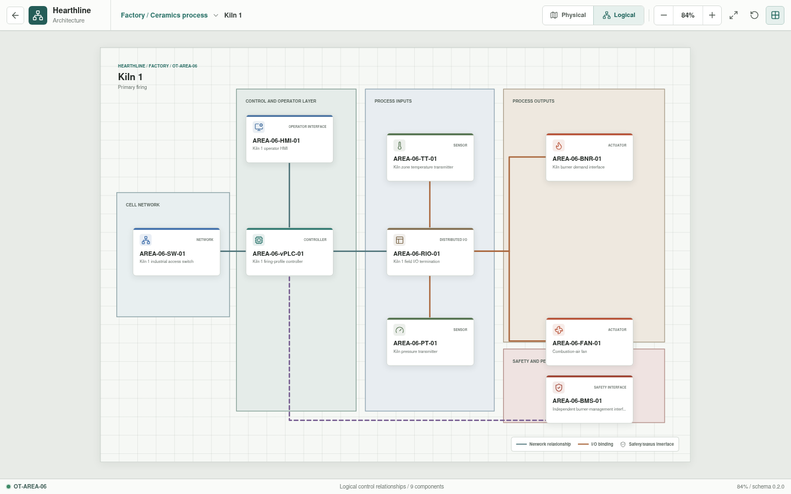

# Kiln 1

**Zone:** `OT-AREA-06`  
**Route:** `factory/process/kiln-one`

Kiln 1 represents the primary firing profile, temperature zones, pressure,
airflow, combustion interfaces, and unloading.

## Current Representation

The architecture view renders the representative assets below from bootstrap
JSON. `AREA-06-HMI-01` is enterable as a Rust-backed operator session assembled
from the area appliance YAML. It displays configured temperature and pressure
samples, evaluates the three modeled burner-management permissives, and exposes
burner-demand and fan states after an authorized reset. Accepted commands
traverse the HMI, vPLC, remote I/O, and field actuator.

The reset and burner-demand path is a deterministic simulation contract. It is
not burner-management logic, a firing sequence, or evidence of functional
safety; Structured Text and kiln dynamics remain pending.

| Function | Representative component |
| --- | --- |
| Cell network | `AREA-06-SW-01` |
| Control workload | `AREA-06-vPLC-01` on `OT-vPLC-HOST-01/02` |
| Local operation | `AREA-06-HMI-01` |
| Distributed I/O | `AREA-06-RIO-01` |
| Sensors | `AREA-06-TT-01`, `AREA-06-PT-01` |
| Actuators | `AREA-06-BNR-01`, `AREA-06-FAN-01` |
| Burner-management interface | `AREA-06-BMS-01` |

## Planned Work

Hearthline will simulate the process and control interface without claiming
functional-safety or burner-management certification. Per-appliance YAML is
implemented; resolved control bindings and firing behavior remain pending.
